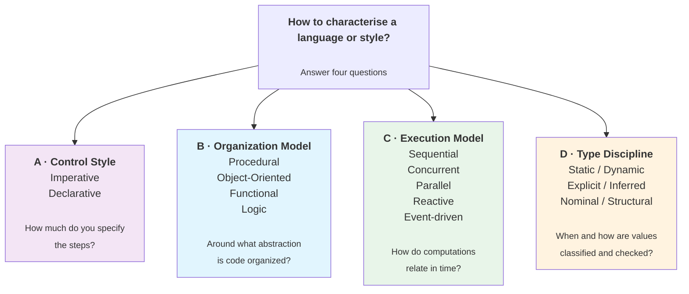
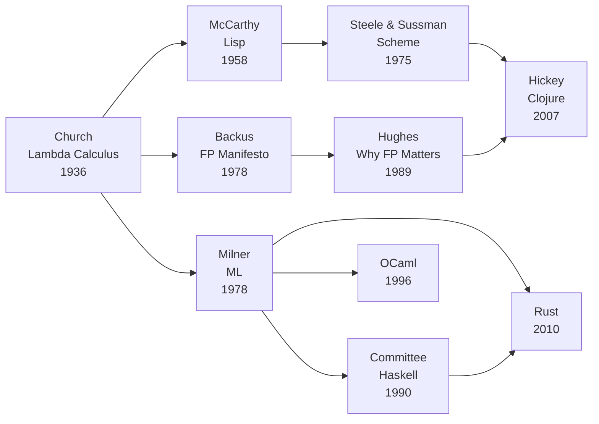
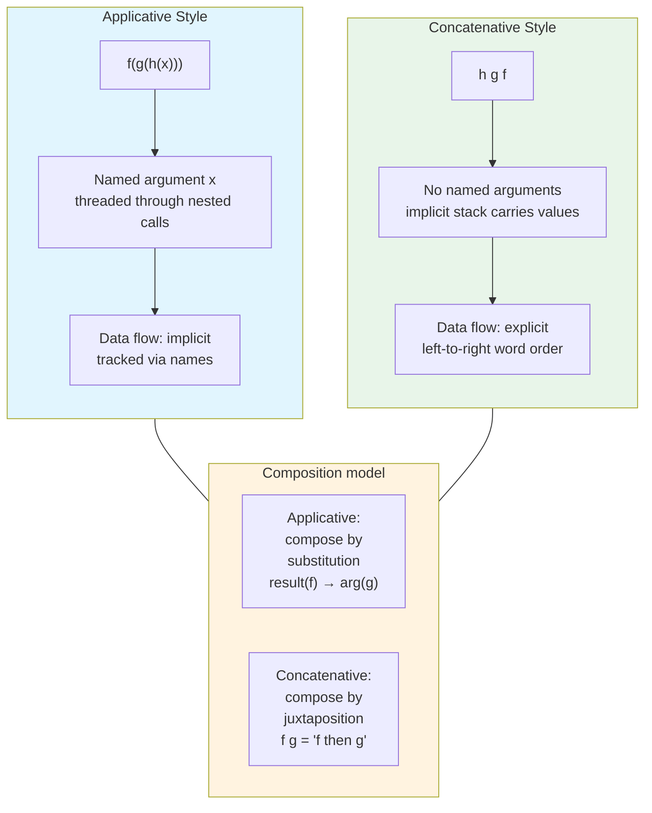
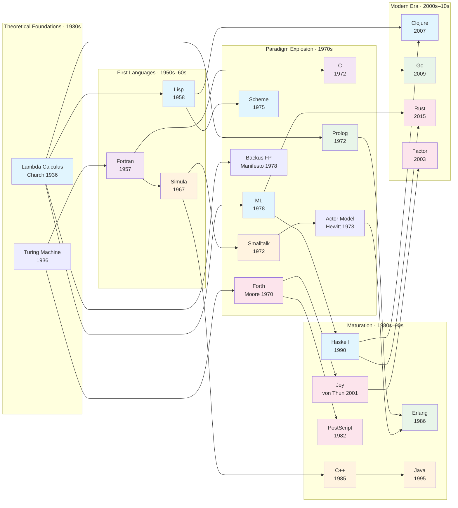

# Paradigms

How we think about computation. Each paradigm offers a different mental
model for structuring programs — a different answer to the question
"what is a program?"

## Contents

- [What Is a Paradigm?](#what-is-a-paradigm)
- [The Big Picture: Four Independent Axes](#the-big-picture-four-independent-axes)
    - [Axis A: Control Style — the Imperative ↔ Declarative Spectrum](#axis-a-control-style--the-imperative--declarative-spectrum)
    - [Axis B: Organization Model — What Is "a Program"?](#axis-b-organization-model--what-is-a-program)
    - [Axis C: Execution Model — How Does Computation Run?](#axis-c-execution-model--how-does-computation-run)
    - [Axis D: Type Discipline — How Are Values Classified and Checked?](#axis-d-type-discipline--how-are-values-classified-and-checked)
- [Mapping Languages to the Four Axes](#mapping-languages-to-the-four-axes)
- [Organization Models in Depth](#organization-models-in-depth)
    - [Procedural Programming](#procedural-programming)
    - [Object-Oriented Programming](#object-oriented-programming)
    - [Functional Programming](#functional-programming)
    - [Logic Programming](#logic-programming)
    - [Applicative vs Concatenative Style](#applicative-vs-concatenative-style)
- [Execution Models in Depth](#execution-models-in-depth)
    - [Actor Model](#actor-model-hewitt-1973--erlang-1986)
    - [CSP — Communicating Sequential Processes](#csp--communicating-sequential-processes-hoare-1978)
- [Declarative Techniques and DSLs](#declarative-techniques-and-dsls)
- [Type Discipline in Practice](#type-discipline-in-practice)
- [The Pragmatic View](#the-pragmatic-view)
- [Historical Evolution](#historical-evolution)
- [Further Reading](#further-reading)
- [Related Topics](#related-topics)

## What Is a Paradigm?

A programming paradigm is a **style of programming** — a set of concepts
and abstractions that determine how you think about and structure programs.

A common mistake is arranging paradigms in a strict hierarchy:
"OOP is a kind of imperative programming," "functional is a kind of
declarative." This mixes levels of abstraction and conflates independent
dimensions. In reality, a paradigm is best understood as **a point in a
multi-dimensional space**, not a node in a tree.

Not every important language property is itself a paradigm. Some describe
the **structure** of programs, some describe **control**, some describe
**execution**, and some describe the language's **type discipline**.
These dimensions are related, but not reducible to one another.

## The Big Picture: Four Independent Axes



These axes are **orthogonal** — choosing a position on one axis does not
determine your position on the others. OOP code can be imperative or
declarative. Functional code can be sequential or concurrent. A language
can be statically or dynamically typed regardless of whether it is procedural,
object-oriented, functional, or logic-based. A language — or even a single
file — can occupy different points on each axis.

---

### Axis A: Control Style — the Imperative ↔ Declarative Spectrum

This is not two boxes but a **continuous spectrum**. The question:
how much do you specify the *steps* of computation?

```
Imperative ◄──────────────────────────────────────► Declarative

Assembly → C → Java → Java Streams → Haskell → SQL → Prolog
   ↑                                                      ↑
   Every step                                    Only the result
   specified                                     is described
```

The same language can sit at different points depending on how you write:

```java
// Java — imperative end of the spectrum
BigDecimal sum = BigDecimal.ZERO;
for (Order o : orders) {
    if (o.getPrice().compareTo(threshold) > 0) {
        sum = sum.add(o.getPrice());
    }
}

// Java — declarative end of the spectrum
BigDecimal sum = orders.stream()
    .map(Order::getPrice)
    .filter(p -> p.compareTo(threshold) > 0)
    .reduce(BigDecimal.ZERO, BigDecimal::add);
```

```haskell
-- Haskell is considered declarative, but IO notation looks sequential
main = do
    putStrLn "Name?"
    name <- getLine
    putStrLn ("Hi " ++ name)
```

!!! note "Imperative and Declarative are properties, not paradigms"
    They describe *how code is written*, not *what the program is made of*.
    Any organization model (OOP, FP, etc.) can be used more imperatively
    or more declaratively. Putting "Imperative" and "Functional" in the
    same flat list is a category error — they answer different questions.

---

### Axis B: Organization Model — What Is "a Program"?

This is the axis most people mean when they say "paradigm." It answers:
around what central abstraction do you organize code?

| Model | "What is a program?" | Central abstraction |
|-------|---------------------|---------------------|
| **Procedural** | A collection of procedures that operate on data | Procedures, functions, modules |
| **Object-Oriented** | A collection of objects that interact via messages | Objects, methods, interfaces |
| **Functional** | A composition of mathematical functions | Pure functions, expressions, immutable values |
| **Logic** | A set of facts and rules; the runtime finds solutions | Facts, rules, queries |

These are not mutually exclusive — most modern languages blend several.

---

### Axis C: Execution Model — How Does Computation Run?

This axis is **orthogonal** to both A and B. It determines how
computational tasks relate to each other in time.

| Model | Key idea | Examples |
|-------|----------|----------|
| **Sequential** | One thing at a time, in order | C, Python (default) |
| **Concurrent** | Multiple logical activities, possibly interleaved | Go, Erlang |
| **Parallel** | Multiple computations at the same physical time | CUDA, OpenMP, fork/join |
| **Reactive** | Computation structured around data streams and propagation | RxJava, Reactor |
| **Event-driven** | Callbacks or handlers triggered by external/internal events | Node.js, GUI frameworks |

!!! warning "Concurrent ≠ Parallel"
    Concurrency is about **structure** (dealing with multiple things at once).
    Parallelism is about **execution** (doing multiple things simultaneously).
    A concurrent program may run on a single core. A parallel computation
    may have no explicit concurrency structure at all.
    See Rob Pike — ["Concurrency Is Not Parallelism"](https://go.dev/blog/waza-talk).

---

### Axis D: Type Discipline — How Are Values Classified and Checked?

This axis captures a different question: not how a program is organized
or executed, but how the language treats **values, expressions, and constraints**
on their use.

The most common distinction is:

- **Static typing** — many constraints are checked before execution
- **Dynamic typing** — many constraints are checked during execution

But this axis is richer than a simple binary. Type disciplines also differ in:

- **Explicit vs inferred typing** — whether the programmer must write annotations
- **Nominal vs structural typing** — whether compatibility depends on declared identity or shape
- **Sound vs unsound typing** — whether the type checker guarantees the absence of certain classes of runtime errors
- **Gradual or optional typing** — whether static checking can be layered onto a dynamic language

| Dimension | Examples |
|----------|----------|
| **Static** | Haskell, Rust, Java, OCaml |
| **Dynamic** | Python, Ruby, JavaScript |
| **Explicit** | Java, C |
| **Inferred** | Haskell, ML, Rust (partially), OCaml |
| **Nominal** | Java, C# |
| **Structural** | TypeScript, Go interfaces |

Type discipline is **orthogonal** to the other axes:

- a language may be **functional and dynamic** (Clojure, Scheme)
- **object-oriented and static** (Java, C#)
- **procedural and static** (C)
- **logic-based and dynamically checked** (classic Prolog)
- **multi-paradigm and strongly static** (Rust, Scala)

!!! note "Typing is not a paradigm in the same sense as OOP or FP"
    A type discipline does not answer the question "what is a program?"
    It answers a different question: **what kinds of values may appear,
    and how does the language enforce constraints on them?**
    That makes it a separate classificatory axis rather than a structural paradigm.

---

## Mapping Languages to the Four Axes

| Language / Style | A: Control Style | B: Organization | C: Execution | D: Type Discipline |
|-----------------|------------------|-----------------|--------------|--------------------|
| C | Imperative | Procedural | Sequential | Static, mostly explicit |
| Java (classic) | Imperative | Object-Oriented | Sequential | Static, nominal, mostly explicit |
| Java (streams + lambdas) | More declarative | OOP + FP | Sequential | Static, nominal, mostly explicit |
| Spring (annotations) | Declarative configuration | OOP + AOP | Depends | Static, nominal |
| Haskell | Declarative | Functional | Sequential* | Static, inferred |
| Erlang / Elixir | Mostly declarative | Functional + Actor | Concurrent | Dynamic |
| Go | Imperative | Procedural | Concurrent (CSP) | Static, inferred + explicit, structural interfaces |
| Scala + Akka | Mixed | OOP + FP + Actor | Concurrent | Static, mostly inferred |
| SQL | Declarative | Query-based | Delegated to DBMS | Typed, dialect-dependent |
| Prolog | Declarative | Logic | Usually sequential search | Typically dynamic / runtime-checked |
| Rust | Imperative | Procedural + FP | Concurrent | Static, strongly inferred |
| Clojure | Mostly declarative | Functional | Concurrent (STM) | Dynamic |
| React (JSX) | Declarative | Component-based | Event-driven | Usually dynamic (JS) or static optional (TS) |
| Python | Mixed | Multi (OOP + Proc + FP) | Sequential* | Dynamic |

!!! note "Most modern languages are multi-paradigm"
    Python supports imperative, OOP, and functional styles. Scala blends
    OOP with FP. Rust is imperative with strong FP features. The paradigm
    is in how you *use* the language, not just in the language itself.

    The same is true of type discipline in practice: many ecosystems support
    annotations, inference, optional checking, code generation, or external
    static analysis layered on top of the base language.

---

## Organization Models in Depth

### Procedural Programming

**Core idea:** A program is a collection of **procedures** (functions)
that operate on **data**. Data and code are separate entities.

```c
// C — procedural style
int total = 0;
for (int i = 0; i < 10; i++) {
    total += i;
}
```

The programmer specifies **how** to compute the result, step by step.
The mental model is a machine executing instructions in order.

**Strengths:**

- Maps directly to how hardware works
- Intuitive for sequential algorithms
- Efficient — close to the metal
- Simple mental model

**Weaknesses:**

- Mutable state makes reasoning hard (especially with concurrency)
- Order-dependent — reordering statements changes meaning
- Procedures can have hidden side effects
- Data and code separated — changes to data structures ripple through all procedures

**Key moment:** Dijkstra's "Go To Considered Harmful" (1968) argued that
unrestricted control flow (with `goto`) was unmanageable. **Structured
programming** restricted flow to `if/else`, `while`, and functions —
making procedural code tractable.

**Languages:** C, Pascal, Fortran, BASIC

→ [Edsger Dijkstra](../../authors/edsger-dijkstra.md) ·
[Go To Considered Harmful](../../works/papers/dijkstra-1968-goto.md)

---

### Object-Oriented Programming

**Core idea:** A program is a collection of **objects** — bundles of data
(state) and behaviour (methods) — that interact by sending **messages**.

> 🔍 **Deep Dive:** This section focuses on OOP as a structural paradigm. For a detailed breakdown of OOP mechanics (encapsulation, inheritance, polymorphism) and the evolution of design principles (DbC, GoF, SOLID), see the **[OOP & Design](../design/)** topic.

#### Two Visions of OOP

OOP has two distinct historical traditions that are often conflated:

##### Kay's OOP: Messaging

Alan Kay, who coined the term "object-oriented programming," defined it
as being about **messages**, not classes:

> "OOP to me means only messaging, local retention and protection
> and hiding of state-process, and extreme late-binding of all things."

In Kay's vision:

- Objects are like biological cells or computers on a network
- The only operation is sending a message to an object
- The receiver decides how to handle the message (late binding)
- Objects are isolated — no shared state

This vision is realised in **Smalltalk**, **Erlang** (processes as objects),
and conceptually in **microservices** (services as objects, APIs as messages).

##### Simula's OOP: Classification

Dahl and Nygaard's Simula introduced OOP through the lens of **modelling**:

- **Classes** as blueprints for real-world entities
- **Inheritance** as an "is-a" relationship
- **Virtual methods** for runtime polymorphism

This tradition was adopted by **C++**, **Java**, **C#**, and most
mainstream languages. It emphasises type hierarchies, code reuse via
inheritance, and encapsulation through access modifiers.

```java
// Java — Simula-tradition OOP
public class Animal {
    private String name;
    public Animal(String name) { this.name = name; }
    public void speak() { System.out.println("..."); }
}

public class Dog extends Animal {
    public Dog(String name) { super(name); }
    @Override
    public void speak() { System.out.println("Woof!"); }
}
```

##### The Tension

| Aspect | Kay's OOP | Simula/C++ OOP |
|--------|-----------|----------------|
| Primary mechanism | Message passing | Method call |
| Binding | Extreme late binding | Earlier binding where possible |
| Coupling | Loose (isolated objects) | Often tighter via class hierarchies |
| State sharing | None in principle | Common in practice |
| Modern echo | Erlang, microservices | Java, C++, C# |

> 🔬 **Polymorphism taxonomy:** OOP polymorphism (inclusion/subtype)
> is one of four forms of polymorphism. For the full Cardelli–Wegner
> taxonomy with diagrams, see **[OOP Deep Dive: Polymorphism](../design/oop-deep-dive.md)**.

#### OOP Is Not Inherently Imperative

A common misconception places OOP as a subtype of imperative programming.
OOP is an **organization model** (axis B) — it says *what a program is
made of* (objects). It says nothing about *how code inside methods is
written* (axis A), *how computations are scheduled* (axis C), or
whether the language is *statically or dynamically typed* (axis D):

```java
// Same OOP class, imperative control style
class OrderService {
    BigDecimal totalPrice(List<Order> orders) {
        BigDecimal sum = BigDecimal.ZERO;
        for (Order o : orders) {
            sum = sum.add(o.getPrice());
        }
        return sum;
    }
}

// Same OOP class, more declarative control style
class OrderService {
    BigDecimal totalPrice(List<Order> orders) {
        return orders.stream()
            .map(Order::getPrice)
            .reduce(BigDecimal.ZERO, BigDecimal::add);
    }
}
```

Same organization (objects with methods). Different control style.
And the same organization model exists in both **statically typed**
languages (Java, C#) and **dynamically typed** ones (Python, Ruby).
**Organization, control, execution, and typing are independent axes.**

**Strengths of OOP:**

- Natural mapping to domain concepts
- Encapsulation hides complexity
- Polymorphism enables extensibility

**Weaknesses of OOP:**

- Inheritance creates tight coupling ("fragile base class" problem)
- Shared mutable state complicates concurrency
- "Kingdom of nouns" — tendency to create unnecessary class hierarchies

**Languages:** Simula, Smalltalk, C++, Java, C#, Python, Ruby, Kotlin

→ [Alan Kay](../../authors/alan-kay.md) ·
[Ole-Johan Dahl](../../authors/ole-johan-dahl.md) ·
[Smalltalk](../../languages/smalltalk/) ·
[Simula](../../languages/simula/)

---

### Functional Programming

**Core idea:** A program is a **composition of functions** that transform
**immutable values**. Functions are mathematical — given the same input,
they always produce the same output, with no side effects.

```haskell
-- Haskell — functional style
total = sum [0..9]

-- Or more explicitly:
total = foldr (+) 0 [0..9]
```

#### Core Concepts

**Pure functions:**

- No side effects (no mutation, no I/O, no global state)
- **Referential transparency** — an expression can be replaced by its
  value without changing the program's behaviour
- Easier to test, reason about, and parallelise

**Immutability:**

- Data structures are never modified in place
- "Changing" a list returns a new list (the old one still exists)
- Eliminates entire categories of bugs (data races, aliasing, stale state)

**Higher-order functions:**

- Functions that take functions as arguments or return functions
- `map`, `filter`, `reduce` replace most loops
- Enable powerful composition and abstraction

**Algebraic data types:**

```haskell
-- Sum type (OR): a Shape is a Circle OR a Rectangle
data Shape = Circle Double | Rectangle Double Double

-- Pattern matching: handle each case
area :: Shape -> Double
area (Circle r)      = pi * r * r
area (Rectangle w h) = w * h
```

#### FP and the Control Spectrum

Functional programming **tends toward** the declarative end of the
control spectrum but is not synonymous with it. A chain of
`map.filter.reduce` is declarative — you describe transformations,
not steps. But:

- Haskell's `do`-notation sequences effects in a linear-looking way
- Clojure allows controlled mutation via atoms and refs
- Scala lets you mix FP with imperative loops

FP is an **organization model** (axis B) with natural affinity for the
declarative end of the **control spectrum** (axis A). They are related
but distinct concepts. Likewise, FP does not imply any one type discipline:
functional languages may be **statically typed** (Haskell, OCaml, F#),
**dynamically typed** (Clojure, Scheme), or span both traditions.

#### Evolution



**Strengths:**

- Easier to reason about (no hidden state changes)
- Natural parallelism (pure functions can be evaluated in any order)
- Composability (small functions combine into larger ones)
- Testability (pure functions are trivially testable)

**Weaknesses:**

- Learning curve (new mental model for most developers)
- Performance overhead in some cases (immutable data structures, GC)
- I/O requires special handling (monads in Haskell, controlled mutation in Clojure)

**Languages:** Lisp, Scheme, ML, Haskell, Erlang, Clojure, F#, Scala, Elixir

→ [Alonzo Church](../../authors/alonzo-church.md) ·
[John McCarthy](../../authors/john-mccarthy.md) ·
[John Backus](../../authors/john-backus.md) ·
[Functional Programming topic](../functional/)

---

### Logic Programming

**Core idea:** A program is a set of **facts** and **rules**. Computation
is not a sequence of execution steps, but an **inference engine searching
for proofs** — the runtime finds values that satisfy the declared constraints.

If Procedural organizes around actions, OOP around stateful entities, and FP
around mathematical transformations, Logic programming organizes code around
**knowledge and constraints**.

#### The Three Pillars

A logic program typically consists of three elements:
1. **Facts:** Unconditional statements about the domain.
2. **Rules:** Conditional statements linking facts.
3. **Queries:** The questions we ask the system.

```prolog
% Prolog — logic programming

% 1. Facts (Knowledge Base)
parent(tom, bob).
parent(tom, liz).
parent(bob, ann).

% 2. Rule (Domain Logic)
grandparent(X, Z) :- parent(X, Y), parent(Y, Z).

% 3. Query
% ?- grandparent(tom, Who).
% Who = ann.
```

#### How It Works (The Engine)

In logic programming, there is no explicit control flow (`if`, `for`, `while`)
in the usual imperative sense, no variable mutation in the ordinary procedural
sense, and no function call structure as the primary organizing principle.
Instead, you submit a query, and the **inference engine** uses
**unification** and **backtracking** to search the knowledge base and prove
the theorem.

**The Sudoku Metaphor:** When solving Sudoku, you don't write an algorithm
("put 1 in the corner, if it fails try 2..."). You define the *rules*
(no duplicates in a row/column/box). Logic programming lets you write the rules
and hand the computer a grid; the engine figures out the numbers that satisfy
those rules. Because you never specify the *steps* to find the answer, this
sits near the extreme declarative end of the control spectrum (Axis A).

#### Modern Influence

While pure Prolog is rarely used in mainstream web/enterprise development today,
the logic organization model heavily influences modern tools:

- **Databases & SQL:** SQL is rooted in relational logic and algebra. You
  declare constraints (`WHERE`, `JOIN`), and the DB optimizer searches for an execution plan.
- **Type systems:** In languages like Haskell, Rust, or TypeScript, type inference
  can often be understood as constraint solving.
- **Rule engines:** Business rules and authorization policies are often expressed
  as facts plus inference rules.
- **Datalog systems:** Modern program analysis and data systems often use Datalog-like subsets.

**Languages:** Prolog, Datalog, miniKanren, core.logic (Clojure)

---

### Applicative vs Concatenative Style

Most programmers work exclusively in the **applicative** style without
realising it has a name or an alternative. The distinction cuts across all
four axes above — it is a property of **how functions are composed and
how arguments are passed**, not of the organization model, execution model,
or type discipline.

#### Applicative Style

In **applicative** (or *applicative-order*) programming, functions are
applied to **named arguments**. Composition is expressed by nesting
function calls or binding intermediate results to names:

```python
# Python — applicative style
result = reduce(add, filter(positive, map(double, numbers)))

# Or with names:
doubled   = map(double, numbers)
positives = filter(positive, doubled)
result    = reduce(add, positives)
```

This is the dominant style in virtually all mainstream languages:
C, Java, Python, Haskell, Lisp, ML. Even when chaining methods
(`orders.stream().map(...).filter(...)`), arguments are still named and
bound explicitly.

The key properties:

- Functions are called with explicit arguments: `f(x)` or `f x`
- Intermediate values have names (or are nested)
- The **data flow** is implicit — you track it by reading how names are threaded through calls
- Composition is expressed by **substitution**: replacing a name with the expression that produced it

#### Concatenative Style

In **concatenative** (or *stack-based*, *point-free*) programming,
functions are composed by **juxtaposition** — placing them next to each
other. There are no named arguments. Instead, every function implicitly
consumes values from a shared **stack** and pushes results back onto it.
The program is read as a **pipeline of transformations**.

```forth
\ Forth — concatenative style
\ Compute (3 + 4) * 2

3 4 + 2 *
\       ^--- multiply top two stack items → result: 14
\     ^----- push 2
\   ^------- add top two items → stack: [7]
\ ^--------- push 3, push 4 → stack: [3, 4]
```

```factor
! Factor — modern concatenative language
: double ( n -- n ) 2 * ;
: positive? ( n -- ? ) 0 > ;

{ 1 -2 3 -4 5 }
[ double ] map
[ positive? ] filter
0 [ + ] reduce
```

The key properties:

- No named parameters — functions implicitly operate on an **implicit data context** (the stack)
- Programs are composed by **concatenation**: `f g h` means "apply f, then g, then h"
- **Data flow is explicit** — the order of words on the page is the order of transformations
- Composition is associative: `(f g) h = f (g h)` — programs can be freely rearranged

#### The Core Contrast



A useful way to feel the difference: in applicative style you ask
*"what value do I pass here?"*; in concatenative style you ask
*"what transformation do I place next in the pipeline?"*

#### Why Concatenative Languages?

Concatenative languages occupy a small but durable niche. They are used where:

- **Extreme simplicity of the runtime** matters — Forth runs on bare metal with
  no OS, no heap allocator, no call stack in the conventional sense. This makes
  it attractive for embedded systems, bootloaders, and firmware.
- **Interactive, incremental development** — Forth and Factor REPLs let you
  define and test individual words in isolation and assemble programs
  interactively on the stack.
- **Metaprogramming and language extension** — because a program is simply a
  sequence of words, it is trivially parsed and manipulated. Forth is famously
  its own assembler, compiler, and operating environment simultaneously.
- **Formal reasoning about programs** — the algebraic property of concatenation
  (`(f g) h = f (g h)`) means programs can be equationally reasoned about and
  mechanically optimised by rewriting sequences of words.
- **Scripting and DSLs embedded in constrained environments** — PostScript
  (the language inside laser printers) is concatenative. PDF's content streams
  are concatenative. Many hardware description languages borrow stack-based ideas.

| Use area | Example |
|----------|---------|
| Embedded / bare-metal | Forth on microcontrollers, OpenFirmware |
| Desktop scripting | Factor, Gforth |
| Printer language | PostScript (every laser printer is a Forth-like VM) |
| Cryptography / formal tools | Joy (theoretical), Cat |
| Blockchain / smart contracts | Bitcoin Script (stack-based) |
| Shell pipelines | Unix pipes share the concatenative data-flow idea |

!!! note "Unix pipes as concatenative thinking"
    `cat file | grep pattern | sort | uniq -c` is concatenative in spirit:
    each command consumes its input stream and produces an output stream,
    and composition is juxtaposition (`|`). There are no named intermediates.
    The data flows left to right through the pipeline exactly as words flow
    left to right in a Forth program.

#### Point-Free Style in Applicative Languages

The concatenative idea leaks into applicative languages via **point-free**
(or **tacit**) style — writing function compositions without mentioning
the argument:

```haskell
-- Haskell — applicative, but point-free composition
-- Named (pointed) style:
process xs = filter positive (map double xs)

-- Point-free (tacit) style — no xs mentioned:
process = filter positive . map double
```

The `.` operator in Haskell is function composition: `(f . g) x = f (g x)`.
Writing `filter positive . map double` without mentioning `xs` brings
applicative Haskell close to the concatenative ideal — the program reads
as a pipeline of transformations. This is the same idea as Forth's word
sequences, expressed within an applicative language.

#### Further Reading

→ [concatenative.org](https://concatenative.org/) — the central community
resource for concatenative languages: language surveys, papers, wiki, and
links to Joy, Factor, Forth, Cat, and related work.

→ Manfred von Thun — *[The Theory of Concatenative Combinators](http://www.latrobe.edu.au/humanities/research/research-projects/past-projects/joy-programming-language)* — Joy language and the algebra of programs

→ [Factor language](https://factorcode.org/) — modern, practical concatenative language with rich libraries

→ [Forth](https://forth-standard.org/) — the original concatenative language, still used in embedded systems

---

## Execution Models in Depth

Execution model is **orthogonal** to organization model. A functional
program can be sequential (Haskell by default) or concurrent (Erlang).
An OOP program can be sequential (Java by default) or concurrent
(Akka actors). Likewise, either may be statically or dynamically typed.
Two major concurrency models emerged from theoretical
work in the 1970s:

### Actor Model (Hewitt 1973 / Erlang 1986)

- Isolated processes with private state
- Communicate via **asynchronous** messages
- No shared memory
- Each actor processes one message at a time

```erlang
%% Erlang — actor model
-module(counter).
-export([start/0, increment/1, get/1]).

start() -> spawn(fun() -> loop(0) end).

increment(Pid) -> Pid ! increment.

get(Pid) ->
    Pid ! {get, self()},
    receive {count, N} -> N end.

loop(N) ->
    receive
        increment -> loop(N + 1);
        {get, From} -> From ! {count, N}, loop(N)
    end.
```

### CSP — Communicating Sequential Processes (Hoare 1978)

- Independent sequential processes
- Communicate via channels
- No shared memory in the model
- Channels are first-class values

```go
// Go — CSP style
func producer(ch chan<- int) {
    for i := 0; i < 10; i++ {
        ch <- i
    }
    close(ch)
}

func main() {
    ch := make(chan int)
    go producer(ch)
    for n := range ch {
        fmt.Println(n)
    }
}
```

### Comparison

| Aspect | Actors | CSP |
|--------|--------|-----|
| Communication | Asynchronous messages | Channel communication |
| Identity | Named actors/processes | Processes + channels |
| Buffering | Mailbox-based | Usually explicit |
| Languages | Erlang, Elixir, Akka | Go, occam, core.async |
| Theory | Hewitt 1973 | Hoare 1978 |

→ [Tony Hoare](../../authors/tony-hoare.md) ·
[Joe Armstrong](../../authors/joe-armstrong.md) ·
[Concurrency topic](../concurrency/)

---

## Declarative Techniques and DSLs

The declarative end of the control spectrum manifests in many forms
beyond functional and logic programming. These are not separate paradigms
but **domain-specific applications** of declarative thinking:

```sql
-- SQL — declarative query
SELECT name, age FROM users WHERE age > 18 ORDER BY name;
-- We describe WHAT we want. The database decides HOW to get it.
```

```html
<!-- HTML — declarative structure -->
<h1>Hello, World!</h1>
<p>This is a paragraph.</p>
<!-- We describe WHAT the page looks like. The browser decides HOW to render. -->
```

| Technique | Domain | Example |
|-----------|--------|---------|
| SQL | Data querying | `SELECT name FROM users WHERE age > 18` |
| HTML / CSS | Document structure and style | `<h1>Hello</h1>` |
| Regular expressions | Text pattern matching | `\d{3}-\d{4}` |
| Build DSLs | Build configuration | Makefile, Gradle DSL |
| Infrastructure as Code | Provisioning and deployment | Terraform, Kubernetes YAML |
| Annotations / Metadata | Framework configuration | Spring `@Transactional` |

!!! note "Annotations are a mechanism, not a paradigm"
    Spring's `@Transactional`, `@Cacheable`, `@RestController` are
    **declarative configuration** implemented via metaprogramming and
    AOP (Aspect-Oriented Programming). You declare *what* behaviour
    you want; the framework generates the imperative code at runtime
    (often through proxies or bytecode instrumentation). This is a powerful
    technique *within* a broader organization model — not a separate paradigm.

    Similarly, AOP is a **modularization technique** for cross-cutting concerns
    (logging, security, transactions), not a standalone answer to the question
    "what is a program?"

---

## Type Discipline in Practice

The type-discipline axis often interacts with the other three axes, but it does
not collapse into them.

Examples:

- **Java**: OOP organization, often imperative control, usually sequential execution,
  **static nominal typing**
- **Python**: multi-paradigm organization, mixed control style, usually sequential execution,
  **dynamic typing**
- **Haskell**: functional organization, declarative style, usually sequential execution,
  **static inferred typing**
- **Go**: procedural organization, imperative control, concurrent execution,
  **static typing with structural interface compatibility**
- **TypeScript**: often object/component-oriented in practice, mixed control,
  event-driven in the browser, **static structural typing layered over JavaScript**

Some practical consequences of axis D:

- **Static typing** shifts many errors earlier, into compilation or analysis
- **Dynamic typing** increases flexibility and lowers annotation overhead, but moves many checks to runtime
- **Inference** can preserve static guarantees while reducing boilerplate
- **Structural typing** often favors composition and ad hoc interoperability
- **Nominal typing** often favors explicit modelling and deliberately declared interfaces

The choice of type discipline shapes API design, refactoring style,
metaprogramming, tool support, and library ergonomics — even when the
organization model stays the same.

---

## The Pragmatic View

Paradigms are not mutually exclusive. Modern practice often combines
several positions across all four axes:

- **Functional core** — pure functions for business logic (testable, composable)
- **Imperative shell** — procedural I/O at the edges
- **Objects** — for organising modules and managing lifecycle
- **Declarative** — SQL for data, HTML for UI, annotations for config
- **Static or dynamic typing** — depending on the language and trade-offs

This is the **Functional Core / Imperative Shell** pattern described by
Gary Bernhardt.

The same task viewed through different organizational lenses:

```
Task: filter orders above a threshold, compute total price

Procedural:     "loop through the list, accumulate sum in a variable"
OOP:            "ask the OrderBook object to calculate its total"
Functional:     "apply a chain of transformations: map → filter → reduce"
Logic:          "define a rule: total(Orders, Sum) :- ..."
Concatenative:  "double filter-positive reduce-add"   \ words compose left-to-right
SQL:            "SELECT SUM(price) FROM orders WHERE price > threshold"
```

All produce the same result. The difference is in the **cognitive model**
and the **properties** of the resulting code (testability,
parallelisability, readability, analyzability).

→ [Gary Bernhardt — Boundaries](../../authors/gary-bernhardt.md) ·
[Rich Hickey — Simple Made Easy](../../authors/rich-hickey.md)

---

## Historical Evolution

The diagram below shows **historical influences**, not a classification
hierarchy. Languages and ideas influenced each other across paradigm
boundaries.



<span style="font-size:0.85em">
🟣 Imperative lineage · 🟠 OOP lineage · 🔵 FP lineage · 🟢 Concurrent / Logic lineage · 🔴 Multi-paradigm / Concatenative
</span>

### Timeline

| Year | Event | Significance |
|------|-------|-------------|
| 1936 | Church — Lambda Calculus | Theoretical foundation of FP |
| 1936 | Turing — Turing Machine | Theoretical foundation of imperative computation |
| 1957 | Backus — Fortran | First high-level imperative language |
| 1958 | McCarthy — Lisp | First FP language |
| 1967 | Dahl & Nygaard — Simula | Invention of OOP (classes, inheritance) |
| 1968 | Dijkstra — Go To Considered Harmful | Birth of structured programming |
| 1970 | Moore — Forth | First concatenative language |
| 1972 | Kay — Smalltalk | Message-passing OOP |
| 1972 | Ritchie — C | Dominant procedural language |
| 1972 | Colmerauer — Prolog | Logic programming |
| 1973 | Hewitt — Actor Model | Theoretical model for concurrency |
| 1978 | Hoare — CSP | Channel-based concurrency model |
| 1978 | Milner — ML | Typed FP, type inference |
| 1978 | Backus — "Can Programming Be Liberated?" | The case against imperative |
| 1982 | Warnock & Geschke — PostScript | Concatenative language in every printer |
| 1985 | Stroustrup — C++ | OOP goes mainstream |
| 1986 | Armstrong — Erlang | Actor model in industrial practice |
| 1989 | Hughes — "Why Functional Programming Matters" | The case for FP |
| 1990 | Committee — Haskell 1.0 | Pure FP with lazy evaluation |
| 1995 | Gosling — Java | OOP for the masses |
| 2001 | von Thun — Joy | Formal algebra of concatenative programs |
| 2003 | Pestov — Factor | Modern practical concatenative language |
| 2007 | Hickey — Clojure | Practical FP on the JVM |
| 2009 | Pike, Thompson — Go | CSP for the masses |
| 2015 | Mozilla — Rust 1.0 | Multi-paradigm with ownership and safety |

---

## Further Reading

- Backus — ["Can Programming Be Liberated from the von Neumann Style?"](../../works/papers/backus-1978-liberated.md) (1978)
- Hughes — ["Why Functional Programming Matters"](../../works/papers/hughes-1989-why-fp.md) (1989)
- Hickey — ["Simple Made Easy"](../../works/talks/hickey-2011-simple-made-easy.md) (2011)
- Pierce — *Types and Programming Languages* (2002)
- Van Roy & Haridi — *Concepts, Techniques, and Models of Computer Programming* (2004)
- Pike — ["Concurrency Is Not Parallelism"](https://go.dev/blog/waza-talk) (2012)
- [concatenative.org](https://concatenative.org/) — community hub for concatenative languages

## Related Topics

- [Functional Programming](../functional/) — deep dive into FP
- [OOP & Design](../design/) — design principles for OOP
- [Concurrency](../concurrency/) — concurrent programming models
- [Type Systems](../types/) — how types interact with paradigms
- [Languages](../../languages/) — how each language embodies paradigms
