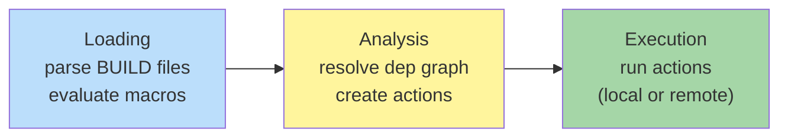

# Bazel

**Type:** Hermetic, polyglot, monorepo-scale build and test system
**Config files:** `MODULE.bazel` (workspace), `BUILD.bazel` (per package), `*.bzl` (rules)
**Docs:** https://bazel.build/docs

---

## Contents

- [Key Concepts](#key-concepts)
- [Project Structure](#project-structure)
- [How a Build Runs](#how-a-build-runs)
- [Dependencies](#dependencies)
- [Common Commands](#common-commands)
- [Where to Find Things](#where-to-find-things)
- [Code Examples](#code-examples)
- [Common Patterns](#common-patterns)
- [Limitations](#limitations)

---

## Key Concepts

| Term | Meaning |
|------|---------|
| **Workspace** | The root of a Bazel project, marked by `MODULE.bazel` (Bzlmod) or `WORKSPACE` (legacy) |
| **Module** | The new dependency unit (Bzlmod, Bazel 6+); replaces the old WORKSPACE format |
| **Package** | A directory containing a `BUILD.bazel` file |
| **Target** | A rule invocation: `//path/to/pkg:name` |
| **Label** | A target identifier; `//foo/bar:lib` (relative to workspace) or `@dep//foo:lib` (external) |
| **Rule** | A function (`cc_library`, `java_binary`, custom `*.bzl`) that creates targets |
| **Macro** | A function that expands into one or more rules at load time |
| **Aspect** | A way to traverse the dependency graph and add behaviour without modifying targets |
| **Action** | A single shell-like invocation Bazel runs (compile, link, archive) |
| **Provider** | Information passed up the rule graph (paths, flags, transitive data) |
| **Toolchain** | A compiler / linker / runtime resolved per-platform |
| **Hermetic** | Inputs and outputs are fully declared; same inputs → same outputs everywhere |
| **Remote cache** | Shared output cache across machines |
| **RBE** | Remote Build Execution — actions run on a remote cluster |

---

## Project Structure

A Bazel workspace is one directory tree containing all your code,
no matter how many languages or modules.

```text
my-monorepo/
├── MODULE.bazel              # workspace + external deps (Bzlmod)
├── .bazelrc                  # default flags
├── BUILD.bazel               # root package (often empty)
├── tools/
│   └── BUILD.bazel
├── app/
│   ├── BUILD.bazel           # cc_binary(name = "app", ...)
│   ├── main.cc
│   └── helper.cc
├── lib/
│   ├── BUILD.bazel           # cc_library(name = "lib", ...)
│   ├── lib.h
│   └── lib.cc
└── test/
    ├── BUILD.bazel           # cc_test(name = "test", ...)
    └── lib_test.cc
```

Targets are addressed as `//app:app`, `//lib:lib`, `//test:test`.

---

## How a Build Runs



Each phase is fully cached:

- **Loading** — parsed `BUILD.bazel` results cached
- **Analysis** — action graph cached
- **Execution** — every action's outputs cached by hash of inputs

Two requests with identical inputs always produce the same outputs.
A second machine in the team or CI can pull those outputs from a
**remote cache** without rebuilding. With **RBE**, the actions run
on a fleet at the same time.

---

## Dependencies

### External modules — Bzlmod (Bazel 6+)

`MODULE.bazel`:

```python
module(name = "my_monorepo", version = "0.1.0")

bazel_dep(name = "rules_cc", version = "0.0.9")
bazel_dep(name = "googletest", version = "1.14.0", repo_name = "gtest")
bazel_dep(name = "rules_python", version = "0.27.1")
```

Bzlmod resolves transitive deps from the [Bazel Central Registry](https://registry.bazel.build/).
Override versions with `single_version_override(...)`.

### Internal targets

Inside any `BUILD.bazel`:

```python
cc_library(
    name = "math",
    srcs = ["math.cc"],
    hdrs = ["math.h"],
    deps = [
        "//common:logging",       # internal
        "@gtest//:gtest_main",    # external
    ],
)
```

`deps` is the canonical name for "things this target depends on" —
across `cc_library`, `java_library`, `py_library`, `go_library`, etc.

---

## Common Commands

```bash
# Build everything reachable
bazel build //...

# Build a specific target
bazel build //app:app

# Run a binary target
bazel run //app:app -- --some-flag value

# Run tests
bazel test //...
bazel test //test:lib_test --test_output=errors

# Query: what does //app:app depend on?
bazel query "deps(//app:app)"

# Reverse query: who depends on //lib:lib?
bazel query "rdeps(//..., //lib:lib)"

# Show how a target was built
bazel aquery "//app:app"

# Clean caches
bazel clean              # clean output base
bazel clean --expunge    # also blow away install base, fetched repos

# Show effective configuration
bazel info

# Useful flags
bazel build //app:app --config=release    # use [release] section in .bazelrc
bazel build //app:app --jobs=auto         # parallelism
bazel build //app:app -k                  # keep going after a failure
bazel build //app:app --remote_cache=grpc://cache.example.com:8980
```

---

## Where to Find Things

| What | Where |
|------|-------|
| Output directories (per-config) | `bazel-bin/`, `bazel-out/`, `bazel-testlogs/`, `bazel-genfiles/` (symlinks at workspace root) |
| Per-user execution root | `$(bazel info execution_root)` (typically under `~/.cache/bazel/_bazel_$USER/...`) |
| Per-user output base | `$(bazel info output_base)` |
| Per-user fetched repositories | `$(bazel info output_base)/external/` |
| Compile commands DB (with hedron-compile-commands) | Project root via `bazel run @hedron_compile_commands//:refresh_all` |
| Bazel version pin | `.bazelversion` (read by `bazelisk`) |
| Default flags | `.bazelrc` (workspace), `~/.bazelrc` (user), `/etc/bazel.bazelrc` (system) |
| Build event log | `bazel build ... --build_event_text_file=events.log` |
| Test output | `bazel-testlogs/<pkg>/<test>/test.log` |

The `bazel-*` directories at the workspace root are **symlinks** —
delete them safely; `bazel build` recreates them.

---

## Code Examples

### Minimal `MODULE.bazel`

```python
module(name = "hello_world", version = "0.1.0")

bazel_dep(name = "rules_cc", version = "0.0.9")
```

### `BUILD.bazel` — C++ binary, library, test

```python
load("@rules_cc//cc:defs.bzl", "cc_binary", "cc_library", "cc_test")

cc_library(
    name = "math",
    srcs = ["math.cc"],
    hdrs = ["math.h"],
    visibility = ["//visibility:public"],
)

cc_binary(
    name = "app",
    srcs = ["main.cc"],
    deps = [":math"],
)

cc_test(
    name = "math_test",
    srcs = ["math_test.cc"],
    deps = [
        ":math",
        "@gtest//:gtest_main",
    ],
)
```

### Multi-language target (Java + protobuf)

```python
load("@rules_java//java:defs.bzl", "java_library", "java_binary")
load("@rules_proto//proto:defs.bzl", "proto_library")
load("@rules_java_proto//java:java_proto_library.bzl", "java_proto_library")

proto_library(
    name = "my_proto",
    srcs = ["my.proto"],
)

java_proto_library(
    name = "my_java_proto",
    deps = [":my_proto"],
)

java_library(
    name = "service",
    srcs = glob(["src/main/java/**/*.java"]),
    deps = [":my_java_proto"],
)

java_binary(
    name = "server",
    main_class = "com.example.Main",
    runtime_deps = [":service"],
)
```

### Custom rule (Starlark)

```python
# tools/copy.bzl
def _copy_impl(ctx):
    out = ctx.actions.declare_file(ctx.attr.name + ".out")
    ctx.actions.run_shell(
        inputs = [ctx.file.src],
        outputs = [out],
        command = "cp $1 $2",
        arguments = [ctx.file.src.path, out.path],
    )
    return [DefaultInfo(files = depset([out]))]

copy_rule = rule(
    implementation = _copy_impl,
    attrs = {
        "src": attr.label(allow_single_file = True),
    },
)
```

```python
# BUILD.bazel
load("//tools:copy.bzl", "copy_rule")

copy_rule(
    name = "config_copy",
    src = "config.yaml",
)
```

---

## Common Patterns

### `.bazelrc` for sane defaults

```ini
common --enable_bzlmod
build --jobs=auto

build:release --compilation_mode=opt
build:release --strip=always

build:ci --remote_cache=grpc://cache.example.com:8980
build:ci --build_event_text_file=$(BUILD_EVENT_FILE)

test --test_output=errors
```

Then `bazel build --config=release //...`.

### Bazelisk

`bazelisk` (or `npx @bazel/bazelisk`) is a launcher that reads
`.bazelversion` and downloads the matching Bazel — same idea as
`mvnw` / `gradlew`. Always commit `.bazelversion`.

### `bazel run` for tools

```python
load("@rules_python//python:defs.bzl", "py_binary")

py_binary(
    name = "format_all",
    srcs = ["format_all.py"],
)
```

```bash
bazel run //tools:format_all -- --check
```

This is hermetic too — `format_all.py` can declare its Python
dependencies and Bazel resolves them.

### Remote cache for free CI speedup

```bash
bazel build //... \
    --remote_cache=https://storage.googleapis.com/my-bucket \
    --google_default_credentials \
    --remote_upload_local_results=true
```

After the first CI run primes the cache, subsequent runs reuse all
unchanged action outputs.

---

## Limitations

- **Steep learning curve** — Bzlmod, BUILD files, rules, providers,
  toolchains, platforms, transitions — there's a lot to learn before
  you can extend the system
- **Rule sets vary in maturity** — `rules_cc`, `rules_java`,
  `rules_python`, `rules_go` are well-supported; smaller ecosystems
  (Swift, R, niche languages) are not
- **Hermeticity has costs** — system libraries can't be used
  implicitly; you must wrap them with toolchains
- **IDE integration is rough** — IntelliJ has a Bazel plugin; for C++
  you generate `compile_commands.json` separately; for Python the
  experience is patchy
- **Remote cache requires infrastructure** — the killer feature only
  pays off when teams have a cache server
- **Big binaries** — Bazel's own JVM and the rule sets it pulls in
  weigh in at hundreds of MB
- **Migration is hard** — moving an existing Maven / npm / CMake
  project to Bazel is a project of its own; tooling like `gazelle`
  helps for some languages

---

## Related

- [Make](make.md) — Bazel solves what Make can't (hermeticity, remote cache)
- [CMake](cmake.md) — Bazel and CMake compete for cross-platform native code
- [Gradle](gradle.md) — alternative when Bazel feels too heavy for JVM-only projects
- [Build Systems Overview](index.md) — comparison and core concepts
- [CI/CD Providers](../ci-cd/index.md) — Bazel's remote cache shines in CI
</content>
