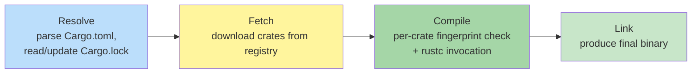

# Cargo

**Type:** Built-in package manager and build tool for Rust
**Config file:** `Cargo.toml` per crate, `Cargo.lock` for the workspace
**Docs:** https://doc.rust-lang.org/cargo/

---

## Contents

- [Key Concepts](#key-concepts)
- [Project Structure](#project-structure)
- [How a Cargo Build Runs](#how-a-cargo-build-runs)
- [Dependencies and crates.io](#dependencies-and-cratesio)
- [Common Commands](#common-commands)
- [Where to Find Things](#where-to-find-things)
- [Code Examples](#code-examples)
- [Common Patterns](#common-patterns)
- [Limitations](#limitations)

---

## Key Concepts

| Term | Meaning |
|------|---------|
| **Crate** | The unit of compilation: a binary, a library, or a test |
| **Package** | One or more crates that share a `Cargo.toml` |
| **Workspace** | A collection of packages sharing one `Cargo.lock` and `target/` |
| **Profile** | Build settings (`dev`, `release`, `test`, `bench`) |
| **Feature** | Conditional compilation flag declared in `Cargo.toml` |
| **Build script** | `build.rs` file run before compilation (codegen, native libs) |
| **Edition** | Rust language version (`2018`, `2021`, `2024`) per crate |
| **Toolchain** | A specific Rust version + components (`stable`, `nightly`, `1.78.0`) |
| **rustup** | The Rust toolchain manager — installs Cargo and rustc |

---

## Project Structure

Cargo enforces a strong convention. Generated by `cargo new my-app`:

```text
my-app/
├── Cargo.toml
├── Cargo.lock
├── src/
│   ├── main.rs        # binary entry point
│   ├── lib.rs         # library root (if both)
│   └── bin/
│       └── extra.rs   # additional binaries (multi-binary crate)
├── tests/             # integration tests (each .rs is a separate crate)
├── examples/          # runnable examples
├── benches/           # benchmarks
├── build.rs           # optional build script
└── target/            # all build output (gitignored)
    ├── debug/
    └── release/
```

Workspace:

```text
my-monorepo/
├── Cargo.toml         # [workspace] members = [...]
├── Cargo.lock
├── target/
├── lib-a/
│   ├── Cargo.toml
│   └── src/lib.rs
└── app/
    ├── Cargo.toml
    └── src/main.rs
```

Workspace members share `Cargo.lock` and `target/`, which is what makes
multi-crate development fast.

---

## How a Cargo Build Runs



Cargo computes a **fingerprint** for each crate (sources + features +
profile + dependency hashes). Recompilation skips crates whose
fingerprint hasn't changed — incremental at the crate level.

The lockfile (`Cargo.lock`) is **always written** for binary crates and
is committed to the repo. For library crates it's typically not committed
(the consumer's lock wins); workspaces do commit it.

---

## Dependencies and crates.io

Add a dependency by editing `Cargo.toml` (or `cargo add`):

```toml
[dependencies]
serde = { version = "1.0", features = ["derive"] }
tokio = { version = "1.36", features = ["full"] }
anyhow = "1.0"

[dev-dependencies]
proptest = "1.4"

[build-dependencies]
cc = "1.0"
```

| Section | Used at |
|---------|---------|
| `[dependencies]` | Build + runtime |
| `[dev-dependencies]` | Tests, examples, benches only |
| `[build-dependencies]` | `build.rs` only |
| `[target.'cfg(unix)'.dependencies]` | Conditional on platform |

**Sources** — crates can come from:

```toml
[dependencies]
# From crates.io (default)
serde = "1.0"

# From a Git repository
my-fork = { git = "https://github.com/me/serde", branch = "patch-1" }

# From a local path (workspace sibling)
my-lib = { path = "../my-lib" }

# Renamed
log_v04 = { package = "log", version = "0.4" }
```

**Features** are additive flags:

```toml
[features]
default = ["json"]
json = ["serde", "serde_json"]
metrics = ["dep:prometheus"]
```

Enable downstream:

```toml
my-lib = { version = "1", features = ["metrics"], default-features = false }
```

---

## Common Commands

```bash
# Build (debug)
cargo build
cargo build --release          # optimised

# Run a binary
cargo run                       # default binary
cargo run --bin extra           # named binary
cargo run --release -- --some-arg

# Tests
cargo test                      # all tests in the workspace
cargo test --package my-lib     # one package
cargo test some_test_name       # filter by name substring
cargo test -- --nocapture       # show println! output

# Lints / format
cargo clippy                    # extra lints
cargo clippy --all-targets --all-features -- -D warnings
cargo fmt                       # rustfmt
cargo fmt --check               # CI: fail on formatting

# Dependency management
cargo add serde                 # add dependency
cargo add tokio --features full
cargo remove tokio
cargo update                    # bump within semver
cargo update -p serde --precise 1.0.150

# Inspect
cargo tree                      # dependency tree
cargo tree -d                   # only duplicate dependencies
cargo metadata                  # full graph as JSON

# Documentation
cargo doc --open
cargo doc --no-deps --open

# Publish
cargo publish --dry-run
cargo publish

# Workspace-wide
cargo build --workspace
cargo test --workspace --exclude slow-crate
```

---

## Where to Find Things

| What | Where |
|------|-------|
| Build output (debug) | `target/debug/<binary>` |
| Build output (release) | `target/release/<binary>` |
| Compiled libraries | `target/<profile>/deps/` |
| Test binaries | `target/<profile>/deps/<test>-<hash>` |
| Documentation | `target/doc/<crate>/index.html` |
| Lockfile | `Cargo.lock` (workspace root) |
| Per-user registry cache | `~/.cargo/registry/cache/` |
| Per-user source cache | `~/.cargo/registry/src/` |
| Per-user Git checkouts | `~/.cargo/git/db/`, `~/.cargo/git/checkouts/` |
| Installed binaries (`cargo install`) | `~/.cargo/bin/` |
| Per-user Cargo config | `~/.cargo/config.toml` |
| Project Cargo config | `.cargo/config.toml` |
| Toolchain pin | `rust-toolchain.toml` |

---

## Code Examples

### Minimal binary `Cargo.toml`

```toml
[package]
name = "my-app"
version = "0.1.0"
edition = "2021"
license = "MIT"

[dependencies]
anyhow = "1.0"
clap = { version = "4.5", features = ["derive"] }
tokio = { version = "1.36", features = ["full"] }

[dev-dependencies]
proptest = "1.4"
```

### Workspace root `Cargo.toml`

```toml
[workspace]
resolver = "2"
members = ["crates/*"]

[workspace.package]
version    = "0.1.0"
edition    = "2021"
license    = "MIT"
repository = "https://github.com/example/my-monorepo"

[workspace.dependencies]
serde   = { version = "1.0", features = ["derive"] }
tokio   = { version = "1.36", features = ["full"] }
anyhow  = "1.0"

[profile.release]
lto           = "thin"
codegen-units = 1
strip         = "symbols"
```

Member crate inherits via `workspace = true`:

```toml
[package]
name    = "lib-a"
version.workspace    = true
edition.workspace    = true
license.workspace    = true
repository.workspace = true

[dependencies]
serde.workspace = true
```

### Build script (`build.rs`)

```rust
fn main() {
    println!("cargo:rerun-if-changed=resources/icon.png");
    println!(
        "cargo:rustc-env=BUILD_TIME={}",
        chrono::Utc::now().to_rfc3339()
    );
}
```

Build scripts are themselves Rust programs compiled with Cargo.

### Toolchain pin

```toml
# rust-toolchain.toml
[toolchain]
channel    = "1.78.0"
components = ["rustfmt", "clippy", "rust-analyzer"]
targets    = ["x86_64-unknown-linux-musl"]
```

`rustup` honours this when invoked in this directory.

---

## Common Patterns

### `cargo install` for CLI tools

```bash
cargo install ripgrep         # downloads, compiles, installs to ~/.cargo/bin
cargo install --locked just   # respect Cargo.lock
cargo install --path .         # install your own binary
```

### Profiles

```toml
[profile.dev]
opt-level = 0
debug     = true

[profile.release]
opt-level     = 3
lto           = "thin"
codegen-units = 1
strip         = "symbols"
panic         = "abort"

[profile.bench]
inherits = "release"

[profile.dev.package."*"]
opt-level = 1                  # speed up dev builds: optimise deps but not local code
```

### Cross-compilation

```bash
rustup target add x86_64-unknown-linux-musl
cargo build --release --target x86_64-unknown-linux-musl
```

For more complex cross compiles, **`cross`** (Docker-based) is the
standard:

```bash
cargo install cross --locked
cross build --target aarch64-unknown-linux-gnu
```

### `cargo-edit`, `cargo-watch`, `cargo-nextest`

Common third-party subcommands:

| Crate | What it does |
|-------|-------------|
| `cargo-edit` | `cargo add` / `cargo rm` / `cargo upgrade` (now mostly built-in) |
| `cargo-watch` | Re-run on file changes: `cargo watch -x test` |
| `cargo-nextest` | Faster, more readable test runner |
| `cargo-deny` | License + advisory + dep policies in CI |
| `cargo-flamegraph` | Profiling shortcut |

### sccache for shared compile cache

```bash
cargo install sccache --locked
export RUSTC_WRAPPER=sccache
```

`sccache` caches rustc invocations, locally or on S3 — same idea as
ccache but for Rust.

---

## Limitations

- **Compile times** — Rust compilation is famously slow; large workspaces
  and macro-heavy crates compound this. Mitigations: `sccache`,
  `cargo-nextest`, `--profile dev opt-level=0`, splitting crates
- **`target/` is enormous** — easily reaches 5-30 GB for non-trivial
  workspaces; routinely `cargo clean` if disk pressure
- **Single registry by default** — crates.io is the only source unless
  you configure alternates; corporate mirroring is possible but extra work
- **No remote cache out of the box** — `sccache` is the de facto answer;
  no native equivalent of Bazel's RBE
- **Workspace inheritance has rough edges** — `workspace = true` can't
  always override; corner cases between Cargo versions
- **Build scripts can run arbitrary code** — supply chain risk; use
  `cargo-deny` to vet
- **No first-class polyglot** — Cargo is Rust-only; mixing C++ goes
  through `cc-rs` build scripts or `cmake-rs`
- **Slow dependency resolution** for huge graphs; usually fast in practice

---

## Related

- [npm](npm.md) — Cargo borrowed from npm but tightened the model
  (no flat hoisting, always-on lockfile)
- [Build Systems Overview](index.md) — comparison and core concepts
- [Rust Examples](../../../../examples/) — Cargo in practice
- [CI/CD Providers](../ci-cd/index.md) — cache `~/.cargo/registry`
  and `target/` in pipelines for faster builds
</content>
