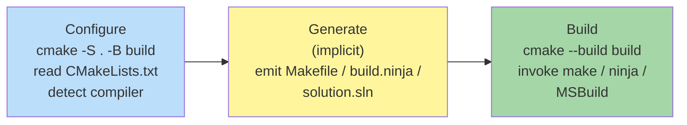

# CMake

**Type:** Cross-platform meta-build system / build-script generator
**Config file:** `CMakeLists.txt` (one per directory)
**Docs:** https://cmake.org/cmake/help/latest/

---

## Contents

- [Key Concepts](#key-concepts)
- [Project Structure](#project-structure)
- [The Three Steps: Configure, Generate, Build](#the-three-steps-configure-generate-build)
- [Targets and Modern CMake](#targets-and-modern-cmake)
- [Dependencies](#dependencies)
- [Common Commands](#common-commands)
- [Where to Find Things](#where-to-find-things)
- [Code Examples](#code-examples)
- [Common Patterns](#common-patterns)
- [Limitations](#limitations)

---

## Key Concepts

| Term | Meaning |
|------|---------|
| **Generator** | Backend CMake produces build files for: Unix Makefiles, Ninja, Visual Studio, Xcode |
| **Configure step** | Runs `CMakeLists.txt` once per build directory, detects compilers, options |
| **Generate step** | Emits the chosen build system's files (Makefile, build.ninja, .sln) |
| **Build step** | Invokes the generator's tool (`make`, `ninja`, MSBuild) |
| **Target** | A library or executable; *"the unit of CMake"* |
| **Property** | Attribute attached to a target (include dirs, compile flags, link libs) |
| **PUBLIC / PRIVATE / INTERFACE** | Visibility qualifiers — propagate through the dependency graph or not |
| **Find module** | `Find<Pkg>.cmake` script that locates a system library |
| **Imported target** | A target representing an external library, so it can flow through `target_link_libraries` |
| **Cache variable** | A persistent variable stored in `CMakeCache.txt` (set with `-DVAR=...`) |

---

## Project Structure

CMake is most natural with **one `CMakeLists.txt` per directory**, the
top-level one calling `add_subdirectory()` for each child.

```text
my-app/
├── CMakeLists.txt
├── include/
│   └── mylib/
│       └── mylib.h
├── src/
│   ├── CMakeLists.txt
│   ├── mylib.cpp
│   └── main.cpp
├── tests/
│   ├── CMakeLists.txt
│   └── test_mylib.cpp
└── build/                # out-of-source build directory (gitignored)
```

Always build out-of-source: `cmake -S . -B build` keeps generated
files outside the source tree.

---

## The Three Steps: Configure, Generate, Build



```bash
# Configure + generate (Ninja)
cmake -S . -B build -G Ninja -DCMAKE_BUILD_TYPE=Release

# Build (calls ninja)
cmake --build build -j

# Install
cmake --install build --prefix /usr/local

# Run tests via CTest
ctest --test-dir build --output-on-failure
```

The configure step runs every time CMake is invoked **but** is incremental
— it caches results in `CMakeCache.txt`. Build options changed via
`-D` re-trigger configuration; subsequent compiles only reflect source
changes.

---

## Targets and Modern CMake

The "modern CMake" style — since CMake 3.0 — is to attach everything
to **targets**, not to global state.

```cmake
# Old style — global, leaks everywhere
include_directories(include)
add_definitions(-DDEBUG)

# Modern — attached to a specific target
target_include_directories(mylib PUBLIC include)
target_compile_definitions(mylib PRIVATE DEBUG)
```

**Visibility qualifiers** (the killer feature):

| Qualifier | Used by target | Propagated to dependents |
|-----------|---------------|--------------------------|
| `PRIVATE` | Yes | No |
| `PUBLIC` | Yes | Yes |
| `INTERFACE` | No | Yes |

Use `PUBLIC` for things that appear in your library's headers; use
`PRIVATE` for things only the implementation needs.

```cmake
target_link_libraries(my-app
    PRIVATE  fmt::fmt        # only my-app needs fmt
    PUBLIC   mylib::mylib    # my-app's headers use mylib's headers too
)
```

---

## Dependencies

Three common ways to bring in external libraries:

### 1. `find_package` — system installs

```cmake
find_package(fmt 9 REQUIRED)
target_link_libraries(my-app PRIVATE fmt::fmt)
```

Looks for installed `fmtConfig.cmake` (or a `Findfmt.cmake` module) in
known paths. Best for system libraries that have CMake config files.

### 2. `FetchContent` — vendor at configure time

```cmake
include(FetchContent)
FetchContent_Declare(
    fmt
    GIT_REPOSITORY https://github.com/fmtlib/fmt.git
    GIT_TAG        10.2.1
)
FetchContent_MakeAvailable(fmt)

target_link_libraries(my-app PRIVATE fmt::fmt)
```

Downloads and adds the dependency as a sub-build. No external package
manager required.

### 3. External package managers

- **vcpkg** — Microsoft, integrates via `CMAKE_TOOLCHAIN_FILE`
- **Conan** — Python-based, generates a CMake toolchain
- **Hunter** — CMake-driven, fully sandboxed

---

## Common Commands

```bash
# Out-of-source build
cmake -S . -B build -G Ninja -DCMAKE_BUILD_TYPE=Debug

# Common option overrides
cmake -S . -B build -DCMAKE_INSTALL_PREFIX=/opt/myapp \
                    -DCMAKE_C_COMPILER=clang \
                    -DCMAKE_CXX_COMPILER=clang++ \
                    -DCMAKE_EXPORT_COMPILE_COMMANDS=ON   # for clangd, IDEs

# Build everything
cmake --build build -j

# Build a specific target
cmake --build build --target mylib

# Clean
cmake --build build --target clean

# Re-run configure (after changing CMakeLists.txt)
cmake --fresh -S . -B build         # CMake 3.24+; clears cache

# Install
cmake --install build --prefix /usr/local

# Run CTest
ctest --test-dir build --output-on-failure
ctest --test-dir build -R unit_     # filter by name regex

# Inspect targets / properties
cmake --build build --target help   # list targets (Make/Ninja)

# Generate compile_commands.json (for clangd / IDEs)
cmake -S . -B build -DCMAKE_EXPORT_COMPILE_COMMANDS=ON
```

---

## Where to Find Things

| What | Where |
|------|-------|
| Build files (Makefile / build.ninja) | `build/` |
| Compiled artifacts (executables, libs) | `build/` (or `build/<subdir>/` for sub-targets) |
| `compile_commands.json` (for clangd/IDEs) | `build/compile_commands.json` |
| CMake cache (variable values) | `build/CMakeCache.txt` |
| CMake configure log | `build/CMakeFiles/CMakeOutput.log` |
| Configure error log | `build/CMakeFiles/CMakeError.log` |
| Test binaries and CTest config | `build/`, `build/CTestTestfile.cmake` |
| CTest results | `build/Testing/Temporary/LastTest.log` |
| Installed CMake config files | `/usr/lib/cmake/<package>/<package>Config.cmake` |
| Installed Find modules | `/usr/share/cmake-*/Modules/Find*.cmake` |

---

## Code Examples

### Minimal `CMakeLists.txt` for an executable

```cmake
cmake_minimum_required(VERSION 3.20)
project(my-app
    VERSION 1.0.0
    LANGUAGES CXX
)

set(CMAKE_CXX_STANDARD 20)
set(CMAKE_CXX_STANDARD_REQUIRED ON)
set(CMAKE_CXX_EXTENSIONS OFF)

add_executable(my-app
    src/main.cpp
)

target_compile_options(my-app PRIVATE
    -Wall -Wextra -Wpedantic
)
```

### Library with public headers + executable + tests

```cmake
cmake_minimum_required(VERSION 3.20)
project(myproject VERSION 1.0.0 LANGUAGES CXX)

set(CMAKE_CXX_STANDARD 20)
set(CMAKE_CXX_STANDARD_REQUIRED ON)

# --- Library
add_library(mylib
    src/mylib.cpp
)

target_include_directories(mylib
    PUBLIC  $<BUILD_INTERFACE:${CMAKE_SOURCE_DIR}/include>
            $<INSTALL_INTERFACE:include>
    PRIVATE src
)

# --- Executable
add_executable(my-app src/main.cpp)
target_link_libraries(my-app PRIVATE mylib)

# --- Tests
enable_testing()
add_subdirectory(tests)

# --- Install
install(TARGETS my-app mylib
    EXPORT  myprojectTargets
    RUNTIME DESTINATION bin
    LIBRARY DESTINATION lib
    ARCHIVE DESTINATION lib
)

install(DIRECTORY include/ DESTINATION include)
```

### `tests/CMakeLists.txt` with GoogleTest via FetchContent

```cmake
include(FetchContent)
FetchContent_Declare(
    googletest
    URL https://github.com/google/googletest/archive/refs/tags/v1.14.0.tar.gz
)
FetchContent_MakeAvailable(googletest)

add_executable(test_mylib test_mylib.cpp)
target_link_libraries(test_mylib PRIVATE mylib GTest::gtest_main)

include(GoogleTest)
gtest_discover_tests(test_mylib)
```

---

## Common Patterns

### Build types

```bash
cmake -S . -B build -DCMAKE_BUILD_TYPE=Release
# Or: Debug, RelWithDebInfo, MinSizeRel
```

For multi-config generators (Visual Studio, Xcode), pick at build time:

```bash
cmake --build build --config Release
```

### Presets (CMake 3.19+)

`CMakePresets.json` captures common configurations:

```json
{
  "version": 6,
  "configurePresets": [
    {
      "name": "release",
      "generator": "Ninja",
      "binaryDir": "build/release",
      "cacheVariables": {
        "CMAKE_BUILD_TYPE": "Release",
        "CMAKE_EXPORT_COMPILE_COMMANDS": "ON"
      }
    }
  ],
  "buildPresets": [
    { "name": "release", "configurePreset": "release" }
  ]
}
```

```bash
cmake --preset release
cmake --build --preset release
```

### Cross-compiling

```cmake
# toolchain.cmake
set(CMAKE_SYSTEM_NAME Linux)
set(CMAKE_SYSTEM_PROCESSOR aarch64)
set(CMAKE_C_COMPILER aarch64-linux-gnu-gcc)
set(CMAKE_CXX_COMPILER aarch64-linux-gnu-g++)
```

```bash
cmake -S . -B build-arm64 -DCMAKE_TOOLCHAIN_FILE=toolchain.cmake
```

---

## Limitations

- **Two languages** — CMake's own DSL plus the underlying generator's
  semantics; debugging is split across both
- **Variable scope confusion** — variables can be local, parent-scope,
  or cache; `set(VAR ...)` vs `set(VAR ... PARENT_SCOPE)` vs
  `set(VAR ... CACHE STRING ...)` are subtly different
- **String everywhere** — almost everything in CMake is a string;
  lists are `;`-separated strings; quoting rules are tricky
- **Configure step is slow on cold runs** — re-checking compilers and
  features each time
- **No hermeticity** — like Make, depends on whatever's on the system
- **Find modules vary in quality** — some `FindXxx.cmake` modules are
  stale; check whether the upstream library ships its own `XxxConfig.cmake`
- **Old code has different style** — codebases that started before 3.0
  use global `include_directories`, `add_definitions`; mixing styles is
  a recipe for confusion
- **Generator expressions are powerful but cryptic** — `$<BUILD_INTERFACE:...>`,
  `$<INSTALL_INTERFACE:...>`, `$<CONFIG:Debug>` etc. take time to learn

---

## Related

- [Make](make.md) — one of CMake's generator backends
- [Bazel](bazel.md) — alternative for cross-platform polyglot native code
- [Build Systems Overview](index.md) — comparison and core concepts
- [CI/CD Providers](../ci-cd/index.md) — `cmake --build` is the canonical CI call
</content>
