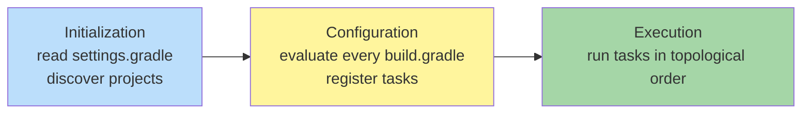
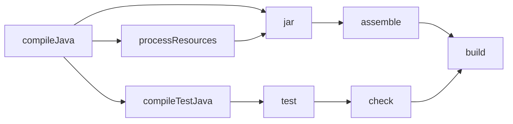

# Gradle

**Type:** Task-graph build system for the JVM and polyglot projects
**Config file:** `build.gradle` (Groovy DSL) or `build.gradle.kts` (Kotlin DSL)
**Docs:** https://docs.gradle.org/current/userguide/userguide.html

---

## Contents

- [Key Concepts](#key-concepts)
- [Project Structure](#project-structure)
- [Build Phases and Task Graph](#build-phases-and-task-graph)
- [Dependencies and Repositories](#dependencies-and-repositories)
- [Common Commands](#common-commands)
- [Where to Find Things](#where-to-find-things)
- [Code Examples](#code-examples)
- [Common Patterns](#common-patterns)
- [Limitations](#limitations)

---

## Key Concepts

| Term | Meaning |
|------|---------|
| **Project** | A buildable component; one `build.gradle(.kts)` per project |
| **Settings** | `settings.gradle(.kts)` — declares the root and sub-projects |
| **Task** | A unit of work (`compileJava`, `test`, `jar`); has inputs and outputs |
| **Task graph** | The DAG Gradle constructs from task dependencies |
| **Plugin** | Adds tasks and conventions (`java`, `application`, `org.springframework.boot`) |
| **Configuration** | A bucket of dependencies (`implementation`, `testImplementation`, `runtimeOnly`) |
| **DSL** | Groovy or Kotlin domain-specific language for the build script |
| **Build cache** | Reuses task outputs from previous runs (local or remote) |
| **Configuration cache** | Caches the configured task graph itself, skipping configuration on re-runs |
| **Wrapper** | `gradlew` script that downloads and runs a pinned Gradle version |
| **Convention plugin** | Custom plugin in `buildSrc/` or `build-logic/` that bundles your project's conventions |

---

## Project Structure

Gradle uses the same conventional layout as Maven but is more permissive:

```text
my-app/
├── settings.gradle.kts
├── build.gradle.kts
├── gradle/
│   ├── wrapper/
│   │   ├── gradle-wrapper.jar
│   │   └── gradle-wrapper.properties
│   └── libs.versions.toml         # version catalog
├── gradlew                        # wrapper (Linux/macOS)
├── gradlew.bat                    # wrapper (Windows)
└── src/
    ├── main/
    │   ├── java/
    │   ├── kotlin/
    │   └── resources/
    └── test/
        ├── java/
        ├── kotlin/
        └── resources/
```

Multi-project (multi-module):

```text
root/
├── settings.gradle.kts            # include("module-a", "module-b")
├── build.gradle.kts               # shared config (allprojects / subprojects)
├── module-a/
│   ├── build.gradle.kts
│   └── src/main/kotlin/
└── module-b/
    ├── build.gradle.kts
    └── src/main/kotlin/
```

---

## Build Phases and Task Graph

A Gradle build proceeds in three phases:



Tasks declare inputs and outputs; Gradle builds a DAG from `dependsOn`
relationships and walks it in topological order, skipping tasks whose
inputs haven't changed (**up-to-date check**) or whose outputs are
already in the **build cache**.



`./gradlew build` triggers the rightmost task — Gradle figures out the
rest from the graph.

---

## Dependencies and Repositories

Dependencies belong to **configurations**:

```kotlin
dependencies {
    implementation("org.springframework.boot:spring-boot-starter-web:3.2.0")
    runtimeOnly("com.h2database:h2:2.2.224")
    testImplementation("org.junit.jupiter:junit-jupiter:5.10.0")
    annotationProcessor("org.projectlombok:lombok:1.18.30")
}

repositories {
    mavenCentral()
    google()
    maven("https://repo.example.com/releases")
}
```

| Configuration | Visible at | Use for |
|---------------|------------|---------|
| `implementation` | Compile + runtime, not exposed downstream | Most dependencies |
| `api` | Compile + runtime, exposed to consumers | Library APIs |
| `runtimeOnly` | Runtime only | DB drivers, log backends |
| `compileOnly` | Compile only (not runtime) | Annotations, `provided` semantics |
| `testImplementation` | Test compile + runtime | JUnit, Mockito |
| `annotationProcessor` | Compile-time annotation processing | Lombok, MapStruct |

**Version catalogs** (`gradle/libs.versions.toml`) centralise versions
across modules:

```toml
[versions]
spring-boot = "3.2.0"
junit = "5.10.0"

[libraries]
spring-boot-web = { module = "org.springframework.boot:spring-boot-starter-web", version.ref = "spring-boot" }
junit-jupiter = { module = "org.junit.jupiter:junit-jupiter", version.ref = "junit" }
```

```kotlin
dependencies {
    implementation(libs.spring.boot.web)
    testImplementation(libs.junit.jupiter)
}
```

---

## Common Commands

```bash
# Always use the wrapper (./gradlew on Unix, gradlew.bat on Windows)
./gradlew build                    # default: assemble + check
./gradlew assemble                 # build artifacts, skip tests
./gradlew test                     # run tests
./gradlew :module-a:test           # one module's tests
./gradlew check                    # all verification (test + lint + ...)
./gradlew clean                    # delete build/ directories

./gradlew tasks                    # list available tasks
./gradlew tasks --all              # include subordinate tasks
./gradlew help --task <name>       # documentation for one task

./gradlew dependencies             # show resolved configurations
./gradlew dependencyInsight --dependency slf4j-api  # who pulls this in?

./gradlew build --scan             # generate a remote build scan (gradle.com)

# Performance
./gradlew build --parallel         # parallel project execution
./gradlew build --configuration-cache
./gradlew build --build-cache
./gradlew build --offline          # use cached dependencies only
./gradlew --stop                   # stop the Gradle daemon
./gradlew --status                 # daemon status
```

---

## Where to Find Things

| What | Where |
|------|-------|
| Per-user dependency cache | `~/.gradle/caches/modules-2/files-2.1/` |
| Per-user Gradle distributions | `~/.gradle/wrapper/dists/` |
| Per-user build cache (local) | `~/.gradle/caches/build-cache-1/` |
| Per-user init scripts | `~/.gradle/init.d/` |
| Per-user properties (proxy, credentials) | `~/.gradle/gradle.properties` |
| Build output (project-level) | `build/` |
| Compiled classes | `build/classes/java/main/` (and `kotlin/main`) |
| Test reports | `build/reports/tests/test/index.html` |
| JAR / dist output | `build/libs/<name>-<version>.jar` |
| Daemon log | `~/.gradle/daemon/<version>/daemon-<n>.out.log` |
| Effective task graph | `./gradlew build --dry-run` |
| Wrapper version | `gradle/wrapper/gradle-wrapper.properties` |

---

## Code Examples

### Minimal Kotlin DSL `build.gradle.kts`

```kotlin
plugins {
    java
    application
}

group = "com.example"
version = "1.0.0-SNAPSHOT"

repositories {
    mavenCentral()
}

dependencies {
    implementation("org.slf4j:slf4j-simple:2.0.9")
    testImplementation("org.junit.jupiter:junit-jupiter:5.10.0")
    testRuntimeOnly("org.junit.platform:junit-platform-launcher")
}

application {
    mainClass.set("com.example.App")
}

tasks.withType<JavaCompile> {
    options.release.set(21)
}

tasks.test {
    useJUnitPlatform()
}
```

### `settings.gradle.kts`

```kotlin
rootProject.name = "my-app"
include("module-a", "module-b")

dependencyResolutionManagement {
    repositories {
        mavenCentral()
    }
    versionCatalogs {
        create("libs") {
            from(files("gradle/libs.versions.toml"))
        }
    }
}
```

### Custom task

```kotlin
tasks.register("greet") {
    description = "Prints a greeting"
    group = "custom"
    doLast {
        println("Hello, ${project.name}!")
    }
}

// Cache-aware task
tasks.register<Copy>("copyDocs") {
    from("src/docs")
    into(layout.buildDirectory.dir("docs"))
}
```

### Spring Boot

```kotlin
plugins {
    java
    id("org.springframework.boot") version "3.2.0"
    id("io.spring.dependency-management") version "1.1.4"
}

dependencies {
    implementation("org.springframework.boot:spring-boot-starter-web")
}
```

The Spring dependency-management plugin imports Spring's BOM, so
versions on individual `spring-boot-starter-*` deps are unnecessary.

---

## Common Patterns

### Wrapper

Always commit `gradlew`, `gradlew.bat`, and `gradle/wrapper/` to the
repo. Pin the version:

```bash
./gradlew wrapper --gradle-version 8.5 --distribution-type all
```

### Convention plugins (`buildSrc` or `build-logic`)

Move shared build logic out of every module's `build.gradle.kts` into
a separate plugin module. Place at `buildSrc/src/main/kotlin/my-conventions.gradle.kts`:

```kotlin
plugins {
    java
    `jvm-test-suite`
}

group = "com.example"

java {
    toolchain.languageVersion.set(JavaLanguageVersion.of(21))
}

tasks.test {
    useJUnitPlatform()
}
```

Apply in modules with `plugins { id("my-conventions") }`.

### Jib (containerise without a Dockerfile)

```kotlin
plugins {
    id("com.google.cloud.tools.jib") version "3.4.0"
}

jib {
    to {
        image = "registry.example.com/my-app:${project.version}"
    }
}
```

`./gradlew jib` builds and pushes a layered OCI image.

### Configuration cache

Opt in for ~30-50% configuration speedup on warm runs:

```properties
# gradle.properties
org.gradle.configuration-cache=true
org.gradle.parallel=true
org.gradle.caching=true
```

---

## Limitations

- **Configuration vs execution confusion** — code at the top level of
  `build.gradle.kts` runs at configuration time; what's inside `doLast { }` runs at execution time. Beginners mix these up
- **Daemon and JVM startup** — Gradle keeps a daemon JVM alive to amortise
  startup; cold start (CI) is slower than Maven for tiny projects
- **DSL discoverability** — figuring out which method is on which receiver
  in deep DSL nesting is hard; IDE help varies
- **Plugin compatibility churn** — major Gradle versions break older plugins;
  upgrading often requires plugin updates
- **Groovy DSL traps** — string interpolation, dynamic resolution, missing
  type info; **prefer Kotlin DSL** for new projects
- **Build script as code = build script bugs** — full programming
  language means the bugs are richer than Maven's
- **Slower than Bazel for very large repos** — sub-project model has
  per-project overhead Bazel avoids

---

## Related

- [Maven](maven.md) — XML cousin, more rigid but more conventional
- [sbt](sbt.md) — sibling Scala-native build tool
- [Bazel](bazel.md) — what to consider when Gradle becomes too slow at scale
- [Build Systems Overview](index.md) — comparison and core concepts
- [Java](../../../languages/java/index.md) — primary ecosystem
- [CI/CD Providers](../ci-cd/index.md) — `./gradlew build` runs inside CI
- [Containers & Orchestration](../../containers/index.md) — Jib plugin produces OCI images
</content>
