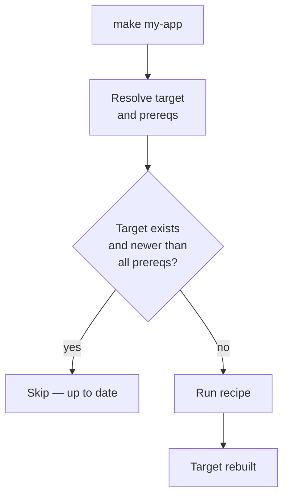

# Make

**Type:** Dependency-graph task runner; the original build tool
**Config file:** `Makefile` (or `makefile` / `GNUmakefile`)
**Docs:** https://www.gnu.org/software/make/manual/make.html

---

## Contents

- [Key Concepts](#key-concepts)
- [Project Structure](#project-structure)
- [How Make Decides What to Rebuild](#how-make-decides-what-to-rebuild)
- [Variables and Functions](#variables-and-functions)
- [Common Commands](#common-commands)
- [Where to Find Things](#where-to-find-things)
- [Code Examples](#code-examples)
- [Common Patterns](#common-patterns)
- [Limitations](#limitations)

---

## Key Concepts

| Term | Meaning |
|------|---------|
| **Target** | The thing being built — a file or a label |
| **Prerequisite** | A file the target depends on |
| **Recipe** | The shell commands to build the target (must start with a TAB) |
| **Rule** | `target: prerequisites` followed by a recipe |
| **Phony target** | A target that isn't a real file (`clean`, `test`, `all`); declared via `.PHONY` |
| **Pattern rule** | `%.o: %.c` — applies to any pair matching the pattern |
| **Implicit rule** | Built-in rules Make applies automatically (e.g., `.c → .o`) |
| **Automatic variable** | `$@` (target), `$<` (first prereq), `$^` (all prereqs), `$*` (stem) |
| **Variable** | `CC = gcc`; expanded as `$(CC)` |
| **Conditional** | `ifeq`, `ifdef`, `ifneq` blocks at parse time |
| **Function** | `$(wildcard *.c)`, `$(patsubst ...)`, `$(shell ...)` |

---

## Project Structure

Make has no convention. A typical small C project:

```text
my-app/
├── Makefile
├── include/
│   └── foo.h
├── src/
│   ├── foo.c
│   └── main.c
└── build/        # output (created by Makefile)
    ├── foo.o
    ├── main.o
    └── my-app
```

Larger projects often have recursive Makefiles (one per directory) or
a single non-recursive Makefile that includes per-directory `*.mk`
fragments.

---

## How Make Decides What to Rebuild

Make compares **modification timestamps**. A target is rebuilt when:

1. The target file does not exist, or
2. Any prerequisite is newer than the target



This is **fast** but **fragile**:

- Clock skew (NFS, network drives) can confuse timestamps
- Removing source files doesn't trigger a rebuild
- Editing compiler flags isn't tracked
- Header dependencies must be declared manually (or auto-generated with
  `gcc -MMD -MP`)

Make does **not** sandbox; recipes run in the user's shell with full
filesystem access. There's no built-in remote cache.

---

## Variables and Functions

```makefile
# Recursive (re-expanded each use) — usually surprising
CC = gcc

# Simple (expanded once at definition) — usually what you want
CFLAGS := -Wall -Wextra -O2 -g -std=c11

# Conditional default (set if not already set)
DESTDIR ?= /usr/local

# Append
CFLAGS += -Werror

# Functions
SOURCES := $(wildcard src/*.c)
OBJECTS := $(patsubst src/%.c,build/%.o,$(SOURCES))

# Shell expansion (use sparingly — runs at parse time)
GIT_REV := $(shell git rev-parse --short HEAD)
```

**Automatic variables in recipes:**

| Variable | Meaning |
|----------|---------|
| `$@` | The target |
| `$<` | The first prerequisite |
| `$^` | All prerequisites (deduplicated) |
| `$+` | All prerequisites (with duplicates) |
| `$?` | Prerequisites newer than the target |
| `$*` | The stem of a pattern match |

---

## Common Commands

```bash
make                    # build the first target in the Makefile
make all                # explicit target
make clean              # phony target, usually deletes build artifacts
make -j8                # parallel: 8 concurrent jobs
make -j$(nproc)         # parallel: one job per core
make -B                 # force rebuild of all targets
make -n                 # dry-run: print recipes without executing
make -p                 # print Make's database (variables, rules)
make --debug=v          # verbose dependency-graph debugging
make -C subdir          # cd into subdir before running
make VAR=value          # override a variable from the command line
make -f BuildScript     # use a non-default Makefile name
```

---

## Where to Find Things

| What | Where |
|------|-------|
| Build script | `Makefile` (or `makefile`, `GNUmakefile`) in CWD |
| Output artifacts | Wherever the recipes write them — Make has no convention |
| Header dependency files | Usually `*.d` next to `*.o` (gcc auto-generated) |
| Implicit rules database | `make -p` (very long) |
| Per-user `MAKEFLAGS` | `~/.bashrc` or `~/.profile` (e.g., `MAKEFLAGS=-j8`) |
| GNU Make manual | `info make` or [gnu.org/software/make](https://www.gnu.org/software/make/manual/) |

---

## Code Examples

### Minimal Makefile for a C program

```makefile
CC      := gcc
CFLAGS  := -Wall -Wextra -O2 -g -std=c11 -Iinclude
LDFLAGS :=

SRC_DIR := src
OBJ_DIR := build
BIN     := $(OBJ_DIR)/my-app

SOURCES := $(wildcard $(SRC_DIR)/*.c)
OBJECTS := $(patsubst $(SRC_DIR)/%.c,$(OBJ_DIR)/%.o,$(SOURCES))
DEPS    := $(OBJECTS:.o=.d)

.PHONY: all clean test

all: $(BIN)

$(BIN): $(OBJECTS)
	@mkdir -p $(@D)
	$(CC) $(LDFLAGS) -o $@ $^

$(OBJ_DIR)/%.o: $(SRC_DIR)/%.c
	@mkdir -p $(@D)
	$(CC) $(CFLAGS) -MMD -MP -c $< -o $@

-include $(DEPS)

clean:
	rm -rf $(OBJ_DIR)

test: $(BIN)
	./$(BIN) --self-test
```

The `-MMD -MP` flags make gcc emit `.d` files containing `%.o: %.c %.h`
header dependencies. `-include $(DEPS)` pulls them in so editing a
header re-triggers compilation.

### Makefile as a polyglot task runner

Many projects use Make to wrap higher-level commands:

```makefile
.PHONY: lint test build docker push help

help:           ## Print this help
	@grep -E '^[a-zA-Z_-]+:.*?## ' $(MAKEFILE_LIST) | \
	  awk 'BEGIN {FS = ":.*?## "}; {printf "%-15s %s\n", $$1, $$2}'

lint:           ## Run linters
	ruff check .
	mypy src

test:           ## Run tests
	pytest -q

build:          ## Build the wheel
	python -m build

docker:         ## Build the container image
	docker build -t my-app:$(shell git rev-parse --short HEAD) .

push: docker    ## Push the image
	docker push my-app:$(shell git rev-parse --short HEAD)
```

Run `make help` to see the documented targets.

---

## Common Patterns

### Phony targets

Always declare non-file targets `.PHONY` so a file named `clean` or
`test` doesn't break the build:

```makefile
.PHONY: all clean test install
```

### Out-of-tree builds

Putting outputs in `build/` (and adding `build/` to `.gitignore`) keeps
sources clean:

```makefile
$(OBJ_DIR)/%.o: $(SRC_DIR)/%.c
	@mkdir -p $(@D)
	$(CC) $(CFLAGS) -c $< -o $@
```

### Multi-platform conditionals

```makefile
UNAME_S := $(shell uname -s)
ifeq ($(UNAME_S),Darwin)
    LDFLAGS += -framework CoreFoundation
endif
ifeq ($(UNAME_S),Linux)
    LDFLAGS += -lpthread
endif
```

### Generated headers

```makefile
include/version.h: .git/HEAD
	echo "#define VERSION \"$(shell git describe --tags)\"" > $@

src/main.c: include/version.h    # force order
```

---

## Limitations

- **Tabs, not spaces** — recipes must start with a literal TAB character.
  Mixing this up gives the famously cryptic *"missing separator"* error
- **No dependency declaration for non-files** — Make can't know that
  changing `CFLAGS` should trigger a rebuild; you bolt this on yourself
- **No package management** — Make doesn't fetch dependencies; it's a
  task runner over a filesystem
- **Recursive Make is harmful** — running `make` in subdirectories breaks
  the global dependency graph; see Peter Miller's classic 1997 paper of
  the same title
- **Variable expansion subtleties** — `=` vs `:=`, parse-time vs
  recipe-time, `$$` to escape `$` for shell — all common gotchas
- **No incremental hash-based fingerprinting** — relies on timestamps;
  if a file is touched without content change, Make rebuilds
- **Portability** — GNU Make features (functions, conditionals) don't
  work in BSD make; portable Makefiles are sparse and verbose
- **No remote cache, no hermeticity** — recipes inherit the user's
  environment. CI and local builds can produce different artifacts

---

## Related

- [CMake](cmake.md) — uses Make (or Ninja) as a backend; adds
  cross-platform configuration on top
- [Bazel](bazel.md) — solves Make's hermeticity and remote-cache gaps
- [Build Systems Overview](index.md) — comparison and core concepts
- [CI/CD Providers](../ci-cd/index.md) — many CI scripts ultimately
  invoke `make`
</content>
