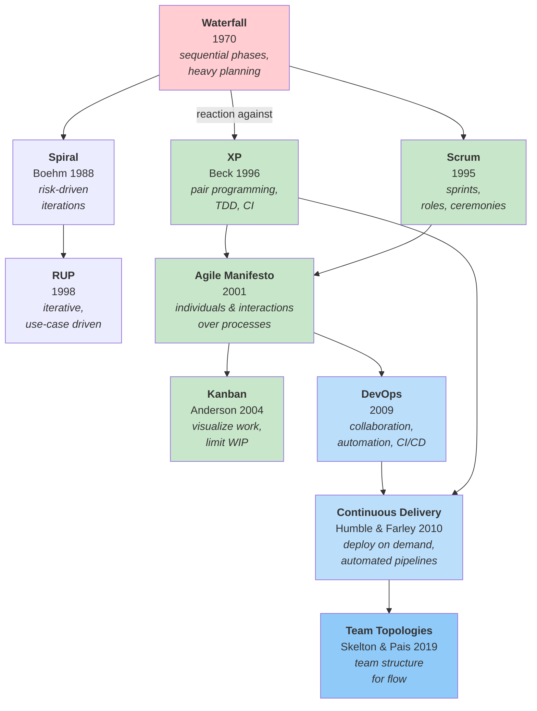
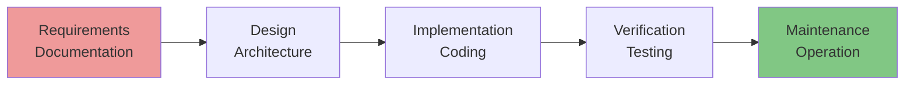
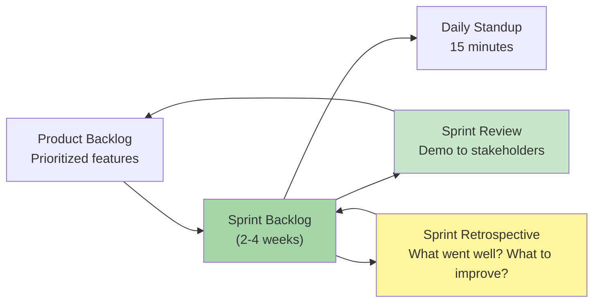
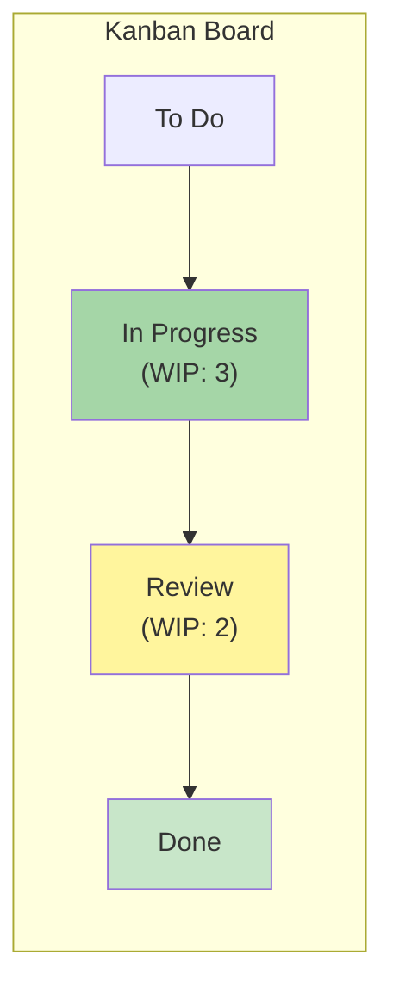
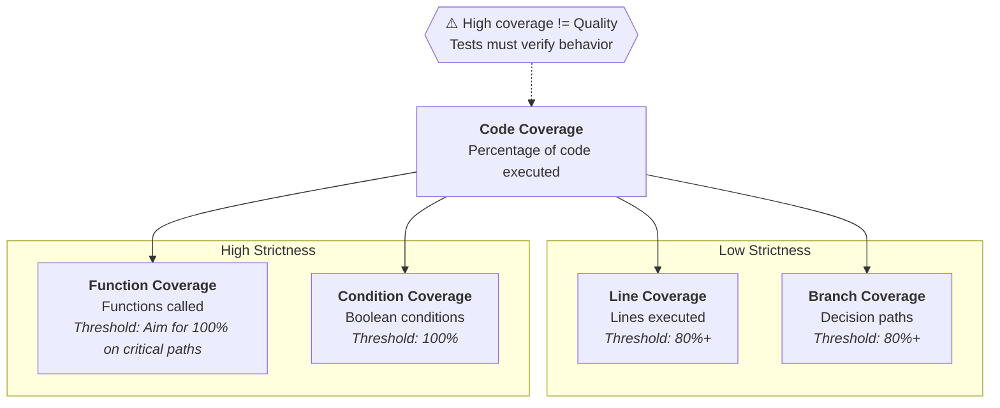
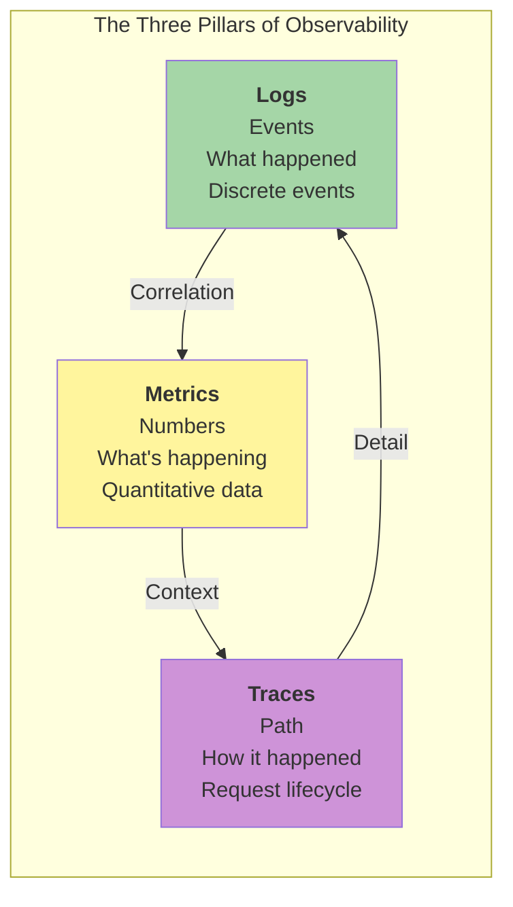
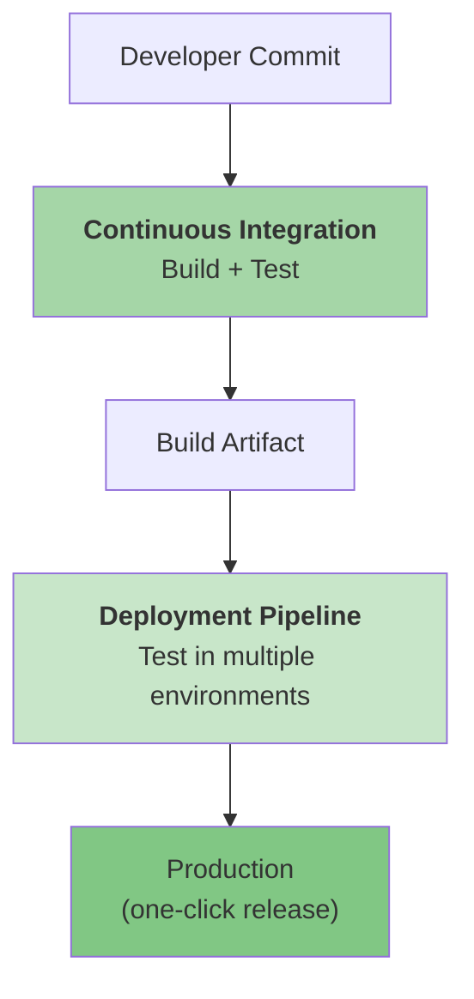
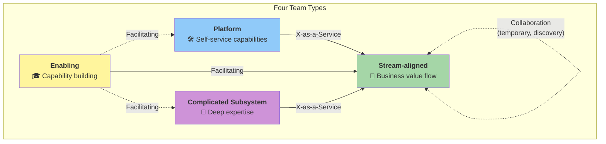
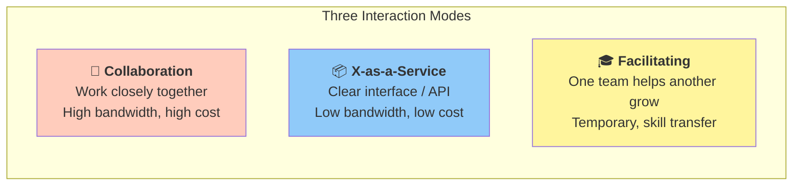
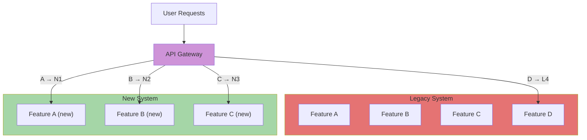

# Process

How teams organize to build software. Process encompasses **methodologies**
(like Scrum or Kanban), **technical practices** (like TDD or CI/CD),
and **team organization** (like DevOps or Team Topologies).

The evolution from Waterfall through Spiral and RUP to Agile to DevOps
reflects a fundamental shift: from planning everything upfront to
embracing uncertainty through continuous feedback.

## Contents

- [History & Context](#history--context)
  - [The Big Picture](#the-big-picture)
  - [Waterfall (1970)](#waterfall-1970)
  - [The Bridge: Spiral and RUP](#the-bridge-spiral-and-rup)
  - [The Agile Manifesto (2001)](#the-agile-manifesto-2001)
  - [Timeline](#timeline)
- [Team Process](#team-process)
  - [Extreme Programming — XP (1996)](#extreme-programming--xp-1996)
  - [Scrum (1995)](#scrum-1995)
  - [Kanban (2004)](#kanban-2004)
  - [Requirements & Planning](#requirements--planning)
- [Technical Practices](#technical-practices)
  - [Testing Practices](#testing-practices)
  - [Refactoring (1999)](#refactoring-1999)
  - [Code Quality](#code-quality)
  - [Static Analysis](#static-analysis)
  - [Observability](#observability)
  - [Technical Debt](#technical-debt)
- [Operations](#operations)
  - [DevOps (2009)](#devops-2009)
  - [Continuous Delivery (2010)](#continuous-delivery-2010)
  - [Containerization (2013)](#containerization-2013)
  - [Site Reliability Engineering — SRE (2016)](#site-reliability-engineering--sre-2016)
  - [Team Topologies (2019)](#team-topologies-2019)
  - [Code Review](#code-review)
- [Build Systems](#build-systems)
  - [Overview of Build Systems](#overview-of-build-systems)
  - [Make](#make)
  - [CMake](#cmake)
  - [Maven](#maven)
  - [Gradle](#gradle)
  - [sbt](#sbt)
  - [npm](#npm)
  - [Cargo](#cargo)
  - [Bazel](#bazel)
- [CI/CD Providers](#cicd-providers)
  - [Overview](#overview)
  - [GitHub Actions](#github-actions)
  - [GitLab CI/CD](#gitlab-cicd)
  - [Jenkins](#jenkins)
  - [CircleCI](#circleci)
  - [Azure DevOps Pipelines](#azure-devops-pipelines)
  - [Bitbucket Pipelines](#bitbucket-pipelines)
  - [TeamCity](#teamcity)
- [System Evolution](#system-evolution)
  - [Software Evolution & Lehman's Laws](#software-evolution--lehmans-laws)
  - [The Strangler Fig Pattern](#the-strangler-fig-pattern)
  - [API Versioning](#api-versioning)
  - [Migration Strategies](#migration-strategies)
- [The Pragmatic View](#the-pragmatic-view)
- [Further Reading](#further-reading)
- [Key Authors](#key-authors)
- [Related Topics](#related-topics)

---

## History & Context

Where modern process thinking came from. Understanding the history
explains *why* practices exist — not just what they are.

### The Big Picture



### Waterfall (1970)

**Core idea:** Complete each phase before the next begins.



**Origin:** Winston Royce (1970) described this sequential model as a baseline architecture, noting that without multiple feedback loops, it is highly prone to failure. Unfortunately, the simplified sequential variant became the industry standard anyway.

**Strengths:**
- Clear documentation
- Predictable for well-understood, static problems
- Works in highly regulated industries (medical, aerospace)

**Weaknesses:**
- Late feedback (testing happens after all code is written)
- High cost of late-stage design modifications
- Assumes requirements can be locked down upfront

**Brooks's Law** (1975) is a classic project management insight from the Waterfall era:

> "Adding manpower to a late software project makes it later."

New team members require onboarding, communication overhead grows exponentially, and software tasks are rarely perfectly partitionable.

→ [Fred Brooks](../../authors/fred-brooks.md) ·
[The Mythical Man-Month](../../works/books/brooks-1975-mmm.md)

### The Bridge: Spiral and RUP

Before Agile, alternative methodologies tried to keep the structure of plan-driven development while introducing iteration and feedback:

#### Spiral Model (1988)

**Core idea:** Iterate while explicitly managing risk.

Barry Boehm's Spiral Model treats risk analysis as the core driver of the process. Each loop usually includes:

1. Define objectives and constraints
2. Identify and resolve risks (via prototyping/simulation)
3. Develop and verify the next-level product
4. Plan the next iteration

**Why it matters:**
- Risk management is treated as a first-class citizen
- Early prototyping reduces major architectural unknowns

#### Rational Unified Process — RUP (1998)

**Core idea:** An iterative, use-case driven, architecture-centric process.

RUP formalised iterative development for larger enterprise projects. It is organised into four phases:

- **Inception** — define scope and business case
- **Elaboration** — stabilise architecture and address major risks
- **Construction** — build the system incrementally
- **Transition** — deliver to users and refine in production

### The Agile Manifesto (2001)

In February 2001, 17 software developers met at Snowbird, Utah.
They signed the **Agile Manifesto**:

> **Individuals and interactions** over processes and tools
>
> **Working software** over comprehensive documentation
>
> **Customer collaboration** over contract negotiation
>
> **Responding to change** over following a plan

The manifesto articulated a set of values that XP, Scrum, Kanban, and other agile approaches share.

→ [Martin Fowler](../../authors/martin-fowler.md)

### Timeline

| Year | Event | Impact |
|------|-------|--------|
| 1970 | Waterfall formalised (Royce) | Sequential phases became standard |
| 1975 | *The Mythical Man-Month* (Brooks) | Understanding of project complexity |
| 1980 | Lehman's Laws of Software Evolution | Understanding software changes over time |
| 1988 | Spiral Model paper published (Boehm) | Formal risk-driven iterative model |
| 1992 | Technical debt metaphor (Cunningham) | Framework for discussing shortcuts |
| 1995 | Scrum formalised (Sutherland, Schwaber) | Iterative delivery |
| 1996 | Extreme Programming (Beck) | First comprehensive agile methodology |
| 1998 | Rational Unified Process (RUP) | Iterative, use-case driven enterprise process |
| 1999 | *Refactoring* (Fowler) | Systematised design improvement |
| 1999 | SUnit / JUnit (Beck, Gamma) | Unit testing mainstream |
| 2000 | QuickCheck (Hughes & Claessen) | Property-based testing |
| 2001 | Agile Manifesto signed | Shared values across methodologies |
| 2002 | *TDD by Example* (Beck) | TDD as design technique |
| 2004 | *Working Effectively with Legacy Code* (Feathers) | Legacy code, characterization tests |
| 2004 | Kanban for software (Anderson) | Flow-based process at Microsoft |
| 2007 | Amazon Dynamo Paper | AP-system model publicized (vector clocks, leaderless) |
| 2009 | DevOps movement begins | Dev + Ops collaboration |
| 2010 | *Continuous Delivery* (Humble, Farley) | Automated deployment pipelines |
| 2016 | *Site Reliability Engineering* (Google) | SRE discipline, error budgets |
| 2018 | *Accelerate* (Forsgren, Humble, Kim) | Evidence for DevOps practices |
| 2019 | *Team Topologies* (Skelton, Pais) | Team structure for flow |

---

## Team Process

How teams organise their work — methodologies, roles, ceremonies,
and the practices that govern what gets built and when.

### Extreme Programming — XP (1996)

**Core idea:** Embrace change through intense technical practices.

XP was the **first comprehensive agile methodology**, bringing engineering practices to the forefront of the process.

#### XP Values
- **Communication** — face-to-face conversation over documentation
- **Simplicity** — do the simplest thing that works (YAGNI)
- **Feedback** — short iterations, continuous testing, frequent releases
- **Courage** — refactor aggressively, throw away bad code
- **Respect** — sustainable pace, no overtime

#### XP Practices

| Practice | What it is |
|----------|-------------|
| **Pair Programming** | Two developers, one keyboard (driver & navigator) |
| **TDD** | Write tests before code |
| **Continuous Integration** | Integrate and test multiple times per day |
| **Refactoring** | Continuously improve design |
| **Small Releases** | Deliver working software frequently |
| **Collective Ownership** | Anyone can change any code |
| **Sustainable Pace** | Maintain 40-hour work weeks to preserve quality |

→ [Kent Beck](../../authors/kent-beck.md)

### Scrum (1995)

**Core idea:** Work in fixed-length iterations called Sprints.

Scrum was formalised by Jeff Sutherland and Ken Schwaber, drawing on "The New New Product Development Game" (Takeuchi & Nonaka, 1986).

#### Scrum Framework



#### Scrum Roles (2020 Update)

Under the Scrum Guide 2020 update, the concept of a separate "Development Team" within the Scrum Team was abolished. Now, there is a single **Scrum Team** containing three specific roles:

| Role | Responsibility |
|------|----------------|
| **Product Owner** | Maximising product value, managing the Product Backlog, ROI |
| **Scrum Master** | Establishing Scrum, removing impediments, team effectiveness |
| **Developers** | Creating the usable increment, tracking progress, quality |

#### Scrum Ceremonies
- **Sprint Planning** — What can be delivered in this Sprint, and how?
- **Daily Scrum** — 15-minute daily sync for Developers to plan the next 24 hours
- **Sprint Review** — Inspect the Sprint outcome and determine future adaptations
- **Sprint Retrospective** — Plan ways to increase quality and effectiveness

---

### Kanban (2004)

**Core idea:** Visualize work, limit work in progress, and manage flow.

David Anderson adapted Kanban (derived from the Toyota production system) for software development. Unlike Scrum, Kanban is continuous and does not use fixed-length iterations.

#### The Kanban Board



#### Kanban Principles

| Principle | Meaning |
|-----------|---------|
| **Visualize work** | Make work visible on a board |
| **Limit WIP** | Limit work in progress to prevent bottlenecks |
| **Manage flow** | Optimise for throughput, not utilisation |
| **Make policies explicit** | Clear definition of "done" for each column |
| **Improve collaboratively** | Evolve based on feedback and metrics |

#### Scrum vs Kanban

| Aspect | Scrum | Kanban |
|--------|--------|---------|
| **Cadence** | Fixed sprints (1-4 weeks) | Continuous flow |
| **Roles** | Defined (PO, SM, Developers) | Optional |
| **WIP limits** | Implicit (sprint capacity) | Explicit per column |
| **Estimates** | Required (story points) | Optional (often cycle time metrics) |
| **Change** | Mid-sprint changes discouraged | Changes can happen anytime |

---

### Requirements & Planning

#### Traditional vs Agile Requirements

| Aspect | Traditional (Waterfall) | Agile |
|---------|----------------------|-------|
| **Timing** | All upfront | Continuous discovery |
| **Format** | Large SRS documents | User stories, backlogs |
| **Changes** | Expensive | Welcomed |
| **Focus** | Feature list | Value delivery |

#### Use Cases

**Use case** — description of how a user interacts with a system to achieve a goal. Introduced by Ivar Jacobson (1992):

```
Use Case: Withdraw Cash
Actor: ATM Customer
Goal: Get cash from account

Main flow:
1. Customer inserts card
2. ATM validates card
3. Customer enters amount
4. ATM checks balance
5. ATM dispenses cash
6. Customer takes card and cash
```

→ [Ivar Jacobson — OOSE](../../authors/ivar-jacobson.md)

#### User Stories & INVEST

**User story** — short description of a feature from a user's perspective.

**INVEST Criteria:**
- **I**ndependent — Can be developed separately
- **N**egotiable — Details can be discussed
- **V**aluable — Delivers value to users
- **E**stimable — Team can estimate effort
- **S**mall — Can be completed in one iteration
- **T**estable — Success can be verified

#### Story Points & Planning Poker

Story points are a **relative measure** of complexity, risk, and effort. They are not hours.

**Planning Poker** is a consensus-based estimation technique used to avoid anchoring bias. Team members select estimation cards simultaneously, ensuring silent individual estimation before discussion.

#### The Cone of Uncertainty

```
Estimation Range Multiplier:
Feasibility:  0.25x <-----> 4.0x
Requirements: 0.50x <---> 2.0x
Design:       0.67x <-> 1.5x
Coding:       0.80x <-> 1.25x
```
*Implication:* Do not commit to fixed-price, fixed-scope deadlines far in advance. Re-estimate as project unknowns resolve.

---

## Technical Practices

How individual developers and teams write, test, and improve code.

### Testing Practices

Testing has its own topic — see [Testing](../testing/index.md) for TDD, the Testing Pyramid, Test Doubles, Property-Based Testing, BDD, Mutation Testing, Fuzzing, and Contract Testing.

---

### Refactoring (1999)

**Core idea:** Improve code structure *without* changing its external behaviour.

Martin Fowler's book *Refactoring* systematised this practice as a continuous activity rather than a separate phase:

- **Extract Method** — pull a block of code into a named function
- **Move Method** — relocate a method to the class where it is used most
- **Replace Conditional with Polymorphism** — use object-oriented interfaces instead of switch/case blocks
- **Introduce Parameter Object** — group related parameters into a single object

---

### Code Quality

#### Code Smells

"Smells" are structural patterns that suggest a potential need for refactoring:

| Smell | What it indicates | Typical fix |
|-------|----------------|-------------|
| **Long Method** | Method does too much (violates SRP) | Extract Method |
| **Long Parameter List** | Too many arguments passed | Introduce Parameter Object |
| **Duplicated Code** | Same logic in multiple places | Extract Method / Pull Up |
| **Large Class** | Class has too many responsibilities | Extract Class |
| **Feature Envy** | Method uses more data from another class | Move Method |
| **God Object** | Class that controls too much | Deconstruct into smaller classes |

#### Cyclomatic Complexity

**Cyclomatic complexity** measures the number of linearly independent paths through a program's source code (McCabe, 1976).

```python
def complexity_example(a, b, c):
    # Base complexity starts at 1
    if a > b:              # Path choice 1 (+1)
        if b > c:          # Path choice 2 (+1)
            if c > a:      # Path choice 3 (+1)
                return True
        else:
            return False
    else:
        return True
# Total Cyclomatic Complexity: 4
```

| Range | Meaning | Action |
|-------|----------|--------|
| **1-10** | Simple, low risk | None |
| **11-20** | Moderate complexity | Consider refactoring |
| **21-50** | High complexity | Refactor recommended |
| **50+** | Untestable, very high risk | Urgent refactoring required |

#### Coupling and Cohesion

*   **Coupling** — how much components depend on each other. Goal: **Low coupling** (depend on abstractions, not concretions).
*   **Cohesion** — how much a component's internal elements belong together. Goal: **High cohesion** (keep related functionality grouped).

#### Maintainability Index

Originally defined by Coleman et al. (1994) as a composite metric:

```text
MI = 171 - 5.2 * ln(V) - 0.23 * G - 16.2 * ln(L)
```
Where $V$ is Halstead Volume, $G$ is Cyclomatic Complexity, and $L$ is Lines of Code. Rescaled to 0-100 in modern tools (like Visual Studio), where higher is better.

#### Code Coverage

Percentage of code executed by tests:



##### Coverage Criteria Hierarchy (Strictness)

```
Input Coverage
      ↑
   Path Coverage          ← generally infeasible for programs with loops
      ↑
MC/DC Coverage            ← required in aviation (DO-178C)
      ↑
Condition Coverage
      ↑
Branch Coverage           ← practical strong guarantee
      ↑
Line Coverage             ← minimum baseline
```

##### Coverage ≈ Decidability in Disguise (The Theoretical View)

*Strictly speaking, this holds for bounded, loop-free code (equivalent to a DAG of decisions). While theoretically decidable, complex data-flow can still lead to state-space explosion:*

- A program with **bounded inputs and no loops** is essentially a **boolean formula**.
- Achieving 100% path coverage on it is equivalent to **checking all rows of a truth table**.
- This is why such programs are decidable. The moment loops or recursion are introduced, path states become infinite, making full coverage impossible.

##### Why 100% Coverage Is Not Enough

```python
def divide(x, y):
    return x / y      # Line covered ✅, but y=0 is never tested ❌
```
Coverage answers: *"was this code reached?"* It does **not** answer: *"was the result correct?"*

---

### Static Analysis

Automatically detect code issues (bugs, style, vulnerabilities) without executing the code.

#### Static Analysis Tools

| Tool | Language | Category | What it finds |
|-------|----------|----------|----------------|
| **ESLint** | JavaScript | Linter | Style violations, potential errors |
| **Pylint** | Python | Linter | PEP 8 violations, unused variables |
| **Rust Clippy** | Rust | Linter | Common mistakes, performance issues |
| **SonarQube** | Multi-language | Quality platform | Bugs, code smells, test coverage |
| **Snyk** | Multi-language | Security SAST | Vulnerabilities in open-source dependencies |

---

### Observability

#### The Three Pillars of Observability



#### Metrics & Percentiles

A few slow requests can inflate the mean (average), hiding critical tail latency problems:

```text
Example request latencies (ms):
  50, 52, 48, 55, 51, 49, 53, 2000, 50, 52

  Mean  = 240 ms   ← looks bad because of one outlier
  p50   = 51 ms    ← typical user experience is fast
  p99   = 2000 ms  ← reveals the slow tail latency experienced by some users
```

---

### Technical Debt

**Core idea:** Metaphor for architectural shortcuts that must be "repaid" with interest later.

Ward Cunningham (1992):
> "Shipping first-time code is like going into debt. A little debt speeds development so long as it is paid back promptly... but interest compounds."

| Type | Description | Pay it back when |
|-------|-------------|-----------------|
| **Deliberate** | Intentional shortcut to ship faster | Before it compounds |
| **Inadvertent** | Poor design due to lack of understanding | As soon as discovered |
| **Bit rot** | Code degrades as the environment changes | When editing nearby files |
| **Knowledge debt** | Documentation gaps, tribal knowledge | Before key people leave the team |

---

## Operations

How software runs in production.

### DevOps (2009)

**Core idea:** Development and Operations collaborating through automated pipelines, shared responsibility, and blameless culture.

#### DORA Metrics

DevOps Research and Assessment (DORA) identifies four key metrics:

| Metric | What it measures | High Performer | Elite Performer |
|--------|-----------------|----------------|-----------------|
| **Deployment frequency** | How often you ship code | Once per day to once per week | Multiple times per day |
| **Lead time for changes** | Time from commit to production | Less than 1 week | Less than 1 hour |
| **Change failure rate** | % of deploys that require rollback | 16% - 30% | 0% - 15% |
| **Time to restore service** | Mean time to recover (MTTR) | Less than 1 day | Less than 1 hour |

---

### Continuous Delivery (2010)

Jez Humble and David Farley formalised CD: ensure that every commit to the main branch is deployable to production on demand.



---

### Containerization (2013)

Package applications into immutable, portable artifacts that execute the same way regardless of host environment.

→ [Containers & Orchestration](../containers/index.md) — full chapter on Docker, Podman, and Kubernetes.

---

### Site Reliability Engineering — SRE (2016)

SRE is what happens when you ask a software engineer to design an operations team.

#### SLIs, SLOs, and SLAs

- **SLI (Service Level Indicator):** Quantitative metric (e.g., Error Rate).
- **SLO (Service Level Objective):** Internal target for the SLI (e.g., Error Rate < 0.1%).
- **SLA (Service Level Agreement):** External contract with customers, usually tied to financial penalties (e.g., SLA Uptime > 99.9%).

#### Error Budgets

```text
Error budget = 100% - SLO (e.g., 99.9% SLO leaves 0.1% Error Budget)
```
- **Budget remaining:** Team can move fast and take risks on new releases.
- **Budget exhausted:** Deployments freeze; team focuses entirely on stability and reliability.

---

### Team Topologies (2019)

#### Four Team Types



| Team Type | Purpose | Primary Interaction | Duration |
|-----------|---------|---------------------|----------|
| **Stream-aligned** | Deliver business value continuously | Consuming Platform/Subsystem services | Permanent |
| **Enabling** | Build capabilities and remove obstacles | Facilitating (teaching/coaching) | Temporary (1-3 months) |
| **Complicated Subsystem** | Own and manage complex technical components | X-as-a-Service | Long-term |
| **Platform** | Provide internal self-service tools | X-as-a-Service | Long-term |

#### Three Interaction Modes



- **Collaboration:** High-bandwidth interaction between two teams to explore or define an interface.
- **X-as-a-Service:** Clean boundary where one team consumes a stable component from another without active collaboration.
- **Facilitating:** One team acts as a consultant or coach to help another team learn new skills or technologies.

> **Key insight:** **Reverse Conway's Law** — design your **teams** to match the system architecture you **want** to achieve, rather than letting team silos dictate the codebase layout.

---

### Code Review

Peer review of code changes before merging into the main branch.

- **Review** is a social, asynchronous practice to verify quality and spread domain knowledge.
- **Refactoring** is a developer's technical practice to restore code design.

---

## Build Systems

> Detailed guides for each build tool: [docs/topics/process/build-systems/](build-systems/index.md)

### Overview of Build Systems

| Tool | Year | Ecosystem | Config file | Best for |
|------|------|-----------|-------------|----------|
| **Make** | 1976 | Native (C/C++) | `Makefile` | Small native projects, ad-hoc task runners |
| **CMake** | 2000 | Native (C/C++) | `CMakeLists.txt` | Cross-platform native projects |
| **Maven** | 2004 | JVM | `pom.xml` | Conventional Java/JVM projects |
| **Gradle** | 2007 | JVM, polyglot | `build.gradle(.kts)` | Large JVM / Android, incremental builds |
| **sbt** | 2008 | Scala | `build.sbt` | Scala / Akka / Play projects |
| **npm** | 2010 | JavaScript / TypeScript | `package.json` | Node apps and libraries |
| **Cargo** | 2012 | Rust | `Cargo.toml` | Anything Rust |
| **Bazel** | 2015 | Polyglot | `BUILD.bazel` | Monorepos, polyglot, large scale |

---

## CI/CD Providers

> Detailed guides for each provider: [docs/topics/process/ci-cd/](ci-cd/index.md)

### Overview

| Provider | Hosting | Config file | Native VCS | Best for |
|----------|---------|-------------|-----------|----------|
| **GitHub Actions** | Cloud (SaaS) | `.github/workflows/*.yml` | GitHub | GitHub-first teams |
| **GitLab CI/CD** | Cloud + Self-hosted | `.gitlab-ci.yml` | GitLab | GitLab-first / on-prem |
| **Jenkins** | Self-hosted | `Jenkinsfile` | Any | Full control, enterprise |
| **CircleCI** | Cloud + Self-hosted | `.circleci/config.yml` | GitHub, Bitbucket, GitLab | Speed, parallelism |
| **Azure DevOps** | Cloud (SaaS) | `azure-pipelines.yml` | Azure Repos, GitHub | Microsoft / .NET stack |
| **Bitbucket Pipelines** | Cloud (SaaS) | `bitbucket-pipelines.yml` | Bitbucket | Atlassian stack |
| **TeamCity** | Self-hosted + Cloud | Kotlin DSL / UI | Any | JetBrains / enterprise |

---

## System Evolution

How software systems change over time.

### Software Evolution & Lehman's Laws

Meir Lehman (1980/1996) formulated laws showing that software naturally degrades in quality unless actively maintained:

1. **Continuing Change:** An evolutionary system must adapt or become progressively less useful.
2. **Increasing Complexity:** As an evolutionary system evolves, its complexity increases unless work is done to reduce it (Software Entropy).

---

### The Strangler Fig Pattern

Gradually replace a legacy monolithic system by routing traffic to modern microservices piece by piece.



---

### API Versioning

Manage breaking changes to APIs without breaking downstream users.

- **Semantic Versioning (SemVer):** `MAJOR.MINOR.PATCH`
- **Strategies:** URI versioning (`/v1/users`), Header versioning (`Accept-Version: v2`), or Content Negotiation.

---

### Migration Strategies

#### Schema Migration

Ensure database schemas evolve safely alongside application servers using **Expand/Contract** patterns:

1. **Expand:** Write migration to add a new column. Keep the old database field intact.
2. **Deploy:** Deploy application version that writes data to *both* old and new columns.
3. **Backfill:** Run script to populate historical rows in the new column.
4. **Contract:** Remove the old column and update application code to read from the new column only.

---

## The Pragmatic View

No single process is correct for all contexts. Choose based on:

| Context | Recommended process | Why |
|---------|-------------------|------|
| **Startup, high uncertainty** | Kanban + XP practices | Speed to pivot, minimal process overhead |
| **Established product team** | Scrum | Predictable rhythm, regular stakeholder sync |
| **Regulated industry** | RUP / Sequential elements | Strict audit requirements |
| **Platform team** | DevOps + SRE | Focus on availability, automation, and toil reduction |

---

## Further Reading

- Beck — *Extreme Programming Explained* (1999)
- Beck — *Test-Driven Development: By Example* (2002)
- Boehm — *A Spiral Model of Software Development and Enhancement* (1988)
- Fowler — *Refactoring* (1999)
- Forsgren, Humble, Kim — *Accelerate* (2018)
- Google SRE Team — *Site Reliability Engineering* (2016)
- Hughes, Claessen — *QuickCheck: A Lightweight Tool for Random Testing* (2000)
- Humble & Farley — *Continuous Delivery* (2010)
- Skelton & Pais — *Team Topologies* (2019)

## Key Authors

- [Fred Brooks](../../authors/fred-brooks.md) — *The Mythical Man-Month*
- [Kent Beck](../../authors/kent-beck.md) — XP, TDD
- [John Hughes](../../authors/john-hughes.md) & Koen Claessen — Property-based testing, QuickCheck
- [Martin Fowler](../../authors/martin-fowler.md) — Refactoring, Continuous Integration
- [Ward Cunningham](../../authors/ward-cunningham.md) — Technical debt metaphor creator

## Related Topics

- [Testing](../testing/index.md) — TDD, Pyramid, Test Doubles, Property-Based, BDD, mutation, fuzzing
- [Architecture & Modularity](../architecture/index.md) — how process interacts with architecture
- [OOP & Design](../design/index.md) — refactoring, code quality
- [Functional Programming](../functional/index.md) — testability, refactoring in FP
- [Version Control & Git](../vcs/index.md) — branching, commit practices, code review workflows