# Process

How teams organize to build software. Process encompasses **methodologies**
(like Scrum or Kanban), **technical practices** (like TDD or CI/CD),
and **team organization** (like DevOps or Team Topologies).

The evolution from Waterfall through Spiral and RUP to Agile to DevOps
reflects a fundamental shift: from planning everything upfront to
embracing uncertainty through continuous feedback.

## Contents

- [History & Context](#history--context)
  - [The Big Picture](#the-big-picture)
  - [Waterfall (1970)](#waterfall-1970)
  - [The Bridge: Spiral and RUP](#the-bridge-spiral-and-rup)
  - [The Agile Manifesto (2001)](#the-agile-manifesto-2001)
  - [Timeline](#timeline)
- [Team Process](#team-process)
  - [Extreme Programming — XP (1996)](#extreme-programming--xp-1996)
  - [Scrum (1995)](#scrum-1995)
  - [Kanban (2004)](#kanban-2004)
  - [Requirements & Planning](#requirements--planning)
- [Technical Practices](#technical-practices)
  - [Test-Driven Development — TDD (2002)](#test-driven-development--tdd-2002)
  - [The Testing Pyramid](#the-testing-pyramid)
  - [Test Doubles](#test-doubles)
  - [Property-Based Testing](#property-based-testing)
  - [Refactoring (1999)](#refactoring-1999)
  - [Code Quality](#code-quality)
  - [Static Analysis](#static-analysis)
  - [Observability](#observability)
- [Operations](#operations)
  - [DevOps (2009)](#devops-2009)
  - [Continuous Delivery (2010)](#continuous-delivery-2010)
  - [Site Reliability Engineering — SRE (2016)](#site-reliability-engineering--sre-2016)
  - [Team Topologies (2019)](#team-topologies-2019)
  - [Code Review](#code-review)
  - [Technical Debt](#technical-debt)
- [System Evolution](#system-evolution)
  - [Software Evolution & Lehman's Laws](#software-evolution--lehmans-laws)
  - [The Strangler Fig Pattern](#the-strangler-fig-pattern)
  - [API Versioning](#api-versioning)
  - [Migration Strategies](#migration-strategies)
- [The Pragmatic View](#the-pragmatic-view)
- [Further Reading](#further-reading)
- [Key Authors](#key-authors)
- [Related Topics](#related-topics)

---

## History & Context

Where modern process thinking came from. Understanding the history
explains *why* practices exist — not just what they are.

### The Big Picture

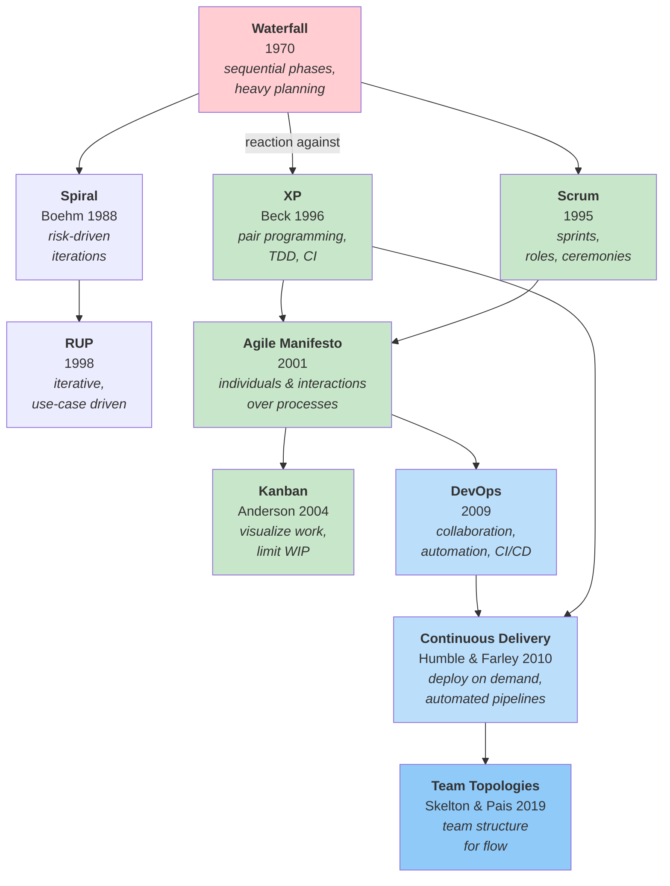

### Waterfall (1970)

**Core idea:** Complete each phase before the next begins.

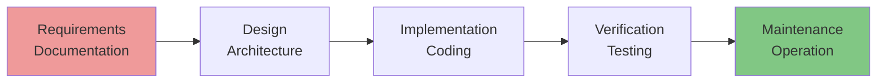

**Origin:** Winston Royce (1970) described this as a *problematic*
model, but it became standard anyway.

**Strengths:**

- Clear documentation
- Predictable for well-understood problems
- Works in regulated industries (medical, aerospace)

**Weaknesses:**

- Late feedback (testing happens after all code is written)
- Expensive to change (a design change requires redoing multiple phases)
- Assumes requirements won't change (rarely true)

**Brooks's Law** (1975) is a classic project management insight
from the Waterfall era:

> "Adding manpower to a late software project makes it later."

New team members need onboarding, communication paths multiply, and tasks
aren't always parallelisable.

→ [Fred Brooks](../../authors/fred-brooks.md) ·
[The Mythical Man-Month](../../works/books/brooks-1975-mmm.md)

### The Bridge: Spiral and RUP

Before Agile, some methods tried to keep the structure of plan-driven development while adding iteration and feedback. The two most important examples are the **Spiral Model** and **Rational Unified Process (RUP)**.

#### Spiral Model (1988)

**Core idea:** Iterate while explicitly managing risk.

Barry Boehm's Spiral Model treats risk analysis as the center of the process. Each cycle usually includes:

1. Define objectives and constraints
2. Identify and analyse risks
3. Develop a prototype or increment
4. Evaluate with stakeholders
5. Plan the next loop

**Why it matters:**
- Risk becomes a first-class input to planning
- Early prototypes reduce uncertainty
- It bridges the gap between Waterfall and later iterative methods

**Trade-offs:**
- More complex than Waterfall
- Requires disciplined risk assessment
- Can be heavy for small teams

#### Rational Unified Process — RUP (1998)

**Core idea:** An iterative, use-case driven, architecture-centric process.

RUP formalised iterative development for larger teams and enterprise projects. It is organised into four phases:

- **Inception** — define scope and business case
- **Elaboration** — stabilise architecture and address major risks
- **Construction** — build the system incrementally
- **Transition** — deliver to users and refine in production

**Why it matters:**
- Brought iteration into mainstream enterprise process
- Made architecture explicit early
- Connected process to use cases and stakeholder goals

**Trade-offs:**
- Can become documentation-heavy
- More prescriptive than Agile methods
- Better suited to larger organisations than to small teams

**In the big picture:** Spiral emphasised **risk**. RUP emphasised **use cases and architecture**. Both moved software process away from pure Waterfall and prepared the ground for Agile.

### The Agile Manifesto (2001)

In February 2001, 17 software developers met at Snowbird, Utah.
They signed the **Agile Manifesto**:

> **Individuals and interactions** over processes and tools
>
> **Working software** over comprehensive documentation
>
> **Customer collaboration** over contract negotiation
>
> **Responding to change** over following a plan

*"While there is value in the items on the right,
we value the items on the left more."*

The manifesto didn't prescribe a single methodology. It articulated a
set of values that XP, Scrum, Kanban, and other approaches share.

**Signatories included:** Kent Beck, Martin Fowler, Ward Cunningham,
Robert C. Martin, Alistair Cockburn, Ron Jeffries, and others.

→ [Martin Fowler](../../authors/martin-fowler.md)

### Timeline

| Year | Event | Impact |
|------|-------|--------|
| 1970 | Waterfall formalised (Royce) | Sequential phases became standard |
| 1975 | *The Mythical Man-Month* (Brooks) | Understanding of project complexity |
| 1980 | *Lehman's Laws of Software Evolution* | Understanding how software changes over time |
| 1986 | Spiral Model proposed (Boehm) | Risk-driven iterations; full paper 1988 |
| 1988 | Spiral Model paper published (Boehm) | Formal risk-driven iterative model |
| 1992 | *Object-Oriented Software Engineering* (Jacobson) | Use case methodology |
| 1992 | Technical debt metaphor (Cunningham) | Framework for discussing shortcuts |
| 1995 | Scrum formalised (Sutherland, Schwaber) | Iterative delivery |
| 1996 | Extreme Programming (Beck) | First comprehensive agile methodology |
| 1998 | Rational Unified Process (RUP) | Iterative, use-case driven enterprise process |
| 1999 | *Refactoring* (Fowler) | Systematised design improvement |
| 1999 | SUnit / JUnit (Beck, Gamma) | Unit testing mainstream |
| 2000 | QuickCheck (Hughes & Claessen) | Property-based testing |
| 2001 | Agile Manifesto signed | Shared values across methodologies |
| 2002 | *TDD by Example* (Beck) | TDD as design technique |
| 2004 | *Working Effectively with Legacy Code* (Feathers) | Legacy code, characterization tests |
| 2004 | *User Stories Applied* (Cohn) | User stories, INVEST, story mapping |
| 2004 | Kanban for software (Anderson) | Flow-based process at Microsoft |
| 2009 | DevOps movement begins | Dev + Ops collaboration |
| 2010 | *Continuous Delivery* (Humble, Farley) | Automated deployment pipelines |
| 2010 | *Kanban* book (Anderson) | Definitive Kanban for software |
| 2016 | *Site Reliability Engineering* (Google) | SRE discipline, error budgets |
| 2018 | *Accelerate* (Forsgren, Humble, Kim) | Evidence for DevOps practices |
| 2019 | *Team Topologies* (Skelton, Pais) | Team structure for flow |

---

## Team Process

How teams organise their work — methodologies, roles, ceremonies,
and the practices that govern what gets built and when.

### Extreme Programming — XP (1996)

**Core idea:** Embrace change through intense technical practices.

Kent Beck developed XP on the Chrysler Comprehensive Compensation (C3) project.
XP was the **first comprehensive agile methodology**.

#### XP Values

- **Communication** — face-to-face conversation over documentation
- **Simplicity** — do the simplest thing that works (YAGNI)
- **Feedback** — short iterations, continuous testing, frequent releases
- **Courage** — refactor aggressively, throw away code that doesn't work
- **Respect** — sustainable pace, no overtime

#### XP Practices

| Practice | What it is |
|----------|-------------|
| **Pair Programming** | Two developers, one keyboard |
| **TDD** | Write tests before code — see [Technical Practices](#technical-practices) |
| **Continuous Integration** | Integrate and test multiple times per day |
| **Refactoring** | Continuously improve design — see [Refactoring](#refactoring-1999) |
| **Small Releases** | Deliver working software frequently |
| **Collective Ownership** | Anyone can change any code |
| **Sustainable Pace** | Fresh developers write better code |

**Key insight:** Process isn't just meetings and documents.
Technical practices *are* process. Pair programming, TDD, and CI
are how XP embraces change.

→ [Kent Beck](../../authors/kent-beck.md)

### Scrum (1995)

**Core idea:** Work in fixed-length iterations called sprints.

Scrum was formalised by Jeff Sutherland and Ken Schwaber (independently)
and draws on "The New New Product Development Game" (Takeuchi & Nonaka, 1986).

#### Scrum Framework

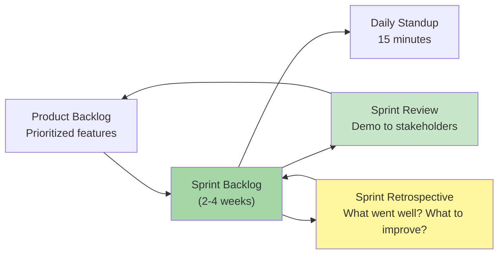

#### Scrum Roles

| Role | Responsibility |
|------|----------------|
| **Product Owner** | What to build, prioritisation, ROI |
| **Scrum Master** | Process facilitation, removing impediments |
| **Development Team** | Self-organising, cross-functional delivery |

#### Scrum Ceremonies

- **Sprint Planning** — What will we accomplish this sprint?
- **Daily Standup** — What did you do? What will you do? Any blockers?
- **Sprint Review** — Demo working software to stakeholders
- **Sprint Retrospective** — Reflect and improve the process

#### Scrum Artifacts

- **Product Backlog** — Prioritised list of everything needed
- **Sprint Backlog** — Items selected for this sprint
- **Increment** — Working software produced by the sprint

**Key insight:** Scrum optimises for **predictability** through
regular delivery and continuous feedback.

### Kanban (2004)

**Core idea:** Visualize work, limit work in progress, and manage flow.

David Anderson adapted Kanban (a Toyota manufacturing technique) for
software development in 2004 at Microsoft. Unlike Scrum's fixed
iterations, Kanban is continuous. The definitive book (*Kanban:
Successful Evolutionary Change*) followed in 2010.

#### The Kanban Board

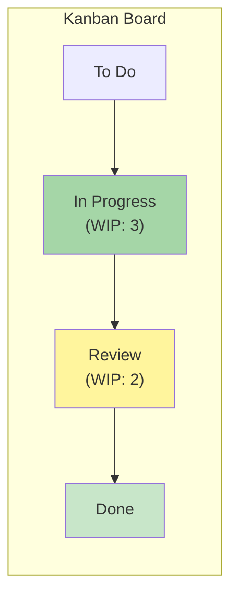

#### Kanban Principles

| Principle | Meaning |
|-----------|---------|
| **Visualize work** | Make work visible on a board |
| **Limit WIP** | Limit work in progress to prevent bottlenecks |
| **Manage flow** | Optimise for throughput, not utilisation |
| **Make policies explicit** | Clear definition of "done" for each column |
| **Improve collaboratively** | Evolve based on feedback and metrics |

**Key insight:** "Stop starting, start finishing." Limit WIP to
reduce context switching and improve flow.

#### Scrum vs Kanban

| Aspect | Scrum | Kanban |
|--------|--------|---------|
| **Cadence** | Fixed sprints (1-4 weeks) | Continuous flow |
| **Roles** | Defined (PO, SM, Team) | Optional (often just "Team") |
| **WIP limits** | Implicit (sprint capacity) | Explicit per column |
| **Estimates** | Required (story points) | Optional (often cycle time metrics) |
| **Change** | Mid-sprint changes discouraged | Changes can happen anytime |
| **Best for** | Predictable delivery, team learning | Continuous delivery, support work |

### Requirements & Planning

**Core idea:** Elicit, document, and manage what to build.

Requirements and planning bridge the gap between "what users need"
and "what we build." Poor requirements and planning are leading causes
of project failure.

#### Traditional vs Agile Requirements

| Aspect | Traditional (Waterfall) | Agile |
|---------|----------------------|-------|
| **Timing** | All upfront | Continuous discovery |
| **Format** | Large documents | User stories, backlogs |
| **Changes** | Expensive | Welcome, expected |
| **Focus** | Features (all) | Value (most valuable first) |
| **Owner** | Business analyst | Product owner + team |

#### Use Cases

**Use case** — description of how a user interacts with a system to achieve a goal.

Introduced by Ivar Jacobson (1992), use cases document:

- **Actor** — external entity (user, system) interacting
- **Goal** — what the actor wants to accomplish
- **Main flow** — primary path to achieve goal
- **Alternative flows** — edge cases, error conditions

**Example:**

```
Use Case: Withdraw Cash
Actor: ATM Customer
Goal: Get cash from account

Main flow:
1. Customer inserts card
2. ATM validates card
3. Customer enters amount
4. ATM checks balance
5. ATM dispenses cash
6. Customer takes card and cash

Alternative flows:
- Insufficient funds → Display error, cancel transaction
- Invalid card → Reject card, return to start
```

→ [Ivar Jacobson — OOSE](../../authors/ivar-jacobson.md) ·
[Object-Oriented Software Engineering](../../works/books/jacobson-1992-oose.md)

#### User Stories

**User story** — short, simple description of a feature from user's perspective.

Evolved from use cases, popularized by XP and Scrum.

**Format:**
```
As a <type of user>,
I want <some goal>,
So that <some benefit>.
```

**Example:**
```
As a customer,
I want to save my payment methods,
So that I don't have to enter them every time.
```

**INVEST Criteria**

Good user stories are:

| Criterion | Meaning |
|-----------|----------|
| **Independent** | Can be implemented separately |
| **Negotiable** | Details can be discussed |
| **Valuable** | Delivers value to users |
| **Estimable** | Team can estimate effort |
| **Small** | Can be completed in one iteration |
| **Testable** | Success can be verified |

#### Story Points

**Story points** — relative measure of effort for a user story.

Story points are **not hours**. They measure complexity, risk, and
effort relative to other stories.

**Planning estimation:**

```
Team estimates:
- Login page: 1 point (small, well-understood)
- User profile: 3 points (medium, some unknowns)
- Payment integration: 8 points (large, external dependency)

Sprint capacity: 30 points
```

**Common scales:**
- **Fibonacci** (1, 2, 3, 5, 8, 13, 21...) — forces differentiation
- **T-shirt sizes** (XS, S, M, L, XL) — intuitive
- **Linear** (1, 2, 3, 4...) — rarely used

#### Planning Poker

**Planning poker** — consensus-based estimation technique.

Process:
1. Product owner describes user story
2. Team discusses questions (no estimation yet)
3. Each member selects a card secretly
4. Cards revealed simultaneously
5. Members discuss differences (highest and lowest explain)
6. Repeat until consensus

**Benefits:**
- Avoids anchoring bias (no one person leads)
- Encourages discussion about complexity
- Reveals different understandings
- Builds team ownership of estimates

#### Velocity

**Velocity** — number of story points completed per iteration.

```
Velocity calculation:
- Sprint 1: 28 points completed
- Sprint 2: 24 points completed
- Sprint 3: 26 points completed

Average velocity: 26 points/sprint
```

**Velocity uses:**
- Predict future capacity
- Plan iterations based on historical data
- Detect process problems (sudden drop)

**Note:** Velocity is a **metric for planning**, not a target to increase.

#### The Cone of Uncertainty

**Cone of uncertainty** — estimation accuracy improves as the project progresses.

Early estimates carry a wide margin of error in both directions.
Boehm's original model expressed this as a multiplier range:

| Phase | Typical estimation range |
|-------|--------------------------|
| **Feasibility** | 0.25x – 4x actual |
| **Requirements** | 0.5x – 2x actual |
| **Design** | 0.67x – 1.5x actual |
| **Coding** | 0.8x – 1.25x actual |

**Implications:**
- Don't commit to fixed deadlines far in advance
- Re-estimate as project progresses and unknowns resolve
- Buffer time for uncertainty — not padding, but honest range

#### Requirements Elicitation

Getting requirements from users is challenging. Techniques:

| Technique | Description | When to use |
|-----------|-------------|--------------|
| **User interviews** | One-on-one conversations | Deep understanding |
| **Focus groups** | Group discussions | Broad feedback, ideas |
| **Observation** | Watch users work | Understand pain points |
| **Prototyping** | Build quick versions | Validate assumptions |
| **Surveys** | Collect data from many users | Statistical feedback |

#### Requirements Types

| Type | Description | Example |
|-------|-------------|---------|
| **Functional** | What system must do | "User can log in with email" |
| **Non-functional** | Quality attributes | "Response time < 200ms" |
| **Business rules** | Constraints and policies | "User must be 18+ to register" |
| **Regulatory** | Legal requirements | "GDPR compliance for data" |
| **Technical** | Technical constraints | "Must use PostgreSQL" |

#### Requirements Management

**Product backlog** — prioritised list of work.

**Backlog refinement (grooming):**
- Review upcoming items
- Add details to ready stories
- Estimate unestimated stories
- Remove outdated items

**Prioritisation techniques:**
- **MoSCoW method** — Must, Should, Could, Won't
- **RICE score** — Reach × Impact × Confidence / Effort
- **Kano model** — Must-be, performance, delighter features

---

## Technical Practices

How individual developers and teams write, test, and improve code.
These practices apply regardless of which methodology the team uses.

### Test-Driven Development — TDD (2002)

**Core idea:** Write a test *before* writing code.

TDD is a development discipline systematised by Kent Beck in
*Test-Driven Development: By Example* (2002), though the practice
emerged earlier from his work on SUnit (~1994) and XP.

```
1. RED    — Write a failing test
2. GREEN  — Write the simplest code that passes
3. REFACTOR — Improve the design
   ↺ Repeat
```

#### Why TDD?

TDD is counterintuitive: write a test before the code exists.
But this inverts the usual pain of testing:

- Tests are never skipped (written first)
- Design is driven by *usage* (the test is a client)
- You get a regression safety net automatically
- Small steps prevent over-engineering

#### Fake It Till You Make It

Start with an obviously wrong implementation:

```python
# Test
def test_sum():
    assert sum([1, 2, 3]) == 6

# Fake it (get to GREEN as fast as possible)
def sum(numbers):
    return 6  # obviously wrong, but test passes!

# Now add another test that forces real implementation
def test_sum_different():
    assert sum([2, 3]) == 5

# Real implementation
def sum(numbers):
    result = 0
    for n in numbers:
        result += n
    return result
```

This seems absurd but has a purpose: it keeps steps small and focuses
on behaviour, not premature abstractions.

#### TDD as Design

Beck's most important claim: **TDD is a design technique**, not just testing.

- Tests written first express the desired API before implementation
- Testability drives decoupling (dependencies must be injectable)
- Small steps prevent over-engineering
- Refactoring keeps design clean

→ [Kent Beck](../../authors/kent-beck.md) ·
[TDD by Example](../../works/books/beck-2002-tdd.md)

### The Testing Pyramid

**Core idea:** More tests at lower levels, fewer at higher levels.

The testing pyramid organises tests by speed, cost, and scope:

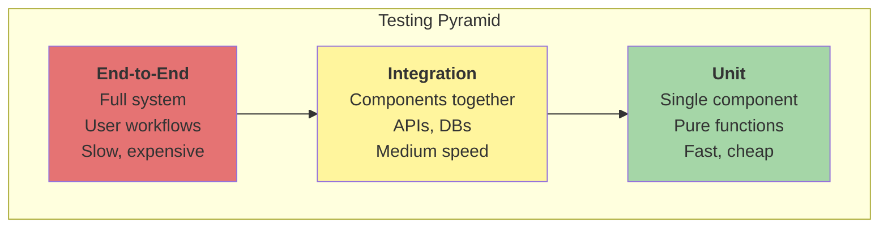

#### Level Breakdown

| Level | What it tests | Typical tools | Speed |
|-------|---------------|---------------|-------|
| **Unit** | Single function/class in isolation | JUnit, pytest, Jest | < 1ms |
| **Integration** | Multiple components working together | TestContainers, integration tests | 100ms-1s |
| **E2E** | Full system through UI | Selenium, Playwright, Cypress | 1-10s |

#### Unit Tests

Unit tests verify behaviour of a single component in isolation:

```python
def test_addition():
    assert add(2, 3) == 5

def test_sort_empty():
    assert sort([]) == []
```

**Benefits:**
- Fast feedback (seconds for entire suite)
- Isolate failures to specific components
- Serve as living documentation
- Enable safe refactoring

**When to write:**
- Business logic (calculations, transformations)
- Pure functions (no side effects)
- Component interfaces

#### Integration Tests

Integration tests verify components work together correctly:

```python
def test_user_registration():
    # Test API + Database + Email service
    response = client.post("/api/users", json={"email": "test@example.com"})
    assert response.status_code == 201
    assert db.user_exists("test@example.com")
    assert email_service.last_sent_to == "test@example.com"
```

**Benefits:**
- Catch integration issues that unit tests miss
- Validate real data flow
- Test configuration and wiring

**When to write:**
- API endpoints
- Database interactions
- External service integrations

#### End-to-End Tests

E2E tests simulate real user workflows through the entire system:

```javascript
// Cypress example
describe("Checkout flow", () => {
  it("allows user to complete purchase", () => {
    cy.visit("/products")
    cy.contains("Add to cart").click()
    cy.visit("/cart")
    cy.contains("Checkout").click()
    cy.contains("Order complete").should("be.visible")
  })
})
```

**Benefits:**
- Validate complete user journeys
- Catch integration issues across system
- Build confidence in critical workflows

**When to write:**
- Critical user paths (checkout, login)
- Multi-component workflows
- Regression testing for known issues

#### Common Pitfalls

| Pitfall | Problem | Solution |
|---------|---------|----------|
| **Inverted pyramid** | Too many slow E2E tests | Add more unit tests, reduce E2E |
| **Flaky tests** | Intermittent failures reduce trust | Make tests deterministic, add retries |
| **Testing implementation** | Breaks on refactoring | Test behaviour, not implementation |
| **Brittle selectors** | E2E tests break on UI changes | Use data-testid attributes, not CSS selectors |

### Test Doubles

**Core idea:** Replace real dependencies with controlled fakes for testing.

Test doubles allow testing components in isolation by substituting real
dependencies (databases, APIs, filesystems) with controlled implementations.

#### Types of Test Doubles

| Type | Purpose | Example |
|------|---------|---------|
| **Dummy** | Fulfils parameter requirements, unused | `DummyLogger()` passed to a function that never logs |
| **Stub** | Provides canned responses | `stub.get_user(123)` returns fake user data |
| **Spy** | Records calls for verification | Verify that `email.send()` was called twice |
| **Mock** | Pre-programmed expectations | Expect `db.save(user)` with specific user object |
| **Fake** | Working but simplified implementation | In-memory database instead of real database |

#### Example: Testing a User Service

```python
# Without test doubles — slow, depends on external systems
def test_user_service():
    service = UserService(real_database, real_email_sender)
    result = service.register("test@example.com")
    assert result.success

# With test doubles — fast, deterministic
class FakeDatabase:
    def __init__(self):
        self.users = {}

    def save(self, user):
        self.users[user.email] = user
        return True

class SpyEmailSender:
    def __init__(self):
        self.sent = []

    def send(self, to, subject):
        self.sent.append((to, subject))

def test_user_service_with_doubles():
    db = FakeDatabase()
    email = SpyEmailSender()
    service = UserService(db, email)

    result = service.register("test@example.com")

    assert result.success
    assert "test@example.com" in db.users
    assert ("test@example.com", "Welcome") in email.sent
```

#### When to Use Test Doubles

| Scenario | Use double? | Type |
|----------|-------------|------|
| **Slow dependency** | Yes | Fake or Stub |
| **Unreliable network** | Yes | Fake or Stub |
| **External API with rate limits** | Yes | Fake or Stub |
| **Need to verify interaction** | Yes | Spy or Mock |
| **Need real database semantics** | No | Use real DB (TestContainers) |

#### Criticism and Best Practices

**Over-mocking** — excessive mocking can lead to:
- Tests that pass but code doesn't work (implementation vs behaviour)
- Brittle tests that break on internal changes
- Tests that don't catch real bugs

**Best practices:**
- Prefer fakes over mocks (working simplifications vs expectations)
- Test behaviour, not implementation
- Use real infrastructure when possible (TestContainers)
- Keep test doubles close to real behaviour

### Property-Based Testing

**Core idea:** Test invariants across randomly generated inputs.

Instead of writing specific test cases, write **properties** — logical
statements that should hold for all inputs. The framework generates
random inputs and searches for counterexamples.

#### QuickCheck and Its Descendants

Claessen & Hughes (2000) introduced property-based testing with QuickCheck.
The approach has been ported to virtually every major language:

| Language | Library |
|----------|---------|
| Python | Hypothesis |
| Scala | ScalaCheck |
| Clojure | test.check |
| F# | FsCheck |
| TypeScript/JavaScript | fast-check |
| Rust | proptest |
| Go | rapid |

#### Example: Testing a Sort Function

```haskell
-- Example-based testing
prop_sort_empty = sort [] == []
prop_sort_simple = sort [3,1,2] == [1,2,3]

-- Property-based testing (Haskell QuickCheck)
prop_sort_sorted :: [Int] -> Bool
prop_sort_sorted xs = isSorted (sort xs)

prop_sort_length :: [Int] -> Bool
prop_sort_length xs = length (sort xs) == length xs

prop_sort_contains :: [Int] -> Int -> Property
prop_sort_contains xs x = elem x xs ==> elem x (sort xs)
```

#### Shrinking

When a property fails, property-based testing frameworks **shrink**
the counterexample to the minimal failing case:

```python
# Hypothesis (Python) example
# Failing input found: [1000, 50, 3, -7, 0, 42, -1]
# After shrinking: [-7]
```

Shrinking makes debugging much easier by removing irrelevant details.

#### When to Use Property-Based Testing

| Scenario | PBT benefit |
|----------|-------------|
| **Algorithms with clear invariants** | Sort, search, compression |
| **Data structures** | Trees, graphs, collections |
| **State machines** | Protocols, game logic |
| **Edge cases** | Boundary conditions you didn't think of |

#### Complementarity with TDD

| TDD | Property-Based Testing |
|-----|------------------------|
| Small, focused tests | Broad, invariant checking |
| Example cases | Randomly generated inputs |
| Specifies exact behaviour | Specifies general properties |
| Good for business logic | Good for algorithms/data structures |

→ [QuickCheck paper](../../works/papers/hughes-claessen-2000-quickcheck.md) ·
[John Hughes](../../authors/john-hughes.md)

### Refactoring (1999)

**Core idea:** Improve code structure *without* changing behaviour.

Martin Fowler's book *Refactoring* systematised this practice:
design degrades under pressure of change, and it must be **constantly restored**
in small steps.

#### What is Refactoring?

Refactoring is **not** rewriting from scratch. It's a sequence of
tiny, behaviour-preserving transformations:

- **Extract Method** — pull a block into a named function
- **Move Method** — move method to class where it belongs
- **Replace Conditional with Polymorphism** — use OOP instead of switch
- **Introduce Parameter Object** — group related parameters

Each step is small, reversible, and preserves behaviour.
Tests are the safety net.

#### Code Smells

"Smells" are not errors but signals that design can be improved:

| Smell | What it often means | Typical refactorings |
|--------|---------------------|---------------------|
| Long Method | too much responsibility | Extract Method |
| Large Class | SRP violated | Extract Class |
| Duplicated Code | low modularity | Extract Method / Pull Up |
| Feature Envy | method lives in wrong place | Move Method |
| Divergent Change | class changes for different reasons | Split responsibility |

**Key insight:** Refactoring is not a separate "phase" but constant
activity. Made a feature → cleaned up a bit nearby.
Tests green → safely improved structure.

→ [Martin Fowler](../../authors/martin-fowler.md) ·
[Refactoring](../../works/books/fowler-1999-refactoring.md)

### Code Quality

**Core idea:** Measure and improve code quality through automated analysis
and manual practices.

Code quality affects maintainability, reliability, and developer
productivity. High-quality code is easier to understand, modify, and
extend.

#### Code Smells (Extended)

See [Refactoring](#refactoring-1999) for the core catalogue.
The table below extends it with additional smells common at larger scale:

| Smell | What it indicates | Typical fix |
|-------|----------------|-------------|
| **Long Method** | Method does too much | Extract Method |
| **Long Parameter List** | Too many parameters | Introduce Parameter Object |
| **Duplicated Code** | Same logic in multiple places | Extract Method / Pull Up |
| **Large Class** | Class has too many responsibilities | Extract Class |
| **Feature Envy** | Method uses more of another class than its own | Move Method |
| **Inappropriate Intimacy** | Class knows too much about another class | Hide Delegate |
| **God Object** | Class that controls too much | Deconstruct into smaller classes |
| **Shotgun Surgery** | Changes touch many classes | Restructure to minimise impact |
| **Data Clumps** | Groups of variables passed together | Introduce Parameter Object |
| **Primitive Obsession** | Excessive use of primitives | Introduce Value Objects |
| **Switch Statements** | Large switch on type | Replace with polymorphism |

#### Example: Long Method

```java
// SMELL: Long, hard to understand
public void processOrder(Order order, Customer customer, Inventory inventory,
                          Shipping shipping, Billing billing, EmailService email) {
    // 50 lines of logic...
}

// FIX: Extract Method
public void processOrder(Order order) {
    OrderProcessor processor = new OrderProcessor(order);
    processor.validate();
    processor.reserveInventory();
    processor.charge();
    processor.ship();
    processor.confirm();
}
```

#### Example: Duplicated Code

```javascript
// SMELL: Same logic repeated
function calculateTaxUS(income) { return income * 0.30; }
function calculateTaxUK(income) { return income * 0.20; }
function calculateTaxDE(income) { return income * 0.42; }

// FIX: Extract to common function
const taxRates = { US: 0.30, UK: 0.20, DE: 0.42 };

function calculateTax(income, country) {
    return income * taxRates[country];
}
```

#### Cyclomatic Complexity

**Cyclomatic complexity** — measures number of independent paths through code.

Each decision point (`if`, `case`, loop) adds 1 to the score.

```python
def complexity_example(a, b, c):
    if a > b:              # +1
        if b > c:          # +2
            if c > a:      # +3
                return True
        else:
            return False
    else:
        return True
# Total: 3

def simple_example(a, b, c):
    return max(a, b, c)
# Total: 1
```

| Range | Meaning | Action |
|-------|----------|--------|
| **1-10** | Simple | None needed |
| **11-20** | Moderate | Consider refactoring |
| **21-50** | Complex | Refactor recommended |
| **50+** | Too complex | Refactor urgent |

#### Coupling and Cohesion

**Coupling** — how much components depend on each other.
**Cohesion** — how much a component's elements belong together.

```
GOAL: Low coupling, high cohesion
```

| Type | Description | Example |
|------|-------------|---------|
| **Tight coupling** | Direct dependencies on concrete classes | `class A { B b = new B(); }` |
| **Loose coupling** | Dependencies on abstractions | `class A { Interface i; }` |
| **High cohesion** | Related functionality grouped together | `UserService` handles all user operations |
| **Low cohesion** | Unrelated functionality mixed | `Utils` class with random methods |

#### Maintainability Index

**Maintainability Index (MI)** — composite measure of code maintainability,
originally defined by Coleman et al. (1994).

The original formula combines Halstead Volume (V), Cyclomatic Complexity (G),
and Lines of Code (L):

```text
MI = 171 - 5.2 × ln(V) - 0.23 × G - 16.2 × ln(L)
```

Tools like Visual Studio rescale this to 0–100, where **higher is better**.

| Range (rescaled) | Meaning |
|------------------|---------|
| **80–100** | Highly maintainable |
| **60–79** | Moderate |
| **0–59** | Difficult to maintain |

Here's the expanded section:

---

#### Code Coverage

**Code coverage** — percentage of code executed by tests.

| Type | What it measures | Typical threshold |
|------|-----------------|-----------------|
| **Line coverage** | Lines of code executed | 80%+ |
| **Branch coverage** | Decision paths tested | 80%+ |
| **Function coverage** | Functions called by tests | 100% |
| **Condition coverage** | Boolean conditions tested | 100% |

**Remember:** High coverage doesn't guarantee quality.
Tests must verify correct behaviour, not just execute code.

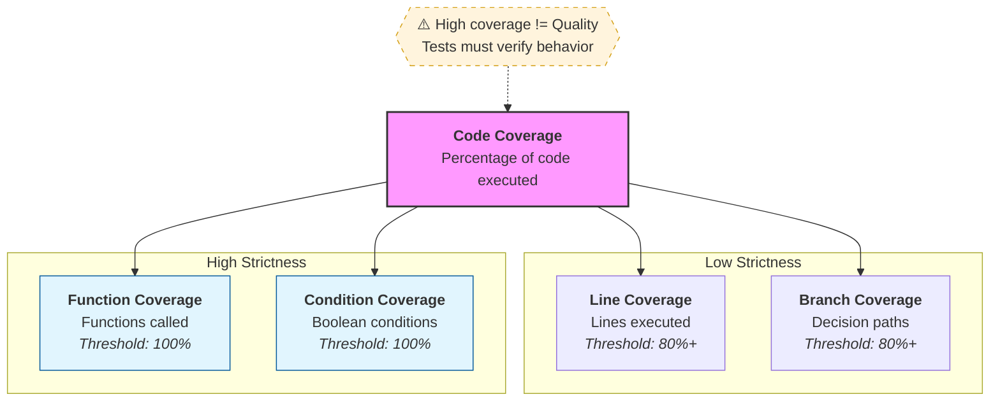
---

#### Coverage Criteria (Completeness Theory)

Coverage metrics form a **hierarchy of strictness** — each level subsumes the previous:

```
Input Coverage
      ↑
   Path Coverage          ← rarely achievable in practice
      ↑
MC/DC Coverage            ← required in aviation (DO-178C)
      ↑
Condition Coverage
      ↑
Branch Coverage           ← most practical strong guarantee
      ↑
Line Coverage             ← minimum baseline
```

| Criterion | What it requires | Feasibility |
|-----------|-----------------|-------------|
| **Line** | Every line executed | Easy |
| **Branch** | Every if/else path taken | Moderate |
| **Condition** | Every boolean sub-expression true and false | Moderate |
| **Branch+Condition** | Both above combined | Harder |
| **MC/DC** | Each condition independently affects outcome | Hard, but tractable |
| **Path** | Every unique execution path | Often infinite |
| **Input** | Every possible input combination | Rarely feasible |

**MC/DC** (Modified Condition/Decision Coverage) is a notable sweet spot —
it catches most logical errors without requiring exponential test cases.

---

#### The Interesting Observation: Coverage ≈ Decidability in Disguise

This connects back to the logic theory above:

```
Finite inputs + finite branches
        ↓
   Full path coverage = truth table
        ↓
   Program behaves like boolean logic
        ↓
   Fully verifiable (decidable)
```

- A program with **bounded inputs and no loops** is essentially a **boolean formula**
- Achieving 100% path coverage on it is equivalent to **checking all rows of a truth table**
- This is exactly why such programs are decidable — finite state space

The moment you introduce **loops or recursion**, paths become potentially infinite —
coverage can never reach 100%, and you're back in undecidable territory.

---

#### Why 100% Coverage Is Not Enough

```python
def divide(x, y):
    return x / y      # line covered ✅
                      # but y=0 is never tested ❌
```

Coverage answers: *"was this code reached?"*
It does **not** answer: *"was the result correct?"*

| What coverage catches | What coverage misses |
|----------------------|---------------------|
| Dead code | Wrong logic |
| Untested branches | Missing edge cases |
| Unreachable paths | Incorrect assertions |
| | Concurrency bugs |
| | Performance issues |

**The gap** between coverage and correctness is exactly where formal verification,
property-based testing, and mutation testing step in.

### Static Analysis

**Core idea:** Automatically detect code issues before running it.

Static analysis tools analyse source code without executing it, finding
potential bugs, security issues, and style violations.

#### Static Analysis Tools

| Tool | Language | Category | What it finds |
|-------|----------|----------|----------------|
| **ESLint** | JavaScript | Linter | Style violations, potential errors |
| **Pylint** | Python | Linter | PEP 8 violations, unused variables |
| **Rust Clippy** | Rust | Linter | Common mistakes, performance issues |
| **SonarQube** | Multi-language | Quality platform | Bugs, code smells, coverage |
| **SpotBugs** | Java | Bug finder | Bugs, security vulnerabilities |
| **Checkstyle** | Java | Style checker | Style violations |
| **MyPy** | Python | Type checker | Type errors |

#### Linters

**Linter** — tool that checks for style violations and potential issues.

```javascript
// BAD: unused variable — ESLint catches this
function calculateTotal(items) {
    const total = 0;
    let subtotal = 0;  // Unused
    for (const item of items) {
        total += item.price;
    }
    return total;
}
// ESLint error: 'subtotal' is assigned a value but never used.
```

#### Type Checkers

| Language | Tool | Benefits |
|----------|------|----------|
| **Python** | mypy, pyright | Catch type errors before runtime |
| **TypeScript** | tsc | Static typing for JavaScript |
| **Haskell** | GHC | Compile-time type checking |
| **Rust** | rustc | Memory safety guarantees |

```python
# With mypy — type error caught at analysis time, not runtime
def greet(name: str) -> str:
    return f"Hello, {name}!"

greet(42)
# error: Argument 1 has incompatible type "int"; expected "str"
```

#### Formatters

| Tool | Language | Style |
|-------|----------|-------|
| **Prettier** | JavaScript, TypeScript, others | Opinionated, consistent |
| **Black** | Python | PEP 8 compliant |
| **Rustfmt** | Rust | Rust standard style |
| **go fmt** | Go | Go standard style |

#### Security Static Analysis

| Tool | What it finds |
|-------|----------------|
| **Snyk** | Known vulnerabilities in dependencies |
| **Dependabot** | Dependency updates, security alerts |
| **Bandit** | Python security issues |
| **ESLint Security** | JavaScript security issues |
| **Semgrep** | Custom security rules |

**Common vulnerabilities found:** SQL injection, XSS, command injection,
path traversal, insecure dependencies.

#### Pre-commit Hooks

```yaml
# .pre-commit-config.yaml
repos:
  - repo: https://github.com/pre-commit/pre-commit-hooks
    rev: v4.4.0
    hooks:
      - id: trailing-whitespace
      - id: end-of-file-fixer
      - id: check-yaml
      - id: check-added-large-files
  - repo: local
    hooks:
      - id: run-tests
        name: Run tests
        entry: pytest
        language: system
        pass_filenames: ".*\\.py$"
```

### Observability

**Core idea:** Understanding what's happening in your system through logs,
metrics, and traces.

Observability is about **asking questions** about your system and getting
answers — even for questions you didn't anticipate.

#### The Three Pillars of Observability

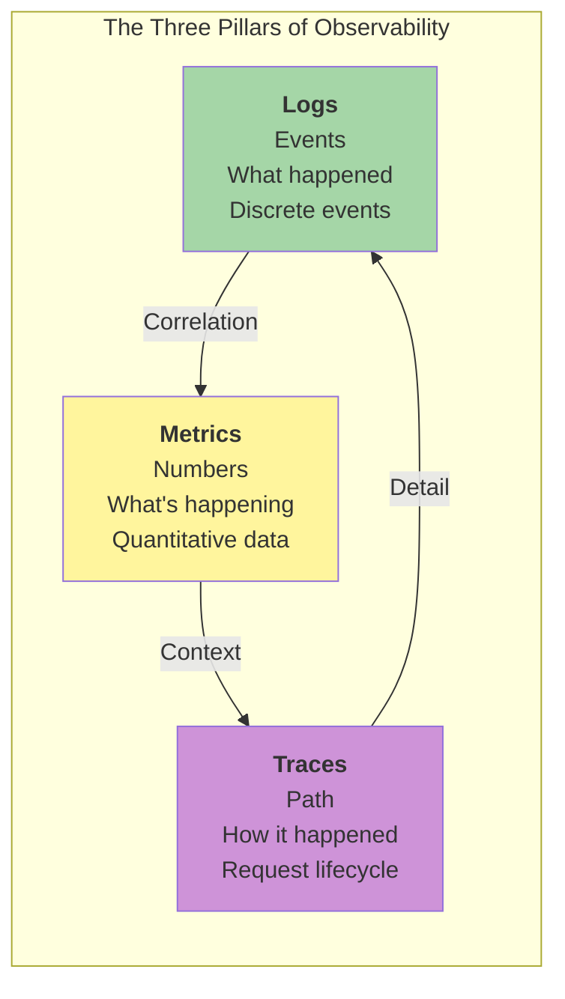

#### Logs

Logs are discrete events that describe what happened in your system.

**Log levels:**
- **DEBUG** — detailed diagnostic information
- **INFO** — informational messages (normal operation)
- **WARN** — unexpected but non-critical conditions
- **ERROR** — error conditions that should be investigated
- **FATAL** — critical errors that require immediate attention

**Structured logging:**
```json
// Unstructured (bad)
"User logged in at 2024-03-29T10:30:00Z"

// Structured (good)
{
  "event": "user_login",
  "timestamp": "2024-03-29T10:30:00Z",
  "user_id": "12345",
  "ip": "192.168.1.1",
  "success": true
}
```

**Best practices:**
- Use structured logging (JSON)
- Include correlation IDs for tracing
- Log at appropriate levels
- Avoid logging sensitive data
- Centralise logs for aggregation

#### Metrics

**Metric types:**

| Type | Description | Example |
|------|-------------|---------|
| **Counter** | Only increases | `http_requests_total` |
| **Gauge** | Can go up or down | `memory_usage_bytes` |
| **Histogram** | Distribution of values | `http_request_duration_seconds` |
| **Summary** | Aggregated statistics | `http_request_duration_summary` |

**Key frameworks:**
- **RED Method** — Rate, Errors, Duration (for services)
- **USE Method** — Utilization, Saturation, Errors (for resources)

#### Traces

Traces track the path of a request through distributed systems.

```text
Request → API Gateway → Service A → Service B → Database
   ↓          ↓            ↓           ↓          ↓
 Trace ID  Span 1      Span 2     Span 3    Span 4
```

**Key concepts:**
- **Trace ID** — unique identifier for the entire request
- **Span ID** — unique identifier for each unit of work
- **Parent ID** — links spans to their parent
- **Tags/Annotations** — metadata about the span

#### Logs vs Metrics vs Traces

| Aspect | Logs | Metrics | Traces |
|--------|-------|---------|--------|
| **What** | Discrete events | Quantitative data | Request path |
| **When** | When events occur | Over time | During request |
| **Why** | Debugging, audit | Trending, alerting | Performance analysis |
| **Cost** | High (volume) | Low (aggregated) | Medium (sampling) |
| **Use case** | "What happened?" | "How is it going?" | "Where did time go?" |

#### Alerting

**Alerting principles:**
1. **Alert on symptoms, not causes**
   - ✅ "Response time > 500ms" (symptom)
   - ❌ "CPU usage > 80%" (cause)

2. **Alerts must be actionable**
3. **Reduce alert fatigue** — too many alerts → engineers ignore them
4. **Use severity levels** (P0 critical → P3 informational)

| Strategy | Description | When to use |
|----------|-------------|-------------|
| **Static threshold** | Alert when metric exceeds fixed value | Simple, well-understood metrics |
| **Dynamic threshold** | Alert when metric deviates from normal | Metrics with seasonal patterns |
| **Anomaly detection** | ML-based outlier detection | Complex systems, unknown patterns |
| **Composite alerts** | Alert only when multiple conditions true | Reduce false positives |

---

## Operations

How software runs in production — delivery pipelines, reliability,
team structure, and the practices that keep systems healthy.

### DevOps (2009)

**Core idea:** Development and Operations working together through automation.

DevOps emerged from the realisation that traditional silos between
Development (who write code) and Operations (who run it) create
painful handoffs and slow feedback.

#### The DevOps Loop

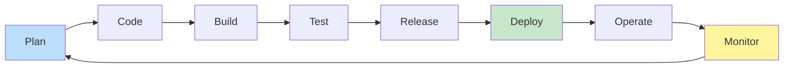

#### DevOps Pillars

| Pillar | Description |
|--------|-------------|
| **Culture** | Collaboration, shared responsibility, breaking down silos |
| **Automation** | CI/CD pipelines, infrastructure as code |
| **Measurement** | Metrics, monitoring, DORA metrics |
| **Sharing** | Knowledge transfer, blameless postmortems |

#### DORA Metrics

The DevOps Research and Assessment (DORA) team identified four
key metrics that distinguish high-performing teams:

| Metric | What it measures | High performer |
|--------|-----------------|----------------|
| **Deployment frequency** | How often you ship | Multiple times per day |
| **Lead time for changes** | Time from commit to deploy | Less than 1 hour |
| **Change failure rate** | Percentage of deploys that fail | Less than 15% |
| **Time to restore service** | Mean time to recover (MTTR) | Less than 1 hour |

→ [Continuous Delivery](../../works/books/humble-2010-cd.md)

### Continuous Delivery (2010)

**Core idea:** Build, test, and deploy software so it can be released
at any time.

Jez Humble and David Farley's book defined **Continuous Delivery** (CD)
as an extension of Continuous Integration:

- **CI** — integrate and test on every commit
- **CD** — ensure every commit can be deployed

#### The CD Pipeline

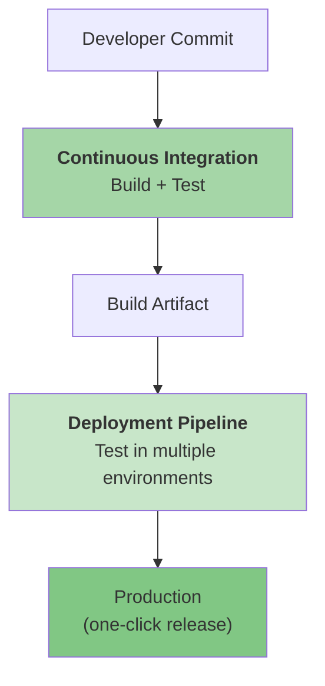

#### CD Principles

| Principle | Meaning |
|-----------|---------|
| **Build quality in** | Automated testing at every stage |
| **Work in small batches** | Small changes are safer and faster |
| **Automate everything** | Manual steps are error-prone and slow |
| **Keep it deployable** | Every commit can go to production |
| **Decouple deployment from release** | Deploy when ready, release when users need it |

**Key insight:** If deploying is scary, you do it rarely.
If deploying is routine and automated, you can ship continuously.

→ [Continuous Delivery](../../works/books/humble-2010-cd.md)

### Site Reliability Engineering — SRE (2016)

**Core idea:** Apply software engineering practices to operations.

SRE emerged from Google's experience running large-scale services.
The core insight: **operations should be automated like software.**

#### SRE vs Traditional Ops

| Traditional Ops | SRE |
|----------------|-----|
| Manual operations | Automate everything |
| Firefighting mode | Proactive engineering |
| Ops is separate from dev | Ops is software engineering |
| "Keep the lights on" | "Reduce toil, improve reliability" |
| Pager rotation for everyone | Limited pager load, error budgets |

#### SLIs, SLOs, and SLAs

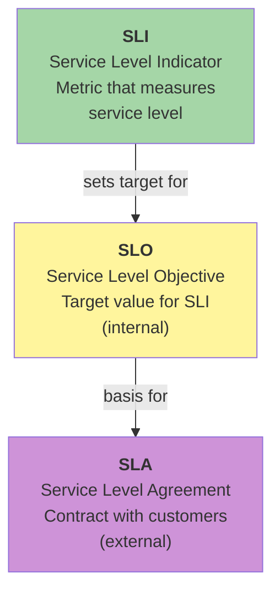

- **SLI** — a metric that measures some aspect of service level (availability, latency, error rate)
- **SLO** — internal target for an SLI: "99.9% of requests succeed"
- **SLA** — contract with customers, often with financial penalties for failure

#### Error Budgets

```text
Error budget = 100% - SLO

Example:
- SLO = 99.9% uptime
- Error budget = 0.1% downtime per period
- Monthly budget = 43.2 minutes of downtime
```

- **Budget spent** — stop feature releases, focus on reliability
- **Budget remaining** — can take more risks, ship features faster

**Key insight:** Error budgets make the reliability/speed trade-off explicit.

#### Reducing Toil

**Toil** — operational work that is manual, repetitive, automatable,
and provides no enduring value.

Examples: manual deployments, responding to routine alerts,
manual certificate rotation, manually scaling resources.

**SRE approach:** identify toil → automate it → if you can't automate,
question whether the work should exist.

#### Blameless Postmortems

Focus on *what* happened, not *who* did it:

```text
NOT blameless:
"John forgot to restart the server after deployment."

Blameless:
"The deployment process didn't include a restart step.
We should automate restarts after all deployments."
```

#### Incident Management

**Incident response workflow:**
1. **Detect** — alert fires
2. **Acknowledge** — someone takes ownership
3. **Diagnose** — gather information, understand scope
4. **Mitigate** — reduce impact (rollback, scale up, failover)
5. **Resolve** — restore normal service
6. **Postmortem** — document, learn, improve

#### SRE Tools

| Category | Examples |
|----------|-----------|
| **Monitoring** | Prometheus, Grafana, Datadog, New Relic |
| **Logging** | ELK Stack, Splunk, CloudWatch |
| **Tracing** | Jaeger, Zipkin, OpenTelemetry |
| **Alerting** | PagerDuty, Opsgenie, VictorOps |

→ [Site Reliability Engineering](../../works/books/google-2016-sre.md)

### Team Topologies (2019)

**Core idea:** Design team structures to enable fast flow of value.

Matthew Skelton and Manuel Pais's *Team Topologies* addresses a
problem: Agile practices work within a team, but how should *teams*
interact?

# Team Topologies — Four Team Types

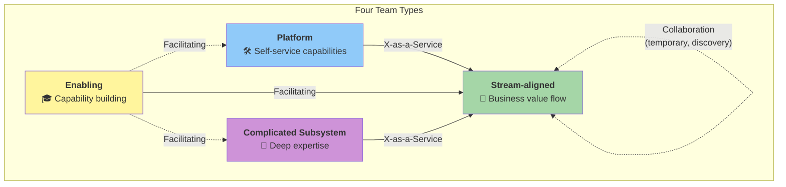

---

## Four Team Types

| Team Type | Purpose | Primary Interaction | Duration | Example |
|-----------|---------|---------------------|----------|---------|
| **Stream-aligned** | Deliver business value continuously | X-as-a-Service (consuming), Collaboration (between streams) | Permanent | Feature team, product team |
| **Enabling** | Build capabilities in stream teams, remove obstacles | Facilitating | Time-boxed (1–3 months) | DevOps coaching, security guild |
| **Complicated Subsystem** | Own and manage complex technical components | X-as-a-Service | Long-term | Video processing, ML models, physics engine |
| **Platform** | Provide internal self-service tools and infrastructure | X-as-a-Service | Long-term | Cloud platform, CI/CD, observability |

---

## Three Interaction Modes

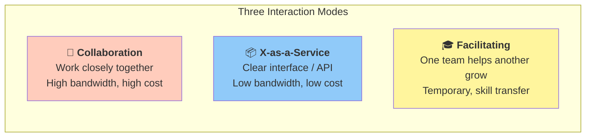

| Interaction Mode | Description | When to Use | Duration | Cost |
|-----------------|-------------|-------------|----------|------|
| **Collaboration** | Teams work closely, high communication overhead | Discovery phase, high uncertainty, rapid learning | Temporary (weeks–months) | High |
| **X-as-a-Service** | Clear API or interface, minimal collaboration needed | Stable, well-defined dependencies | Long-term | Low |
| **Facilitating** | One team accelerates another's capability growth | Enabling teams helping stream/platform/subsystem teams | Time-boxed (1–3 months) | Medium |

---

## Who Interacts How

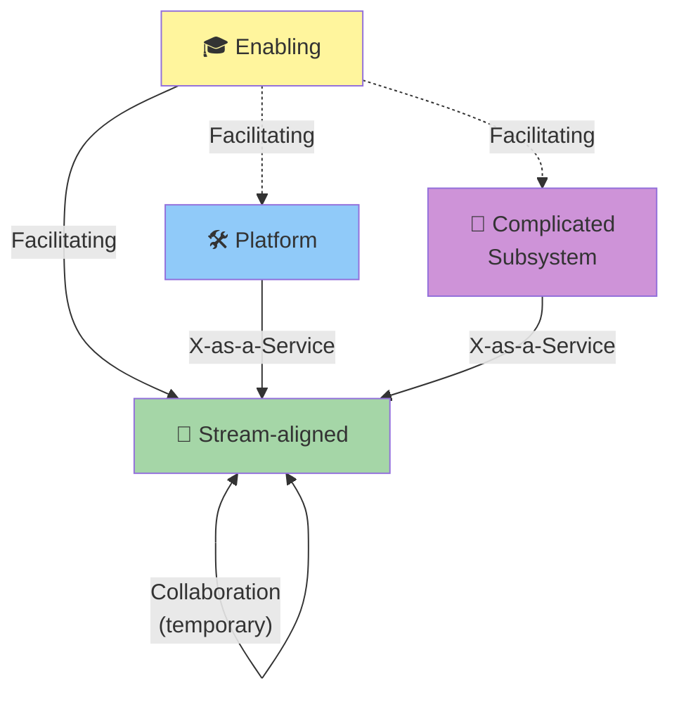

| From → To | Mode | Notes |
|-----------|------|-------|
| **Enabling → Stream-aligned** | Facilitating | Primary enabling flow |
| **Enabling → Platform** | Facilitating | Help platform team grow capabilities |
| **Enabling → Complicated Subsystem** | Facilitating | Help subsystem team adopt practices |
| **Platform → Stream-aligned** | X-as-a-Service | Self-service infrastructure |
| **Complicated Subsystem → Stream-aligned** | X-as-a-Service | Specialised component as service |
| **Stream-aligned ↔ Stream-aligned** | Collaboration | Temporary, discovery phase only |

---

## Key Principles

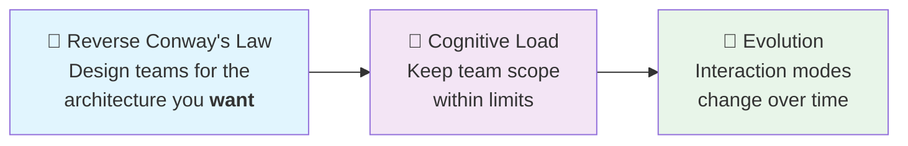

| Principle | Description |
|-----------|-------------|
| **Reverse Conway's Law** | Design your team structure to match the system architecture you want to achieve, not the one you already have |
| **Cognitive Load Management** | Each team must own only what fits within their cognitive capacity — avoid overloading stream teams |
| **Interaction Mode Evolution** | Collaboration → X-as-a-Service over time as interfaces stabilise; Enabling teams fade out when capability is built |
| **Team-first thinking** | Team boundaries and APIs are as important as software APIs |

---

## Lifecycle of Interaction Modes

```mermaid
flowchart LR
    A["🔬 Discovery<br/><b>Collaboration</b><br/>High uncertainty"] 
    -->|"Interface stabilises"| 
    B["📦 Delivery<br/><b>X-as-a-Service</b><br/>Clear boundaries"]

    C["⚠️ Capability gap<br/>detected"]
    -->|"Enabling team steps in"| 
    D["🎓 <b>Facilitating</b><br/>Skill transfer"]
    -->|"Capability built"| 
    E["✅ Enabling team<br/>steps out"]

    style A fill:#ffccbc
    style B fill:#90caf9
    style C fill:#ffccbc
    style D fill:#fff59d
    style E fill:#a5d6a7
```

---

> **Key insight:** Conway's Law in reverse — design your **teams** for the system architecture you **want**, not the one you have. Interaction modes are not permanent — they evolve as teams mature and interfaces stabilise.

### Code Review

**Core idea:** Peer review of code changes before merge.

| Practice | Why it matters |
|-----------|-----------------|
| **Small changes** | Easier to review, faster feedback |
| **Clear description** | Context helps reviewer understand intent |
| **Constructive tone** | Learning, not policing |
| **Automated checks** | Linters, tests, formatting reviewed automatically |
| **Timely review** | Fast feedback prevents accumulation |

- **Review** — someone else looks at your code (social)
- **Refactor** — you improve your own code structure (technical)

Both are important. Review catches issues you miss. Refactor keeps
design clean over time.

### Technical Debt

**Core idea:** Metaphor for shortcuts that must be "repaid" later.

Ward Cunningham coined "technical debt" in 1992:

> "Shipping first-time code is like going into debt. A little debt
> speeds development so long as it is paid back promptly... but
> interest compounds."

| Type | Description | Pay it back when |
|-------|-------------|-----------------|
| **Deliberate** | Intentional shortcut to ship faster | Before it compounds |
| **Inadvertent** | Poor design, lack of understanding | As soon as discovered |
| **Bit rot** | Code works but is hard to modify | When touching that code |
| **Knowledge debt** | Documentation gaps, tribal knowledge | Before people leave |

**Key insight:** Some debt is rational (time-to-market). The problem
is not *having* debt, but *ignoring* it.

→ [Ward Cunningham](../../authors/ward-cunningham.md)

---

## System Evolution

How software systems change over time — the forces that drive complexity,
and the patterns that manage it.

### Software Evolution & Lehman's Laws

**Core idea:** Software systems naturally evolve over time, becoming more
complex and harder to maintain unless actively managed.

Meir Lehman's 1980 work established fundamental principles about how
software changes.

#### Lehman's Eight Laws

| Law | Description | Implication |
|------|-------------|-------------|
| **I. Continuing Change** | Software must adapt or become obsolete | "Done" is a myth |
| **II. Increasing Complexity** | Complexity grows without work to reduce it | Refactoring is essential |
| **III. Self-Regulation** | The evolution process is self-regulating — metrics change within statistically invariant bounds | Drastic interventions rarely stick |
| **IV. Organizational Stability** | Software reflects org structure | Conway's Law in action |
| **V. Conservation of Familiarity** | Developers preserve what they know | Architectural inertia |
| **VI. Continuing Growth** | Systems grow with requirements | Growth continues until too complex |
| **VII. Declining Quality** | Quality degrades over time | Entropy increases without effort |
| **VIII. Feedback System** | Evolution is feedback-driven | Without feedback, system fails |

#### Software Entropy

As the second law of thermodynamics states, entropy increases unless
energy is applied. The same holds for software: without active effort,
complexity and disorder accumulate.

Active countermeasures:
- **Refactoring** — counters Law II
- **Architecture reviews** — prevent structural decay
- **Technical debt management** — reduces entropy (Law VII)
- **Incremental delivery** — supports Law I
- **Strangler Fig** — gradual replacement when system too complex (Law VI)

#### The Rewrite Question

| Maintain | Rewrite |
|---------|--------|
| System provides value | System can't be maintained profitably |
| Incremental improvement possible | Architecture is fundamentally wrong |
| Complexity manageable | Quality has declined beyond recovery |
| Familiar with codebase | Team knows different approaches better |

→ [Meir Lehman](../../authors/meir-lehman.md) ·
[Lehman's Laws](../../works/papers/lehman-1980-laws.md)

### The Strangler Fig Pattern

**Core idea:** Gradually replace a legacy system by strangling it
piece by piece, avoiding "Big Bang" rewrites.

#### How It Works

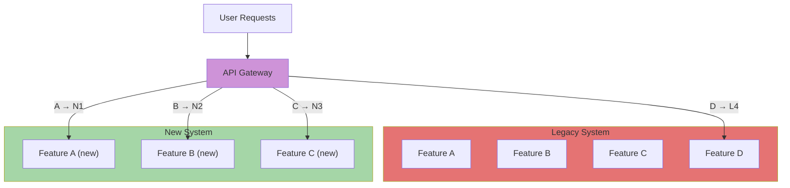

#### The Process

1. **Identify functionality to migrate** — start with non-critical features
2. **Implement in new system** — use modern architecture
3. **Deploy alongside legacy** — both systems running
4. **Route via gateway** — feature flag determines which system handles request
5. **Monitor and validate** — ensure new system works correctly
6. **Migrate data** — copy/sync data as needed
7. **Switch traffic** — route more users to new system
8. **Retire old feature** — remove from legacy when unused

#### Strangler vs Big Bang Rewrite

| Aspect | Strangler Fig | Big Bang |
|---------|---------------|-----------|
| **Deployment** | Gradual, incremental | One-time, cutover |
| **Risk** | Low — can rollback | High — hard to rollback |
| **User impact** | Minimal | High — all users switch at once |
| **Feedback** | Continuous | Delayed until after cutover |
| **Data migration** | Ongoing, in small batches | One-time, massive effort |

### API Versioning

**Core idea:** Manage breaking changes to APIs while maintaining
backward compatibility.

#### Why Version APIs?

```text
Option 1: Never break API → Can't improve, stagnates
Option 2: Change anytime → Breaks existing clients
Option 3: Version APIs → Can improve without breaking everyone
```

#### Versioning Strategies

| Strategy | How | Pros | Cons |
|----------|-----|------|------|
| **URI versioning** | `/v1/users` | Clear boundary, easy routing | URL changes are permanent |
| **Header versioning** | `API-Version: v2` | URL stays clean | Can't route by infrastructure |
| **Query parameter** | `?version=v2` | Simple to test | Can be ignored by caching |
| **Content negotiation** | `Accept: application/vnd.api.v2+json` | RESTful | Verbose, complex clients |

#### Semantic Versioning

| Component | When to increment | Example |
|-----------|------------------|---------|
| **MAJOR** | Incompatible API changes | 1.0.0 → 2.0.0 |
| **MINOR** | Backward-compatible additions | 2.0.0 → 2.1.0 |
| **PATCH** | Backward-compatible bug fixes | 2.1.0 → 2.1.1 |

#### Breaking Changes vs Non-Breaking

| Change type | Breaking? | Example |
|-------------|-----------|---------|
| **New field** | No | Add `email` to user response |
| **Remove field** | Yes | Remove `phone` from user response |
| **Field rename** | Yes | Rename `user_name` to `username` |
| **Field type change** | Yes | Change `age` from int to string |
| **Add new endpoint** | No | Add `/v2/users` while `/v1/users` exists |

#### Deprecation Strategy


### Migration Strategies

**Core idea:** Move data and functionality from old system to new.

#### Data Migration

| Type | Description | When to use |
|------|-------------|-------------|
| **Big Bang** | All data copied at once, cutover | Small datasets, short downtime window |
| **Incremental** | Copy over time, sync changes | Large datasets, must avoid downtime |
| **Parallel write** | Write to both systems, read from new | High availability requirements |

**Migration challenges:** data transformation, consistency,
validation, rollback planning.

#### Schema Migration

```sql
-- Version 1: original
CREATE TABLE users (id INT PRIMARY KEY, name VARCHAR(100), email VARCHAR(100));

-- Version 2: non-breaking (add column)
ALTER TABLE users ADD COLUMN created_at TIMESTAMP;

-- Version 3: breaking (rename requires application update)
ALTER TABLE users RENAME COLUMN name TO username;

-- Version 4: expand/contract
-- Keep old column during migration window, remove after all clients updated
```

**Migration strategies:**
- **Expand** — add new columns/tables, keep old (non-breaking phase)
- **Contract** — remove deprecated columns after migration window closes
- **Migration scripts** — automated data transformation

#### Backward Compatibility

| Strategy | Description | Trade-off |
|----------|-------------|-----------|
| **Expand/Contract** | Add optional fields, keep existing; remove later | Clean API evolution, two-phase work |
| **Versioned endpoints** | Separate endpoints for each version | Clear separation, more maintenance |
| **Adapter layer** | Translation layer for legacy clients | Central logic, performance overhead |
| **Feature flags** | Enable new features selectively | Gradual rollout, added complexity |

---

## The Pragmatic View

No single process is right for all contexts. Choose based on:

| Context | Recommended process | Why |
|---------|-------------------|------|
| **Startup, uncertain requirements** | Kanban + XP practices | Flexibility, speed to change |
| **Established product team** | Scrum | Rhythm, predictability |
| **Regulated industry** | Waterfall elements + Agile | Documentation + adaptability |
| **Platform team** | DevOps + SRE | Automation, reliability |
| **Large organisation** | Team Topologies | Optimising inter-team flow |
| **Research/exploratory** | XP + loose process | Small steps, adaptability |

The core evolution: from **plan everything** to **learn everything**.
Modern process embraces uncertainty through small batches, fast feedback,
continuous delivery, and safe refactoring.

---

## Further Reading

- Beck — *Extreme Programming Explained* (1999)
- Beck — *Test-Driven Development: By Example* (2002)
- Boehm — *A Spiral Model of Software Development and Enhancement* (1988)
- Cockburn — *Writing Effective Use Cases* (2000)
- Cohn — *User Stories Applied* (2004)
- Feathers — *Working Effectively with Legacy Code* (2004)
- Fowler — *Refactoring* (1999)
- Forsgren, Humble, Kim — *Accelerate* (2018)
- Google SRE Team — *Site Reliability Engineering* (2016)
- Hughes & Claessen — *QuickCheck: A Lightweight Tool for Random Testing* (2000)
- Humble & Farley — *Continuous Delivery* (2010)
- Jacobson — *Object-Oriented Software Engineering* (1992)
- Kruchten — *The Rational Unified Process: An Introduction* (1998)
- Lehman — *Programs, Life Cycles, and Laws of Software Evolution* (1980)
- Skelton & Pais — *Team Topologies* (2019)

## Key Authors

- [Fred Brooks](../../authors/fred-brooks.md) — *The Mythical Man-Month*
- [Kent Beck](../../authors/kent-beck.md) — XP, TDD
- [Alistair Cockburn](../../authors/alistair-cockburn.md) — Use cases, Crystal methods
- [Mike Cohn](../../authors/mike-cohn.md) — User stories, INVEST, story mapping
- [Michael Feathers](../../authors/michael-feathers.md) — Legacy code, characterization tests
- [John Hughes](../../authors/john-hughes.md) — Property-based testing, QuickCheck
- [Ivar Jacobson](../../authors/ivar-jacobson.md) — OOSE, use cases
- [Meir Lehman](../../authors/meir-lehman.md) — Software evolution laws
- [Martin Fowler](../../authors/martin-fowler.md) — Refactoring, CI
- [Ward Cunningham](../../authors/ward-cunningham.md) — Technical debt

## Related Topics

- [Architecture & Modularity](../architecture/index.md) — how process interacts with architecture
- [OOP & Design](../design/index.md) — refactoring, code quality
- [Functional Programming](../functional/index.md) — testability, refactoring in FP
- [Version Control & Git](../vcs/index.md) — branching, commit practices, code review workflows
- [Languages](../../languages/index.md) — language-specific processes (Rust cargo, Go conventions)
