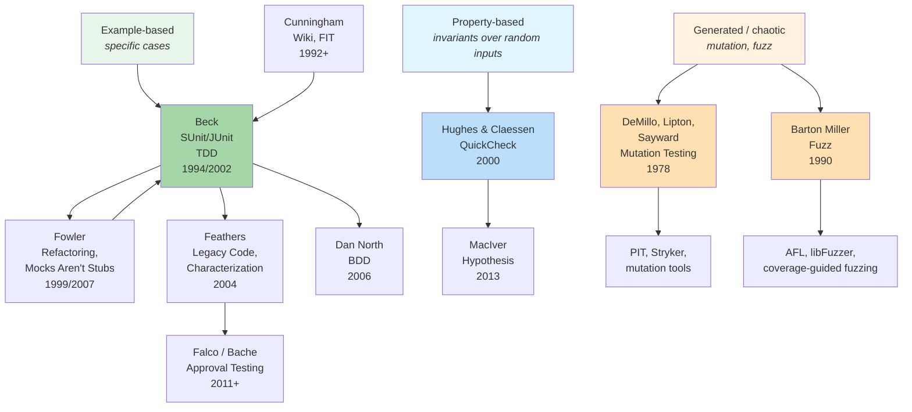
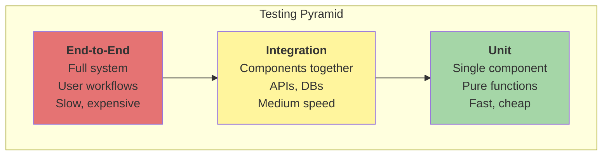
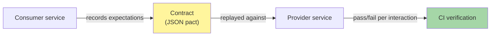

# Testing

How we gain confidence that software does what it should — and keeps doing
it as code changes.

Testing is not a phase that follows development; it is a **design
discipline** woven into how code is written, refactored, integrated, and
deployed. Kent Beck's most quoted claim about TDD captures the wider point
of this topic: *the test is the first client of the code*.

## The Big Picture



Three lineages converge:

- **Example-based** — humans pick the cases (TDD, Pyramid, BDD).
- **Property-based** — humans pick the invariants; the framework picks cases (QuickCheck → Hypothesis).
- **Generated / chaotic** — the framework picks both, then mutates code (mutation testing) or input (fuzzing).

## Why Testing Can't Be Exhaustive

Every testing technique on this page is, at heart, a reaction to one
brutal fact: **the input space is too large to enumerate**. A function
that adds two 32-bit integers has 2⁶⁴ possible input pairs — about
18 quintillion. No machine, however fast, can run them all.

So testers cheat — intelligently. Two classical techniques formalise
*how* to pick the few cases that should stand in for the many.

### Equivalence Partitioning

**Core idea:** Divide the input domain into classes whose members the
program treats *the same way*. Pick one representative from each class.

If the program does the same thing for `25` as it does for `33` as it
does for `42`, then testing all three is redundant — testing one of
them carries the same information.

For an age field that accepts 0–120:

| Class | Examples | Why |
|-------|----------|-----|
| `age < 0` | `-1`, `-1000` | Invalid (negative ages) |
| `0 ≤ age ≤ 120` | `25` | Valid range |
| `age > 120` | `121`, `9999` | Invalid (out of range) |

Three test cases instead of millions. The assumption — that members of
a class are interchangeable — is exactly what gives the technique its
leverage, and exactly what can fail (see Dijkstra's critique below).

### Boundary Value Analysis

**Core idea:** Bugs cluster on the boundaries between classes. Test
*just inside*, *on*, and *just outside* every boundary.

`< 18` vs `<= 18` is a classic off-by-one error, and it is invisible
to a test that only uses `25` and `5`. For the age range above:

| Boundary | Cases to test |
|----------|---------------|
| Lower bound `0` | `-1`, `0`, `1` |
| Upper bound `120` | `119`, `120`, `121` |

Together, equivalence partitioning *(pick one from each class)* and
boundary analysis *(probe every class's edges)* convert "infinite
input space" into a 7–10 test plan with high defect coverage.

### Dijkstra's Critique — Testing vs Proof

In 1972 [Edsger Dijkstra](../../authors/edsger-dijkstra.md) delivered
his Turing Award lecture, *The Humble Programmer*, with a line that
has shadowed testing ever since:

> "Program testing can be used to show the presence of bugs, but never
> to show their absence."

His point was epistemological. Equivalence partitioning rests on the
assumption that one representative speaks for an entire class — but if
a programmer wrote `if (age == 42) crash();`, the assumption is wrong
and the test of `age == 25` will never know. Sampling, no matter how
clever, can falsify a claim but cannot verify a universal.

Dijkstra's alternative was **formal verification**: prove,
mathematically, that the program meets its specification for *all*
inputs. The vocabulary comes from
[Tony Hoare](../../authors/tony-hoare.md)'s 1969 paper, *An Axiomatic
Basis for Computer Programming*:

```
  { P }  S  { Q }
```

A **Hoare triple** reads: "if precondition *P* holds before statement
*S* executes, then postcondition *Q* holds afterwards." Proving a
triple is a logical exercise — no inputs are run.

| | Testing | Formal verification |
|---|---------|---------------------|
| **Method** | Empirical — run the program on selected inputs | Mathematical — prove a logical theorem about the program |
| **Coverage** | Sample of the input space | All inputs satisfying *P* |
| **Outcome** | Counterexamples on failure; *confidence* on success | Proof on success; refined proof on failure |
| **Where used** | Almost all commercial software | Aerospace, medical devices, crypto, kernels (seL4, CompCert), smart contracts |
| **Cost** | Linear in #tests | Often super-linear in program size; needs human guidance |

The two are not rivals so much as different points on a
**rigour ↔ effort** curve. Equivalence partitioning is *practical
sampling* of an infinite domain; formal verification is the
mathematical limit where the sample becomes the whole.

→ [Edsger Dijkstra](../../authors/edsger-dijkstra.md) ·
[Tony Hoare](../../authors/tony-hoare.md) ·
[*The Humble Programmer*](https://www.cs.utexas.edu/users/EWD/transcriptions/EWD03xx/EWD340.html) (Turing Award lecture, 1972)

### The Bridge: Predicates Everywhere

Look closely and the two camps speak the *same logical language*.
A tester writing equivalence classes is writing predicates:
`P(x) ≡ 0 ≤ x ≤ 120`. Hoare's `{ P } S { Q }` uses the very same
predicate. Where they diverge is what they do with it:

- The **tester** picks values satisfying `P`, runs `S`, checks `Q`.
- The **verifier** reasons symbolically about `S` to *prove* `P ⇒ wp(S, Q)`.

[Property-based testing](#property-based-testing) — covered below —
is the modern synthesis. The engineer writes the property (the
predicate `Q`), the framework generates inputs satisfying `P`
*including the boundaries*, and the runtime checks the property
across thousands of cases. It is sampling done at machine scale,
guided by Dijkstra-style thinking about invariants.

## Two Axes of Tests

Almost every test sits on two orthogonal axes — **scope** (what it
exercises) and **style** (how cases are produced):

| Scope ↓  / Style → | Example      | Property    | Generated      | Snapshot / Approval |
|--------------------|--------------|-------------|----------------|---------------------|
| **Unit**           | Classic TDD  | QuickCheck  | Mutation       | Jest snapshots      |
| **Integration**    | API tests    | Stateful PBT | Fuzz harness  | Approval on records |
| **E2E**            | Cypress flow | rare        | Chaos / fuzz   | Golden-master       |

The Pyramid (below) governs the *scope* axis. The newer practices —
property, mutation, fuzzing, approval — extend the *style* axis.

## Test-Driven Development — TDD (2002)

**Core idea:** Write a test *before* writing code.

TDD is a development discipline systematised by Kent Beck in
*Test-Driven Development: By Example* (2002), though the practice
emerged earlier from his work on SUnit (~1994) and XP.

```
1. RED    — Write a failing test
2. GREEN  — Write the simplest code that passes
3. REFACTOR — Improve the design
   ↺ Repeat
```

### Why TDD?

TDD is counterintuitive: write a test before the code exists.
But this inverts the usual pain of testing:

- Tests are never skipped (written first)
- Design is driven by *usage* (the test is a client)
- You get a regression safety net automatically
- Small steps prevent over-engineering

### Fake It Till You Make It

Start with an obviously wrong implementation:

```python
# Test
def test_sum():
    assert sum([1, 2, 3]) == 6

# Fake it (get to GREEN as fast as possible)
def sum(numbers):
    return 6  # obviously wrong, but test passes!

# Now add another test that forces real implementation
def test_sum_different():
    assert sum([2, 3]) == 5

# Real implementation
def sum(numbers):
    result = 0
    for n in numbers:
        result += n
    return result
```

This seems absurd but has a purpose: it keeps steps small and focuses
on behaviour, not premature abstractions.

### TDD as Design

Beck's most important claim: **TDD is a design technique**, not just testing.

- Tests written first express the desired API before implementation
- Testability drives decoupling (dependencies must be injectable)
- Small steps prevent over-engineering
- Refactoring keeps design clean

→ [Kent Beck](../../authors/kent-beck.md) ·
[TDD by Example](../../works/books/beck-2002-tdd.md)

## The Testing Pyramid

**Core idea:** More tests at lower levels, fewer at higher levels.

The testing pyramid organises tests by speed, cost, and scope:



### Level Breakdown

| Level | What it tests | Typical tools | Speed |
|-------|---------------|---------------|-------|
| **Unit** | Single function/class in isolation | JUnit, pytest, Jest | < 1ms |
| **Integration** | Multiple components working together | TestContainers, integration tests | 100ms-1s |
| **E2E** | Full system through UI | Selenium, Playwright, Cypress | 1-10s |

### Unit Tests

Unit tests verify behaviour of a single component in isolation:

```python
def test_addition():
    assert add(2, 3) == 5

def test_sort_empty():
    assert sort([]) == []
```

**Benefits:**
- Fast feedback (seconds for entire suite)
- Isolate failures to specific components
- Serve as living documentation
- Enable safe refactoring

**When to write:**
- Business logic (calculations, transformations)
- Pure functions (no side effects)
- Component interfaces

### Integration Tests

Integration tests verify components work together correctly:

```python
def test_user_registration():
    # Test API + Database + Email service
    response = client.post("/api/users", json={"email": "test@example.com"})
    assert response.status_code == 201
    assert db.user_exists("test@example.com")
    assert email_service.last_sent_to == "test@example.com"
```

**Benefits:**
- Catch integration issues that unit tests miss
- Validate real data flow
- Test configuration and wiring

**When to write:**
- API endpoints
- Database interactions
- External service integrations

### End-to-End Tests

E2E tests simulate real user workflows through the entire system:

```javascript
// Cypress example
describe("Checkout flow", () => {
  it("allows user to complete purchase", () => {
    cy.visit("/products")
    cy.contains("Add to cart").click()
    cy.visit("/cart")
    cy.contains("Checkout").click()
    cy.contains("Order complete").should("be.visible")
  })
})
```

**Benefits:**
- Validate complete user journeys
- Catch integration issues across system
- Build confidence in critical workflows

**When to write:**
- Critical user paths (checkout, login)
- Multi-component workflows
- Regression testing for known issues

### Common Pitfalls

| Pitfall | Problem | Solution |
|---------|---------|----------|
| **Inverted pyramid** | Too many slow E2E tests | Add more unit tests, reduce E2E |
| **Flaky tests** | Intermittent failures reduce trust | Make tests deterministic, add retries |
| **Testing implementation** | Breaks on refactoring | Test behaviour, not implementation |
| **Brittle selectors** | E2E tests break on UI changes | Use data-testid attributes, not CSS selectors |

## Test Doubles

**Core idea:** Replace real dependencies with controlled fakes for testing.

Test doubles allow testing components in isolation by substituting real
dependencies (databases, APIs, filesystems) with controlled implementations.
Martin Fowler's *Mocks Aren't Stubs* (2007) is the canonical taxonomy.

### Types of Test Doubles

| Type | Purpose | Example |
|------|---------|---------|
| **Dummy** | Fulfils parameter requirements, unused | `DummyLogger()` passed to a function that never logs |
| **Stub** | Provides canned responses | `stub.get_user(123)` returns fake user data |
| **Spy** | Records calls for verification | Verify that `email.send()` was called twice |
| **Mock** | Pre-programmed expectations | Expect `db.save(user)` with specific user object |
| **Fake** | Working but simplified implementation | In-memory database instead of real database |

### Example: Testing a User Service

```python
# Without test doubles — slow, depends on external systems
def test_user_service():
    service = UserService(real_database, real_email_sender)
    result = service.register("test@example.com")
    assert result.success

# With test doubles — fast, deterministic
class FakeDatabase:
    def __init__(self):
        self.users = {}

    def save(self, user):
        self.users[user.email] = user
        return True

class SpyEmailSender:
    def __init__(self):
        self.sent = []

    def send(self, to, subject):
        self.sent.append((to, subject))

def test_user_service_with_doubles():
    db = FakeDatabase()
    email = SpyEmailSender()
    service = UserService(db, email)

    result = service.register("test@example.com")

    assert result.success
    assert "test@example.com" in db.users
    assert ("test@example.com", "Welcome") in email.sent
```

### When to Use Test Doubles

| Scenario | Use double? | Type |
|----------|-------------|------|
| **Slow dependency** | Yes | Fake or Stub |
| **Unreliable network** | Yes | Fake or Stub |
| **External API with rate limits** | Yes | Fake or Stub |
| **Need to verify interaction** | Yes | Spy or Mock |
| **Need real database semantics** | No | Use real DB (TestContainers) |

### Criticism and Best Practices

**Over-mocking** — excessive mocking can lead to:
- Tests that pass but code doesn't work (implementation vs behaviour)
- Brittle tests that break on internal changes
- Tests that don't catch real bugs

**Best practices:**
- Prefer fakes over mocks (working simplifications vs expectations)
- Test behaviour, not implementation
- Use real infrastructure when possible (TestContainers)
- Keep test doubles close to real behaviour

→ [Martin Fowler](../../authors/martin-fowler.md)

## Behaviour-Driven Development — BDD (2006)

**Core idea:** Express tests as natural-language scenarios that describe
*behaviour*, not implementation.

Dan North coined BDD in his 2006 essay *Introducing BDD*. The motivation:
TDD newcomers were getting stuck on the word "test" — they wrote tests
about methods and classes rather than about the behaviour the system
should exhibit. North reframed the practice in the language of examples.

### Given–When–Then

A BDD scenario describes a single example of behaviour in three parts:

```
Feature: Cash withdrawal

  Scenario: Successful withdrawal within balance
    Given the account has $200
    When the customer withdraws $50
    Then the balance is $150
    And $50 is dispensed
```

| Clause | Role |
|--------|------|
| **Given** | Preconditions / context |
| **When** | The event or action under test |
| **Then** | The observable outcome |

Multiple `Given` or `Then` clauses can be chained with `And`/`But`.

### Tooling

| Language | Tool |
|----------|------|
| Polyglot | **Cucumber** — runs Gherkin (Given/When/Then) scenarios |
| Ruby | RSpec (drove the early BDD vocabulary) |
| Java | JBehave (North's own framework), Cucumber-JVM |
| .NET | SpecFlow, Reqnroll |
| Python | behave, pytest-bdd |
| JavaScript | Cucumber.js |

### BDD vs ATDD vs Specification by Example

The terms overlap heavily:

| Practice | Emphasis |
|----------|----------|
| **BDD** | Vocabulary that ties tests to behaviour |
| **ATDD** | Tests as acceptance criteria, collaboratively written |
| **Specification by Example** | Live, executable examples as the spec of record (Gojko Adzic) |

In modern usage they describe a shared style: examples as a three-way
conversation between product, dev, and test — captured as automated
scenarios that survive the conversation.

### When BDD Helps and When It Hurts

| Helps | Hurts |
|-------|-------|
| Cross-functional teams that struggle to align on intent | Solo engineers who write Gherkin to themselves |
| Complex domains with non-trivial business rules | Pure technical concerns (parsing, math) |
| Scenarios where stakeholders read the tests | Scenarios where Gherkin becomes a verbose JUnit |

## Property-Based Testing

**Core idea:** Test invariants across randomly generated inputs.

Instead of writing specific test cases, write **properties** — logical
statements that should hold for all inputs. The framework generates
random inputs and searches for counterexamples.

### QuickCheck and Its Descendants

Claessen & Hughes (2000) introduced property-based testing with QuickCheck.
The approach has been ported to virtually every major language:

| Language | Library |
|----------|---------|
| Python | Hypothesis |
| Scala | ScalaCheck |
| Clojure | test.check |
| F# | FsCheck |
| TypeScript/JavaScript | fast-check |
| Rust | proptest |
| Go | rapid |

### Example: Testing a Sort Function

```haskell
-- Example-based testing
prop_sort_empty = sort [] == []
prop_sort_simple = sort [3,1,2] == [1,2,3]

-- Property-based testing (Haskell QuickCheck)
prop_sort_sorted :: [Int] -> Bool
prop_sort_sorted xs = isSorted (sort xs)

prop_sort_length :: [Int] -> Bool
prop_sort_length xs = length (sort xs) == length xs

prop_sort_contains :: [Int] -> Int -> Property
prop_sort_contains xs x = elem x xs ==> elem x (sort xs)
```

### Shrinking

When a property fails, property-based testing frameworks **shrink**
the counterexample to the minimal failing case:

```python
# Hypothesis (Python) example
# Failing input found: [1000, 50, 3, -7, 0, 42, -1]
# After shrinking: [-7]
```

Shrinking makes debugging much easier by removing irrelevant details.

### When to Use Property-Based Testing

| Scenario | PBT benefit |
|----------|-------------|
| **Algorithms with clear invariants** | Sort, search, compression |
| **Data structures** | Trees, graphs, collections |
| **State machines** | Protocols, game logic |
| **Edge cases** | Boundary conditions you didn't think of |

### Complementarity with TDD

| TDD | Property-Based Testing |
|-----|------------------------|
| Small, focused tests | Broad, invariant checking |
| Example cases | Randomly generated inputs |
| Specifies exact behaviour | Specifies general properties |
| Good for business logic | Good for algorithms/data structures |

→ [QuickCheck paper](../../works/papers/hughes-claessen-2000-quickcheck.md) ·
[John Hughes](../../authors/john-hughes.md) ·
[Koen Claessen](../../authors/koen-claessen.md) ·
[David MacIver](../../authors/david-maciver.md) (Hypothesis)

## Mutation Testing

**Core idea:** Measure test quality by introducing small faults
("mutants") into the code and checking whether the tests notice.

The intellectual root is DeMillo, Lipton, and Sayward's 1978 paper
*Hints on Test Data Selection: Help for the Practicing Programmer*, which
argued that good test suites should be sensitive to small program
perturbations. Jeff Offutt's later work moved the technique from theory
to practice.

### How It Works

1. The tool makes a **single mutation** to the source — e.g. flips
   `a < b` to `a <= b`, replaces `+` with `-`, drops a method call.
2. The tool re-runs the test suite against this *mutant*.
3. If a test fails, the mutant is **killed**.
4. If every test still passes, the mutant **survived** — the suite
   missed it.

```
Mutation score = killed / (killed + survived)
```

Coverage answers *"was this line executed?"*. Mutation testing answers
*"would my tests have noticed if this line did the wrong thing?"*.

### Example

```python
def is_adult(age):
    return age >= 18

# Tests
def test_adult():
    assert is_adult(18) == True

def test_child():
    assert is_adult(17) == False
```

A mutation tool may produce:

| Mutant | Code change | Killed? |
|--------|-------------|---------|
| `age >  18` | strict | ✅ kills via `is_adult(18)` |
| `age >= 17` | off-by-one | ❌ survives (no test at 16 or 17 boundary) |
| `return False` | always false | ✅ kills via `is_adult(18)` |
| `return True` | always true | ✅ kills via `is_adult(17)` |

The surviving mutant exposes a missing edge case.

### Tooling

| Language | Tool |
|----------|------|
| Java / Kotlin | **PIT** |
| JavaScript / TypeScript | **Stryker** |
| Python | mutmut, cosmic-ray |
| C# | Stryker.NET |
| Scala | Stryker4s |
| Go | go-mutesting |
| Rust | mutagen, cargo-mutants |

### Trade-offs

| Benefit | Cost |
|---------|------|
| Reveals weak assertions and missing tests | Slow — N × test-suite runtime |
| Forces tests to be sensitive to behaviour, not just coverage | Equivalent mutants (semantically identical) inflate noise |
| Surfaces dead code (mutant unreachable) | Heavy in CI; usually run nightly or per-PR target only |

Mutation testing pairs naturally with TDD: the loop becomes
*Red → Green → Refactor → Run mutants on the new test*.

## Fuzzing

**Core idea:** Generate random or semi-random *inputs* to a program and
look for crashes, hangs, or assertion failures.

Barton Miller coined "fuzz" in a 1990 University of Wisconsin paper —
*An Empirical Study of the Reliability of UNIX Utilities* — after a
storm sent line noise down a dial-up shell and crashed multiple core
utilities. The conclusion was uncomfortable: standard UNIX tools
fell over on garbage input at very high rates.

### Modern Fuzzing

```
Generator → Input → System Under Test
                    ↓
              Crash / hang / assertion?
                    ↓
              Minimise + report
```

Three generations of fuzzers:

| Generation | Approach | Example |
|------------|----------|---------|
| **Random** | Pure random bytes | Miller's 1990 study |
| **Mutational** | Mutate a seed corpus | radamsa |
| **Coverage-guided** | Mutate, then favour inputs that hit new branches | **AFL** (Michał Zalewski, 2013), **libFuzzer**, **honggfuzz** |

Coverage-guided fuzzing turned fuzzing from a smoke test into a
**continuous correctness tool**: Google's OSS-Fuzz fuzzes hundreds of
open-source projects 24/7 and has filed thousands of bugs.

### Fuzz Targets

A *fuzz target* is a small harness — typically `LLVMFuzzerTestOneInput`
in C/C++ or `fuzz_target!` in Rust — that consumes a byte buffer and
exercises the API under test:

```rust
// cargo-fuzz example
fuzz_target!(|data: &[u8]| {
    if let Ok(s) = std::str::from_utf8(data) {
        let _ = my_parser::parse(s);
    }
});
```

The fuzzer drives the target with millions of inputs, recording any
crash plus a minimised reproducer.

### Fuzzing vs Property-Based Testing

Both generate inputs, but the contract differs:

| | Fuzzing | Property-Based Testing |
|---|---------|------------------------|
| **Oracle** | Implicit — crash, hang, assertion, sanitiser violation | Explicit property |
| **Input shape** | Raw bytes or close to it | Typed values from generators |
| **Loop length** | Hours to weeks | Seconds to minutes |
| **Goal** | Find security / robustness bugs | Specify behaviour |

In practice they converge: modern Rust and Go fuzzers accept
property-style assertions, and PBT libraries are adopting coverage
feedback.

### Language Support

| Language | Built-in / standard tool |
|----------|--------------------------|
| C / C++ | libFuzzer, AFL++ |
| Rust | `cargo fuzz` (libFuzzer), `cargo-afl` |
| Go | native `go test -fuzz` since 1.18 (2022) |
| Python | Atheris (libFuzzer-backed) |
| Java | Jazzer |
| OCaml | Crowbar |

## Contract Testing

**Core idea:** Verify that two services agree on the *messages* they
exchange — without spinning up both at once.

Ian Robinson described **consumer-driven contracts** in 2006 (ThoughtWorks
essay). The motivation: end-to-end tests across microservices are slow,
flaky, and couple unrelated teams. A contract test pins down the API
shape that one service depends on, so each side can evolve independently.

### Consumer-Driven Contracts



1. The **consumer** writes a test that talks to a local mock provider
   and records the interactions it expects.
2. The recording is the **contract** (e.g. a Pact file).
3. The **provider's** CI replays each interaction against the real
   service and fails if any expectation breaks.

If the provider changes a field name, the contract check fires *before*
deployment.

### Tooling

| Tool | Notes |
|------|-------|
| **Pact** | Polyglot (JVM, JS, .NET, Go, Python, Ruby), with a shared Pact Broker for sharing contracts |
| **Spring Cloud Contract** | JVM-native, Groovy/YAML DSL, generates stubs |
| **OpenAPI schema diffing** | Lightweight alternative — verify both sides implement the same schema |

### When to Reach For It

- Microservices owned by different teams.
- A public API whose breaking changes you want to catch early.
- A messaging contract (Kafka topic, RabbitMQ exchange) — Pact supports
  message pacts as well.

### When NOT To

- A monolith: a regular integration test is simpler and stronger.
- Two services owned by the same team that ship together: an integration
  test catches the same bugs with less ceremony.

## Snapshot / Approval Testing

**Core idea:** Compare today's output to a previously *approved* output;
fail on mismatch.

The pattern has two complementary names:

- **Snapshot testing** — popularised by **Jest** (Facebook, 2017) for
  React components. The first run writes the snapshot file; later runs
  diff against it.
- **Approval testing** — the broader formulation by **Llewellyn Falco**
  and later **Emily Bache**. Designed especially for legacy code, where
  no specification exists and the only honest oracle is the system's
  current behaviour.

### Workflow

```
1. Run the code, capture its output (text, JSON, image, HTML).
2. A human REVIEWS the output and APPROVES it.
3. Approved output is committed alongside the test.
4. Future runs diff produced ↔ approved.
5. Intentional changes require explicit re-approval.
```

### Example

```javascript
// Jest snapshot
test("renders user card", () => {
  const tree = renderer.create(<UserCard name="Ada" />).toJSON()
  expect(tree).toMatchSnapshot()
})
```

```
__snapshots__/UserCard.test.js.snap
exports[`renders user card 1`] = `
<div className="card">
  <h2>Ada</h2>
</div>
`
```

### Approval Testing for Legacy Code

This is the connection to Michael Feathers's **characterization tests**
(*Working Effectively with Legacy Code*, 2004). Both pin down the
current behaviour of code that lacks tests — but the approval-testing
*tooling* automates the comparison and the diff review.

```
Legacy function with no tests
        ↓
Run it on representative inputs
        ↓
Capture output → approve
        ↓
Refactor freely — diff catches any drift
```

→ [Michael Feathers](../../authors/michael-feathers.md) ·
[Working Effectively with Legacy Code](../../works/books/feathers-2004-legacy.md)

### Trade-offs

| Benefit | Cost |
|---------|------|
| Cheap to add — captures the existing behaviour | Snapshots can rot — humans rubber-stamp diffs |
| Excellent for refactor safety nets | Bad fit when output is non-deterministic (timestamps, random IDs, ordering) |
| Works on text, JSON, images, HTML, terminal output | Large snapshots are hard to review in PRs |

### Common Pitfalls

- **Auto-updating without reading the diff** — Jest's `--updateSnapshot`
  must be used deliberately, not as a CI fix-up step.
- **Snapshots of dynamic data** — scrub timestamps, UUIDs, and locale
  sensitive output before approving.
- **Snapshots of full DOM trees** — prefer targeted snapshots of
  meaningful slices.

## Characterization Tests

**Core idea:** Capture what code *actually does* (not what it should do)
so you can change it safely.

Coined by Michael Feathers in *Working Effectively with Legacy Code*
(2004). The motivation is the practical reality of legacy systems:

> "When you put a piece of legacy code under test, you may discover
> behaviour that looks wrong, but is actually relied upon by other
> parts of the system. Lock the behaviour in first, fix it later."

### Recipe

1. Pick a unit of legacy code with no tests.
2. Identify a **seam** — a place where you can swap or observe behaviour
   without changing the source (Feathers's term).
3. Drive it with representative inputs; assert on whatever it produces.
4. The assertion's *value* is filled in by what the code actually emits.
5. Now you have a regression net for refactoring.

Modern approval testing (above) is the most direct tooling for this
recipe — point the harness at the legacy function, capture, approve,
proceed.

## Authors → Contribution → Year

| Author | Key contribution to testing | Year | Page |
|--------|----------------------------|------|------|
| Tony Hoare | Hoare triples `{P} S {Q}`, axiomatic basis | 1969 | [Tony Hoare](../../authors/tony-hoare.md) |
| Edsger Dijkstra | *The Humble Programmer* — testing shows presence of bugs, not absence | 1972 | [Edsger Dijkstra](../../authors/edsger-dijkstra.md) |
| Richard DeMillo, Richard Lipton, Frederick Sayward | Mutation testing — *Hints on Test Data Selection* | 1978 | — |
| Glenford Myers | *The Art of Software Testing* — equivalence partitioning, boundary analysis | 1979 | — |
| Barton Miller | Coined "fuzz" — *Empirical Study of UNIX Utilities* | 1990 | [Barton Miller](../../authors/barton-miller.md) |
| Ward Cunningham | Wiki, FIT (Framework for Integrated Test) | 1992+ | [Ward Cunningham](../../authors/ward-cunningham.md) |
| Kent Beck | SUnit (1994), JUnit (1997 with Erich Gamma), TDD | 1994/2002 | [Kent Beck](../../authors/kent-beck.md) |
| Martin Fowler | *Refactoring*, *Mocks Aren't Stubs* taxonomy | 1999/2007 | [Martin Fowler](../../authors/martin-fowler.md) |
| Koen Claessen & John Hughes | QuickCheck — property-based testing | 2000 | [Hughes](../../authors/john-hughes.md) · [Claessen](../../authors/koen-claessen.md) |
| Michael Feathers | Characterization tests, seams | 2004 | [Michael Feathers](../../authors/michael-feathers.md) |
| Dan North | Behaviour-Driven Development | 2006 | [Dan North](../../authors/dan-north.md) |
| Ian Robinson | Consumer-driven contracts | 2006 | — |
| Llewellyn Falco | Approval testing (the framework + practice) | 2011+ | — |
| David MacIver | Hypothesis (PBT for Python, with shrinking) | 2013 | [David MacIver](../../authors/david-maciver.md) |
| Emily Bache | Refactoring + approval-testing katas and books | 2014+ | — |
| Michał Zalewski | AFL — coverage-guided fuzzing | 2013 | — |

## Timeline

| Year | Event | Impact |
|------|-------|--------|
| 1969 | Hoare — *An Axiomatic Basis for Computer Programming* | Hoare triples `{P} S {Q}`; formal verification's vocabulary |
| 1972 | Dijkstra — *The Humble Programmer* (Turing Award lecture) | "Testing shows the presence of bugs, never their absence" |
| 1978 | DeMillo, Lipton, Sayward — *Hints on Test Data Selection* | Mutation testing theory |
| 1979 | Myers — *The Art of Software Testing* | Equivalence partitioning, boundary value analysis as discipline |
| 1990 | Miller — *Empirical Study of the Reliability of UNIX Utilities* | "Fuzz" enters the vocabulary |
| 1992 | Cunningham — Wiki, then FIT | Acceptance testing via wiki tables |
| 1994 | Beck — SUnit (Smalltalk) | xUnit pattern is born |
| 1997 | Beck & Gamma — JUnit | xUnit mainstream on JVM |
| 1999 | Fowler — *Refactoring* | Tests as the refactoring safety net |
| 2000 | Claessen & Hughes — QuickCheck | Property-based testing |
| 2002 | Beck — *Test-Driven Development by Example* | TDD as a design discipline |
| 2004 | Feathers — *Working Effectively with Legacy Code* | Seams + characterization tests |
| 2006 | North — *Introducing BDD* | Behaviour as the unit of test |
| 2006 | Robinson — Consumer-driven contracts | Microservices testing |
| 2007 | Fowler — *Mocks Aren't Stubs* | Test-double taxonomy |
| 2010 | PIT (Java mutation testing) released | Mutation testing in CI |
| 2013 | Zalewski — AFL | Coverage-guided fuzzing mainstream |
| 2013 | MacIver — Hypothesis | PBT for Python with great shrinking |
| 2016 | Stryker (JavaScript mutation testing) | Mutation testing for JS / TS |
| 2017 | Jest snapshots become widespread | Approval-style tests in front-end |
| 2022 | Go 1.18 — native fuzzing | Fuzzing in the standard toolchain |

## Examples by Language

Runnable testing samples live under [`examples/`](../../../examples/):

| Language | Path |
|----------|------|
| C | [`examples/c/09-testing`](../../../examples/c/09-testing) |
| Clojure | [`examples/clojure/09-testing`](../../../examples/clojure/09-testing) |
| Erlang | [`examples/erlang/09-testing`](../../../examples/erlang/09-testing) |
| Go | [`examples/go/10-testing`](../../../examples/go/10-testing) |
| Haskell | [`examples/haskell/09-testing`](../../../examples/haskell/09-testing) |
| Java | [`examples/java/10-testing`](../../../examples/java/10-testing) |
| Lisp | [`examples/lisp/09-testing`](../../../examples/lisp/09-testing) |
| Python | [`examples/python/10-testing`](../../../examples/python/10-testing) |
| Rust | [`examples/rust/09-testing`](../../../examples/rust/09-testing) |
| TypeScript | [`examples/typescript/09-testing`](../../../examples/typescript/09-testing) |

Language-specific pages with deeper coverage:

- [Spring Boot Testing](../../languages/java/spring-testing.md) — test
  slices, MockMvc, Testcontainers, context caching on the JVM.

## Reading Path

For a guided sequence from TDD through Refactoring, Legacy Code, and
Continuous Delivery, see the dedicated
[Testing & Delivery reading path](../../reading-paths/testing-and-delivery-path.md).

## Further Reading

- Beck — *Test-Driven Development: By Example* (2002)
- Beck — *Extreme Programming Explained* (1999)
- Dijkstra — *The Humble Programmer* (Turing Award lecture, 1972)
- Feathers — *Working Effectively with Legacy Code* (2004)
- Fowler — *Refactoring* (1999, 2nd ed. 2018)
- Fowler — *Mocks Aren't Stubs* (2007)
- Hoare — *An Axiomatic Basis for Computer Programming* (1969)
- Hughes & Claessen — *QuickCheck: A Lightweight Tool for Random Testing* (2000)
- Miller et al. — *An Empirical Study of the Reliability of UNIX Utilities* (1990)
- Myers — *The Art of Software Testing* (1979; 3rd ed. with Sandler & Badgett, 2011)
- DeMillo, Lipton, Sayward — *Hints on Test Data Selection* (1978)
- North — *Introducing BDD* (2006)
- Robinson — *Consumer-Driven Contracts* (ThoughtWorks, 2006)
- Bache — *The Coding Dojo Handbook* (2014); *Mocking Pitfalls* talks
- Humble & Farley — *Continuous Delivery* (2010) — testing in the pipeline

## Related Topics

- [Process](../process/index.md) — XP, CI/CD, DevOps; testing as part of how teams ship
- [OOP & Design](../design/index.md) — testability via SOLID, refactoring
- [Functional Programming](../functional/index.md) — why pure code is the easiest to test, and where PBT was born
- [Type Systems](../types/index.md) — formal verification, Hoare logic, types as proofs
- [Developer Tools](../dev-tools/index.md) — IDE test runners, coverage, profilers
- [Version Control & Git](../vcs/index.md) — pre-commit hooks, CI triggers
- [Architecture & Modularity](../architecture/index.md) — hexagonal / ports & adapters as a testability driver
