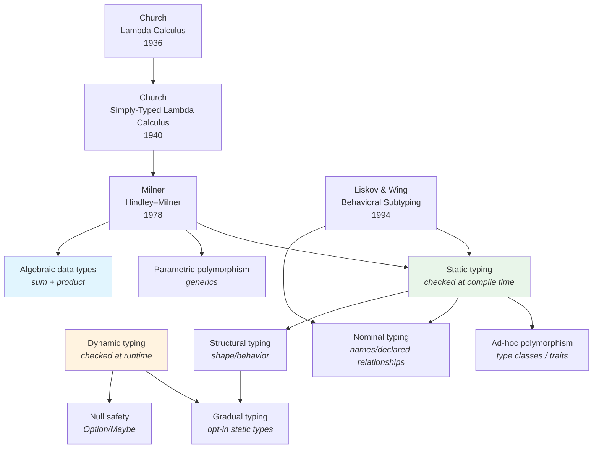

# Type Systems

How types help us reason about programs: what a value *is*, what you can
*do* with it, and what kinds of mistakes can be prevented before runtime.

Types are both:
- **A safety tool** (prevent invalid operations)
- **A design tool** (make invariants explicit)
- **A communication tool** (document intent)

## The Big Picture



## Core Dimensions

### Static vs Dynamic

| Dimension | Static typing | Dynamic typing |
|---|---|---|
| When checked | Compile time | Runtime |
| Feedback loop | Earlier (compiler) | Later (tests/production) |
| Refactoring | Safer, tool-assisted | Faster iteration, more runtime checks |
| Typical strengths | Large codebases, correctness | REPL-driven, rapid exploration |

Examples:
- Static: Haskell, Rust, Java, Go, TypeScript
- Dynamic: Python, Ruby, JavaScript, Erlang, Clojure

### Strong vs Weak (pragmatic notion)

This informal axis is about how freely a language performs implicit conversions.

| Dimension | Strong | Weak |
|---|---|---|
| Implicit conversions | Rare | Common |
| Typical failure | Explicit cast needed | Surprising coercions |

Examples:
- Strong: Python (`"3" + 4` fails), Go (no numeric implicit casts), Rust
- Weak: C (numeric conversions everywhere; pointer casts possible)

### Nominal vs Structural

| Dimension | Nominal typing | Structural typing |
|---|---|---|
| Compatibility | Must *declare* relation (`implements/extends`) | Must *match shape* (methods/fields) |
| Typical languages | Java, C#, Swift | TypeScript, Go interfaces (structural-ish) |

**Go interfaces**: structural satisfaction (implicit), but still with named interfaces.
**TypeScript**: structural across the board.

### Subtyping vs Parametric Polymorphism

Two different ideas often conflated:

- **Subtyping**: `Dog` can be used where `Animal` is expected.
- **Parametric polymorphism**: `List<T>` works for any `T`.

```ts
// Parametric polymorphism
function first<T>(xs: T[]): T | undefined { return xs[0]; }

// Subtyping
interface Animal { speak(): void }
class Dog implements Animal { speak(){ console.log("woof") } }
```

## The Liskov Substitution Principle (LSP)

"Subtype" should mean "safe replacement", not "is-a by intuition".

→ [Liskov & Wing (1994)](../../works/papers/liskov-1994-subtyping.md)

**Rule of thumb:**
- A subtype may accept *more* inputs (weaker preconditions)
- A subtype may guarantee *more* outputs (stronger postconditions)
- A subtype must preserve invariants

## Hindley–Milner Type Inference (ML → Haskell)

HM inference is why Haskell/ML can be both:
- **Statically typed**
- **Low-boilerplate** (few annotations)

```haskell
-- No type annotations needed
add x y = x + y
-- inferred: add :: Num a => a -> a -> a
```

This line of work traces back to:
- Church's typed lambda calculus (1940)
- Milner's ML (1978)

## Algebraic Data Types (ADTs) and "No Null"

ADTs let you model domain states explicitly.

### Option / Maybe

```rust
fn find_user(id: i32) -> Option<String> {
    if id == 1 { Some("Ada".to_string()) } else { None }
}
```

```haskell
findUser :: Int -> Maybe String
findUser 1 = Just "Ada"
findUser _ = Nothing
```

In dynamic languages, you often default to `null`/`nil`/`None`.
In typed FP and Rust, "absence" is explicit and handled exhaustively.

### Sum Types (Discriminated Unions)

```ts
type Shape =
  | { kind: "circle"; radius: number }
  | { kind: "rect"; w: number; h: number };

function area(s: Shape): number {
  switch (s.kind) {
    case "circle": return Math.PI * s.radius ** 2;
    case "rect": return s.w * s.h;
  }
}
```

This reduces "forgot a case" bugs: adding a new variant forces updates.

## Generics, Variance, and Sharp Edges

Generics improve reuse, but variance is subtle:

- **Covariant**: `List<Dog>` is usable where `List<Animal>` is expected (often unsafe for mutation)
- **Contravariant**: function parameters
- **Invariant**: safest default for mutable containers

Java: `? extends T` and `? super T` express variance.
C#: `out` / `in`.
Kotlin: `out` / `in` + declaration-site variance.

## Gradual Typing (TypeScript, Python type hints)

Gradual typing allows a dynamic language ecosystem to adopt types incrementally.

TypeScript:
- Types exist at compile time only (erased at runtime)
- Structural typing + unions + inference make it practical

Python:
- Type hints are optional; runtime doesn't enforce them
- Tools (mypy/pyright) give static checking benefits

## A Pragmatic Mental Model

Types help most when you use them to encode **invariants**:
- "this value may be missing" → `Option<T>`
- "this function may fail" → `Result<T, E>`
- "this state is one of these cases" → ADT / discriminated union
- "this id is not interchangeable with that id" → newtypes / distinct types

## Timeline

| Year | Event | Impact |
|---|---|---|
|1936 | Church — Lambda Calculus | Computation as function application |
|1940 | Church — Simply-typed λ-calculus | Types enter λ world |
|1978 | Milner — ML / HM inference | Static typing without annotations |
|1988 | Meyer — DbC | Contracts + invariants as "semantic types" |
|1994 | Liskov & Wing — Behavioral subtyping | Formal substitutability |
|2007 | Clojure | Dynamic + immutable data, FP emphasis |
|2010 | Rust announced | Ownership + lifetimes (compile-time safety) |
|2012 | TypeScript | Structural, gradual typing for JS |

## Further Reading

- [Liskov & Wing (1994)](../../works/papers/liskov-1994-subtyping.md)
- Milner — *A Theory of Type Polymorphism in Programming* (1978) *(planned page)*
- Pierce — *Types and Programming Languages* (2002)
- Wadler — *Theorems for Free!* (1989)

## Related Topics

- [Paradigms](../paradigms/) — OOP in context of all paradigms
- [Functional Programming](../functional/) — alternative to OOP
- [OOP & Design](../design/) — SOLID, patterns, refactoring
- [Concurrency](../concurrency/) — shared state vs message passing
