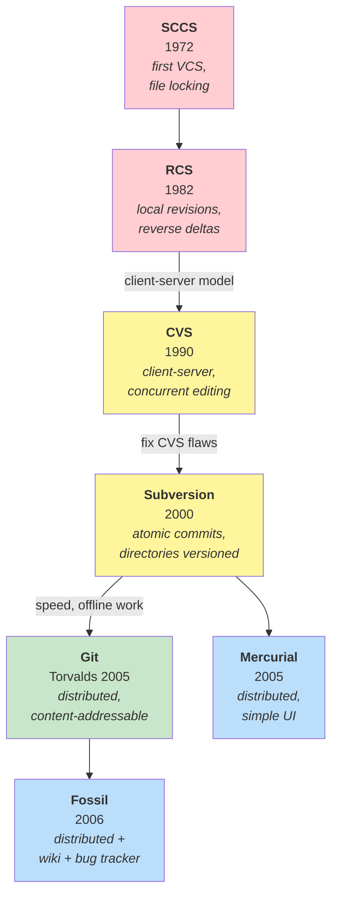
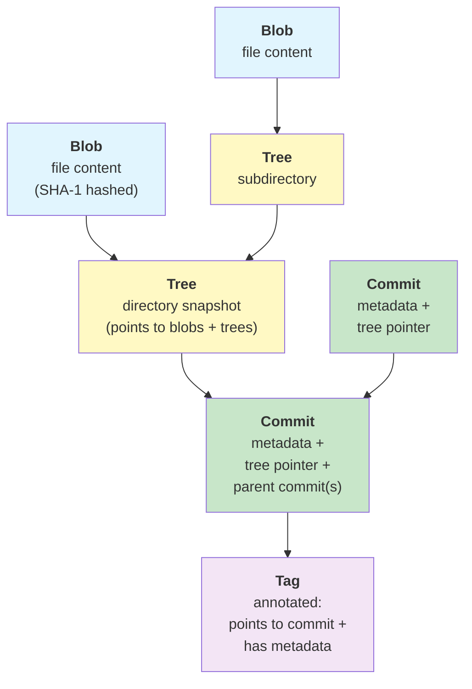
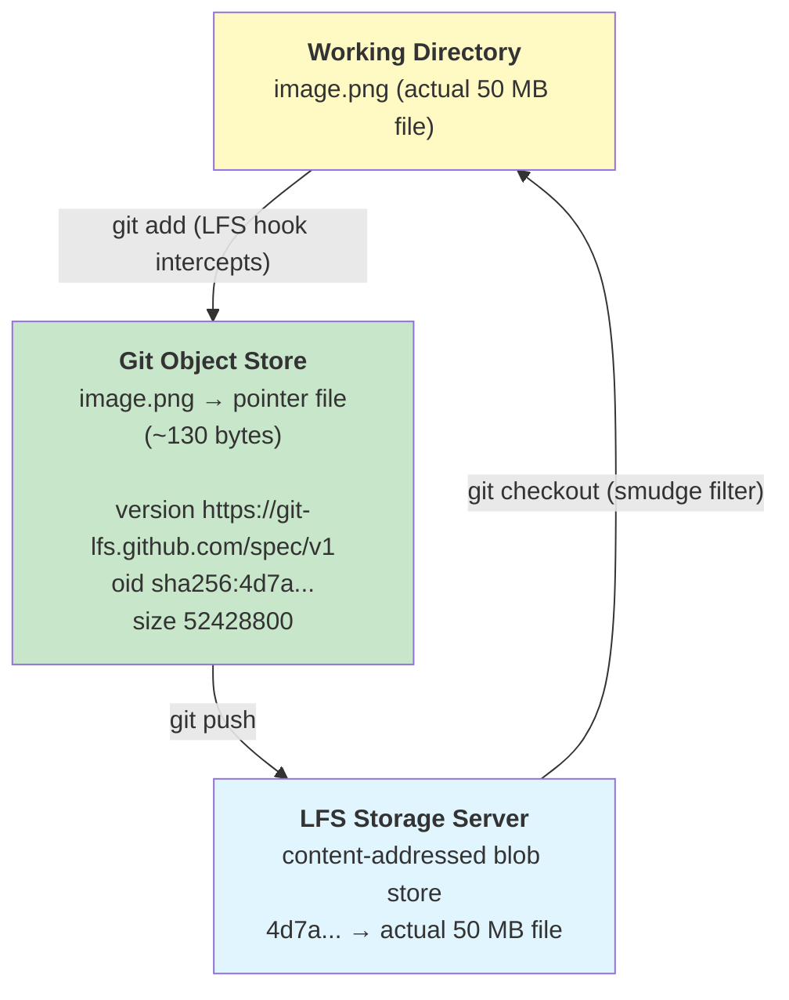
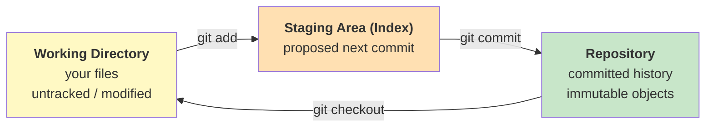
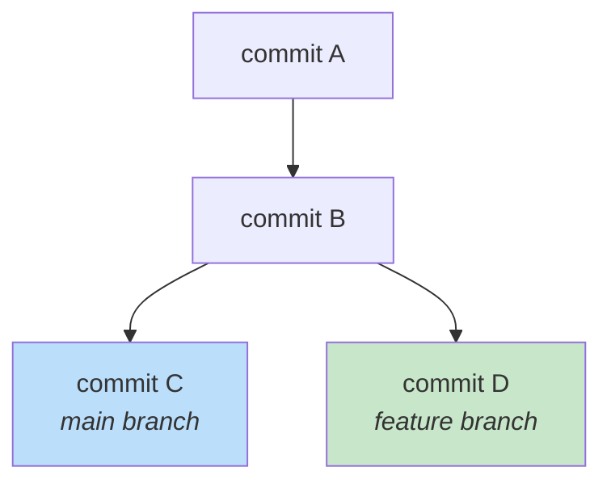
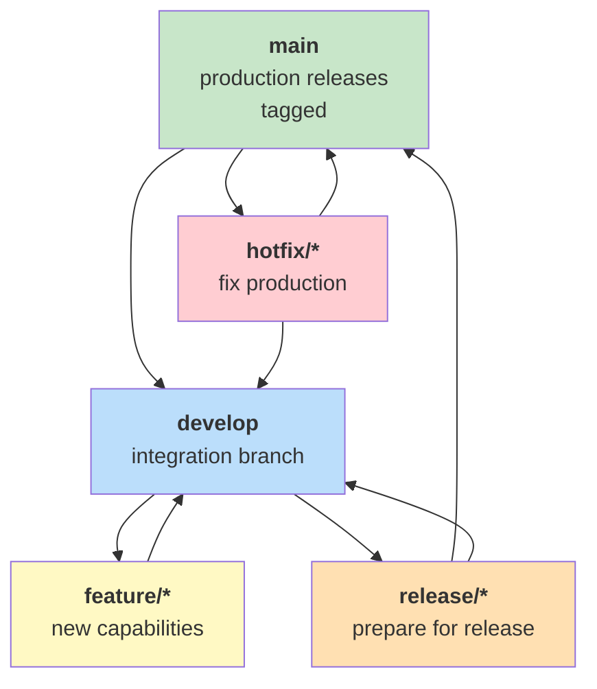
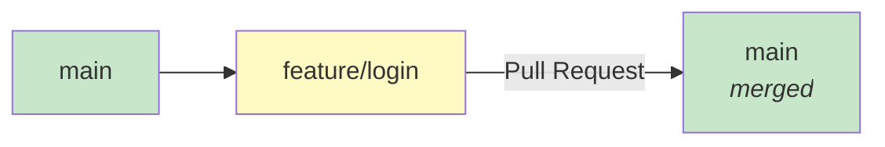

# Version Control & Git

Version control is the foundation of collaborative software development. It tracks
every change to source code, enables parallel work through branching, and provides
an immutable history that teams can inspect, revert, and reason about.

The evolution from file-locking systems to distributed models reflects a deeper
shift: from *preventing conflict* to *embracing parallel work* and resolving
conflict through merge.

## Contents

- [History & Context](#history--context)
  - [The Big Picture](#the-big-picture)
  - [Local Version Control](#local-version-control)
  - [Centralized VCS](#centralized-vcs)
  - [Distributed VCS](#distributed-vcs)
  - [Timeline](#timeline)
- [Git Fundamentals](#git-fundamentals)
  - [The Git Object Model](#the-git-object-model)
  - [Binary Files & Storage Efficiency](#binary-files--storage-efficiency)
  - [Git LFS](#git-lfs)
  - [The Staging Area](#the-staging-area)
  - [Branching & Merging](#branching--merging)
  - [Distributed Workflows](#distributed-workflows)
- [Branching Strategies](#branching-strategies)
  - [Git Flow](#git-flow)
  - [GitHub Flow / GitLab Flow](#github-flow--gitlab-flow)
  - [Trunk-Based Development](#trunk-based-development)
- [Modern Practices](#modern-practices)
  - [Commit Hygiene](#commit-hygiene)
  - [Pull Requests & Code Review](#pull-requests--code-review)
  - [Monorepo vs Polyrepo](#monorepo-vs-polyrepo)
  - [Signing & Security](#signing--security)
- [The Pragmatic View](#the-pragmatic-view)
- [Further Reading](#further-reading)
- [Key Authors](#key-authors)
- [Related Topics](#related-topics)

---

## History & Context

Version control systems evolved through three distinct eras: local, centralized,
and distributed. Each solved the limitations of the previous while introducing
new trade-offs.

### The Big Picture



### Local Version Control

**Core idea:** Track revisions of files on a single machine.

**SCCS (Source Code Control System, 1972)** — the first VCS, developed by Marc
Rochkind at Bell Labs. Used a *file-locking* model: only one developer could
edit a file at a time. Revisions stored as forward deltas (differences from the
original).

**RCS (Revision Control System, 1982)** — Walter Tichy's improvement over SCCS.
Introduced *reverse deltas* (store the latest version whole, keep older versions
as deltas backward). Still single-user, file-based, no networking.

**Limitations:**
- No collaboration across machines
- File locking prevents parallel work
- No concept of a project-wide snapshot

### Centralized VCS

**Core idea:** A single central server holds the canonical repository; clients
check out files to work.

**CVS (Concurrent Versions System, 1990)** — built on top of RCS. Introduced
*concurrent editing* (editors no longer lock files; conflicts resolved at commit
time). First widely adopted open-source VCS.

**Subversion (SVN, 2000)** — designed by CollabNet to fix CVS's flaws:
- Atomic commits (all files in a commit succeed or fail together)
- Directories versioned (not just files)
- Cheap branching and tagging (copy-on-write)
- Better binary file handling

**Strengths:**
- Simple mental model: one central truth
- Fine-grained access control per path
- Good for large binary assets (with locking)

**Weaknesses:**
- Requires network for most operations (history, diff, blame)
- Branching is server-side and slow
- Single point of failure: if the server dies, collaboration stops

### Distributed VCS

**Core idea:** Every clone is a full repository with complete history. No
central server required; collaboration happens by pushing and pulling between
peers.

**Git (2005)** — created by Linus Torvalds for Linux kernel development after
BitKeeper's free license was revoked. Design goals:
- Speed (operations in milliseconds)
- Fully distributed (work offline with complete history)
- Strong integrity (content-addressable, SHA-1 object names)
- Cheap branching (branches are just references)

**Mercurial (2005)** — created by Matt Mackall around the same time as Git.
Similar distributed model but with a simpler command-line interface and more
consistent behavior.

**Key differences from centralized:**

| Aspect | Centralized (SVN) | Distributed (Git) |
|--------|-------------------|-------------------|
| **Repository** | Single server | Every clone is full repo |
| **History** | Server-only | Local, complete |
| **Branching** | Server-side, heavy | Local, lightweight (reference) |
| **Commits** | Published immediately | Local commits, push when ready |
| **Collaboration** | Check out / commit | Pull / push between any repos |
| **Offline work** | Read-only history | Full operations |

### Timeline

| Year | System | Creator | Key Innovation |
|------|--------|---------|----------------|
| **1972** | SCCS | Marc Rochkind (Bell Labs) | First version control; file locking |
| **1982** | RCS | Walter Tichy | Reverse deltas; better storage |
| **1990** | CVS | Dick Grune | Concurrent editing; network client-server |
| **2000** | Subversion | CollabNet | Atomic commits; versioned directories |
| **2005** | Git | Linus Torvalds | Distributed; content-addressable; speed |
| **2005** | Mercurial | Matt Mackall | Distributed; simpler UI than Git |
| **2006** | Fossil | D. Richard Hipp | DVCS + wiki + bug tracker in one binary |
| **2008** | GitHub | Tom Preston-Werner | Social coding; pull request workflow |
| **2011** | GitLab | Dmitriy Zaporozhets | Open-source GitHub alternative; CI integrated |

---

## Git Fundamentals

Git's design differs fundamentally from traditional VCS. Understanding its
internals explains why it behaves the way it does.

### The Git Object Model

Git stores data as a directed acyclic graph (DAG) of four object types:



| Object | Purpose | Addressed By |
|--------|---------|-------------|
| **Blob** | Stores file contents (uncompressed, but zlib-compressed on disk) | SHA-1 of content |
| **Tree** | Represents a directory: list of filenames + blob/tree hashes + modes | SHA-1 of tree content |
| **Commit** | Points to a tree (root directory snapshot) + parent commit(s) + metadata | SHA-1 of commit content |
| **Tag** | Annotated label pointing to a commit; can include GPG signature | SHA-1 of tag object |

**Content-addressable storage:** The SHA-1 hash of an object's content is its
name. If two files have identical content, they share one blob. If a commit has
the same tree and parents and metadata, it has the same hash. This guarantees
integrity: any corruption changes the hash.

**Snapshots, not deltas:** Unlike SVN (which stores differences), Git stores a
complete snapshot of every file at every commit. For unchanged files, it reuses
the same blob hash — storage is efficient in practice through deduplication and
packfiles (delta compression at the storage layer, not the semantic layer).

### Binary Files & Storage Efficiency

Git's snapshot model interacts poorly with binary files. Understanding why
clarifies when to reach for Git LFS.

**Deduplication for unchanged files:**

```
Commit 1:              Commit 2:
├── README.md ─────────────────► blob: abc123  (shared, one copy)
├── main.py   ─────────────────► blob: def456  (shared, one copy)
└── image.png ──► blob: aaa111  blob: bbb222   (two separate blobs)
              ↑ changed ──────────────────────► new full copy stored
```

If a file is unchanged between commits, Git reuses the same blob — no extra
storage. A new blob is only created when content changes.

**Why binary changes are expensive:**

When a binary file changes, Git stores the new version as a complete blob.
`git gc` and `git push` attempt delta compression inside packfiles, but binary
formats (PNG, ZIP, video, compiled artifacts) are typically already compressed —
their bytes differ unpredictably, so deltas are large and often useless:

```
text file (2 lines changed):
  packfile stores: base blob + ~100 byte delta      ✅ efficient

image.png (1 pixel changed):
  packfile stores: two near-identical 5 MB blobs    ❌ ~10 MB on disk
```

**Cumulative effect over time:**

```
image.png v1  →  blob aaa111  (5 MB)
image.png v2  →  blob bbb222  (5 MB)   ← full copy, not a patch
image.png v3  →  blob ccc333  (5 MB)   ← full copy again

Total: 15 MB for one file across three commits
```

This compounds across many assets and many contributors. A game project or
design repository can balloon to gigabytes even with modest file counts.

**File types and their Git behaviour:**

| File Type | Delta Compression | Practical Impact |
|-----------|------------------|-----------------|
| Source code, text, configs | Excellent | Negligible growth per change |
| PNG, JPEG, GIF | Poor (already compressed) | Full copy per version |
| MP4, MOV, audio | Poor | Full copy per version |
| PDF | Poor to moderate | Often full copy per version |
| ZIP, tar.gz | Poor (already compressed) | Full copy per version |
| PSD, Sketch, Figma exports | Poor | Full copy per version |
| SQLite databases | Poor | Full copy per version |

### Git LFS

**Git Large File Storage (LFS)** is an open-source Git extension, developed by
GitHub in 2015, that moves large binary blobs out of the Git object store and
into a separate content-addressed storage server. The Git repository retains
only small pointer files.



**How it works:**

1. `git lfs track "*.png"` adds a pattern to `.gitattributes`
2. On `git add`, a Git clean filter intercepts the file, uploads the blob to
   the LFS server, and stages a small pointer file instead
3. The pointer file is what Git stores as a blob — 130 bytes, not 50 MB
4. On `git checkout`, a smudge filter reads the pointer and downloads the real
   file from the LFS server
5. The Git history stays small; the LFS server holds the actual bytes

**Pointer file format:**

```
version https://git-lfs.github.com/spec/v1
oid sha256:4d7a214aaf0a7fcd61e1f6cf2cba851df4614b2df6d9438a01ab3b5ceb4c9de
size 52428800
```

**Setting up Git LFS:**

```bash
# Install (macOS)
brew install git-lfs

# Install (Ubuntu/Debian)
apt install git-lfs

# Initialize LFS hooks in a repository
git lfs install

# Track file patterns
git lfs track "*.png"
git lfs track "*.psd"
git lfs track "*.mp4"
git lfs track "*.zip"

# .gitattributes must be committed
git add .gitattributes
git commit -m "chore: configure Git LFS tracking"

# Normal workflow from here — LFS is transparent
git add assets/hero.png
git commit -m "feat: add hero image"
git push
```

**Inspecting LFS:**

```bash
# List tracked patterns
git lfs track

# List all LFS-managed files in the working tree
git lfs ls-files

# Show pointer content for a file
git lfs pointer --file=assets/hero.png

# Check LFS storage status
git lfs status

# Fetch LFS objects for a specific ref
git lfs fetch origin main

# Pull LFS objects (fetch + checkout)
git lfs pull
```

**Git LFS vs plain Git — comparison:**

| Aspect | Plain Git | Git LFS |
|--------|-----------|---------|
| **Binary storage** | Full blob per version in `.git` | Pointer in `.git`; blob on LFS server |
| **Clone size** | Full history including all blobs | History + pointers only; blobs on demand |
| **Bandwidth on clone** | All versions of all files | Only current versions of LFS files |
| **Offline access** | Full history available | LFS blobs require server connection |
| **Server requirement** | None beyond git remote | LFS-capable server (GitHub, GitLab, Bitbucket, self-hosted) |
| **Storage cost** | Part of repo quota | Separate LFS quota (often paid) |
| **Locking support** | None | `git lfs lock` — exclusive file locks |

**File locking with LFS:**

LFS adds optional file locking — useful for binary assets that cannot be
meaningfully merged (Photoshop files, 3D models, video):

```bash
# Lock a file before editing
git lfs lock assets/character.psd

# List currently locked files
git lfs locks

# Unlock after committing
git lfs unlock assets/character.psd
```

Locking is advisory (enforced by the server, not Git itself) but prevents
accidental parallel edits of unmergeable assets.

**Limitations and trade-offs:**

- LFS storage and bandwidth are metered separately on hosting platforms —
  GitHub includes 1 GB storage and 1 GB/month bandwidth free; additional
  capacity is purchased in data packs
- Clones without LFS installed see the raw pointer file instead of the actual
  binary
- `git bisect` and `git blame` on LFS-tracked files still work, but each
  checkout downloads the corresponding LFS blob — slow over poor connections
- Forking a GitHub repository does not automatically fork its LFS objects;
  LFS storage is not copied between accounts by default
- Self-hosted options: [Gitea](https://gitea.io/) has built-in LFS support;
  dedicated servers like [lfs-test-server](https://github.com/git-lfs/lfs-test-server)
  or object storage (S3 + [rudolfs](https://github.com/jasonwhite/rudolfs)) are
  common for private infrastructure

**When to use Git LFS:**

| Situation | Recommendation |
|-----------|---------------|
| Design assets (PSD, Sketch, Figma exports) | ✅ LFS |
| Game assets (textures, audio, 3D models) | ✅ LFS |
| Video and audio files | ✅ LFS |
| Build artifacts checked into repo | ⚠️ Reconsider — use artifact registry instead |
| ML model weights | ✅ LFS (or DVC for versioned datasets) |
| PDFs, compiled documentation | ✅ LFS if frequently updated |
| Small logos that rarely change | ⚠️ Plain Git is fine |

**Alternatives:**

| Tool | Use Case |
|------|----------|
| [Git LFS](https://git-lfs.com/) | General large file storage integrated with Git |
| [DVC](https://dvc.org/) | ML pipelines; versions data + models + experiments |
| [Perforce Helix Core](https://www.perforce.com/) | Full VCS designed for large binary assets (games, media) |
| Artifact registries (Nexus, Artifactory, ECR) | Build outputs, container images, packages — not source assets |

### The Staging Area

Git introduces an intermediate *index* (staging area) between the working
directory and the repository:



This three-state model gives precise control over what goes into each commit.
You can stage part of a file, unstage changes, or craft commits that group
related changes even if they were made at different times.

### Branching & Merging

**Branches are references:** A Git branch is simply a file containing the SHA-1
of the latest commit on that branch. Creating a branch is instant (writing 40
bytes). Switching branches updates the working directory to match that commit's
tree.



### Branching & Merging

**Branches are references:** A Git branch is simply a file containing the SHA-1
of the latest commit on that branch. Creating a branch is instant.

#### Integrating Changes

There are three primary ways to integrate changes from one branch into another. Choosing the right one defines how your project history looks.

| Method | Command | History Impact | Use Case |
|--------|---------|----------------|----------|
| **Merge** | `git merge` | **Preserves everything** (adds a merge commit) | Official history, collaborative branches |
| **Rebase** | `git rebase` | **Linearizes history** (rewrites commits) | Cleaning local work before pushing |
| **Squash** | `git merge --squash`| **Condenses history** (one new commit) | Making a feature PR look like one atomic unit |

**Key Differences:**
*   **Merge ("Honest"):** Preserves the "truth" of the timeline. You see exactly when and how branches converged. Can create complex "spaghetti" graphs if overused.
*   **Rebase ("Clean"):** Rewrites history to make it look like your work happened sequentially after the target branch. **Warning:** Rebase creates new commit hashes.
*   **Squash ("Atomic"):** Discards intermediate "work-in-progress" commits (typos, fixes, drafts). Perfect for clean `main` branches where each commit represents a finished feature.

**The Golden Rule:** *Never rebase commits that have been pushed to a shared branch.* Rebasing rewrites history (changes hashes); if others have already pulled those commits, it will break their local repositories.

#### How `git merge` works

When you run `git merge`, Git chooses a strategy based on the repository state:

- **Fast-forward:** If your branch has not diverged from the target, Git simply 
  moves the target pointer forward to the tip of your branch. No merge commit.
- **Recursive (Three-way):** If your branch and the target have diverged, Git 
  creates a new "merge commit" that has two parents. This preserves the 
  complete history of both branches.

**Merge vs Rebase:** Merge is "honest" (shows exactly what happened), while 
Rebase is "clean" (shows a linear path). 

**The golden rule:** *Never rebase commits that have been pushed to a shared 
branch, as it rewrites history and breaks other developers' copies.*

### Distributed Workflows

Git's distributed nature supports multiple collaboration patterns:

| Workflow | Structure | Best For |
|----------|-----------|----------|
| **Centralized** | Single shared repo; everyone pushes to `main` | Small teams migrating from SVN |
| **Integration-Manager** | Each contributor forks, pushes to own repo, opens pull request | Open source (GitHub model) |
| **Dictator and Lieutenants** | Trusted lieutenants merge to integration branch; dictator releases | Large projects (Linux kernel) |
| **Feature Branch** | Shared repo; each feature on a branch, merged via PR | Corporate teams |

---

## Branching Strategies

How teams structure branches impacts release cadence, code review, and incident
response.

### Git Flow

Introduced by Vincent Driessen in 2010. Uses two permanent branches and three
types of temporary branches:



| Branch | Lifespan | Merges To |
|--------|----------|-----------|
| `main` | Permanent | — |
| `develop` | Permanent | — |
| `feature/*` | Temporary | `develop` |
| `release/*` | Temporary | `main` + `develop` |
| `hotfix/*` | Temporary | `main` + `develop` |

**When to use:** Projects with scheduled releases, need to support multiple
production versions, QA processes requiring release stabilization.

**Drawbacks:** Complex; `develop` branch adds friction; overkill for teams doing
continuous delivery.

### GitHub Flow / GitLab Flow

Simplified model: one permanent `main` branch, everything else is short-lived
feature branches.



1. Create feature branch from `main`
2. Make commits, push to remote
3. Open Pull Request (GitHub) / Merge Request (GitLab)
4. Code review + CI checks
5. Merge to `main` (often with "squash and merge" or "rebase and merge")
6. Deploy `main`

**GitLab Flow additions:**
- Environment branches (`production`, `staging`) that `main` merges into
- Release branches for versioning

**When to use:** Teams doing continuous delivery, web applications, most
modern software projects.

### Trunk-Based Development

Extreme simplification: developers commit directly to `main` (trunk) or use
very short-lived branches (hours, not days).

**Practices:**
- Feature flags hide incomplete work
- Small, frequent commits
- Continuous integration: every commit is built and tested
- Pair programming or immediate code review

**When to use:** High-performing teams with strong CI/CD, mature testing
culture, feature flag infrastructure.

| Strategy | Complexity | Release Model | Team Size |
|----------|-----------|---------------|-----------|
| **Git Flow** | High | Scheduled releases | Medium-large, QA gates |
| **GitHub Flow** | Low | Continuous delivery | Small-medium, CI/CD mature |
| **Trunk-Based** | Minimal | Continuous deployment | Small, high trust, strong automation |

---

## Modern Practices

### Commit Hygiene

Commits are the unit of code history. Good commits make `git blame`, `git log`,
and `git bisect` effective tools.

**Atomic commits:** Each commit should represent one logical change. Don't mix
refactoring with feature work in the same commit.

**Conventional Commits** (popularized 2014):
```
type(scope): subject

body

footer
```
Types: `feat`, `fix`, `docs`, `style`, `refactor`, `test`, `chore`. Enables
automated changelog generation and semantic versioning.

**Good commit messages:**
- Subject line under 50 characters
- Imperative mood: "Add user authentication" not "Added user authentication"
- Body explains *why*, not just *what*
- Reference issue numbers

### Pull Requests & Code Review

Pull Requests (GitHub) / Merge Requests (GitLab) are the standard mechanism for
code review in Git workflows.

**Elements of a good PR:**
- Small, focused change (ideally under 400 lines)
- Clear description: what, why, how to test
- Passes CI before human review
- One or more approvals before merge
- Automated checks: lint, tests, security scan, coverage

**Review practices:**
- Review within 24 hours to avoid blocking
- Distinguish "blocking" from "suggestions"
- Use PR templates for consistency
- Consider pair/mob programming as "continuous code review"

### Monorepo vs Polyrepo

| Aspect | Monorepo | Polyrepo |
|--------|----------|----------|
| **Structure** | One repo for all projects | One repo per project/service |
| **Cross-project changes** | Single atomic commit | Multiple PRs across repos |
| **Tooling** | Bazel, Nx, Turborepo, Rush | Standard package managers |
| **CI complexity** | Higher (affected targets only) | Simpler per repo |
| **Access control** | Coarse (one ACL) | Fine-grained per repo |
| **Adopted by** | Google, Meta, Netflix | GitHub, Kubernetes (before mono) |

**Monorepo works best** when: tight coupling between components, frequent
cross-project refactoring, shared build tooling.

**Polyrepo works best** when: independent teams, open-source components,
different release cadences.

### Signing & Security

Git supports cryptographic verification of commits and tags:

- **GPG signing** — sign commits/tags with a GPG key; verifiable via `git verify-commit`
- **SSH signing** — newer, simpler alternative using existing SSH keys (Git 2.34+)
- **Verified signatures on platforms** — GitHub/GitLab show "Verified" badge

**Supply chain considerations:**
- Signed commits prevent impersonation
- `.mailmap` file normalizes author identities
- `git config --global commit.gpgsign true` enables signing by default
- Commit-SHA pinning for dependencies verifies exact code versions

---

## The Pragmatic View

No single VCS or workflow fits all contexts. Choose based on constraints:

| Context | Recommendation | Why |
|---------|---------------|-----|
| **New project, small team** | GitHub Flow + squash merge | Simplicity, speed to learn |
| **Open source project** | Integration-manager (fork + PR) | Controls untrusted contributions |
| **Enterprise, scheduled releases** | Git Flow or GitLab Flow with env branches | Release gating, hotfix path |
| **High-performance delivery team** | Trunk-Based Development + feature flags | Fastest integration, smallest batch size |
| **Game development / large assets** | Git + LFS, or Perforce | Binary file locking, large file support |
| **ML / data science** | Git + LFS or DVC | Versions models, datasets, experiments |
| **Regulated industry** | Signed commits + protected branches + audit log | Compliance, traceability |

The core evolution of version control: from *preventing change* (file locking)
to *enabling parallel change* (distributed, branching) to *managing the flow of
change* (PRs, CI/CD, trunk-based development).

---

## Further Reading

- Chacon & Straub — *Pro Git* (2nd ed., 2014) — freely available at git-scm.com
- Loeliger & McCullough — *Version Control with Git* (2nd ed., 2012)
- Swicegood — *Pragmatic Version Control Using Git* (2008)
- Driessen — *A successful Git branching model* (2010) — Git Flow article
- Hammant — *Trunk-Based Development* (2016+)
- Forsgren, Humble, Kim — *Accelerate* (2018) — DORA research on VCS and performance
- Spinellis — *Version Control Systems* (IEEE Software, 2005)
- [Git LFS documentation](https://git-lfs.com/) — official specification and guides
- [DVC documentation](https://dvc.org/doc) — data versioning for ML projects

## Key Authors

- [Linus Torvalds](../../authors/linus-torvalds.md) — Git creator, Linux kernel
- Junio Hamano — Git maintainer since 2005
- Matt Mackall — Mercurial creator
- Vincent Driessen — Git Flow branching model
- Paul Hammant — Trunk-Based Development advocate

## Related Topics

- [Process & Testing](../process/) — CI/CD pipelines integrate with VCS workflows
- [Distributed Systems](../distributed/) — consensus, replication, and distributed state
- [Architecture & Modularity](../architecture/) — monorepo vs polyrepo impacts system structure
- [Languages](../../languages/) — language-specific package managers (cargo, npm, go modules) interact with repositories
