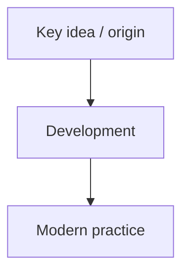

# [Topic Name]

**Category:** engineering | architecture | design | concepts | tools | process

**Tags:** tag1 · tag2 · tag3

**Related:** [Related Topic 1](../related-topic/index.md) · [Related Topic 2](../other-topic/index.md)

---

## Overview

[One-paragraph summary of the topic: what it is, why it matters, and where it fits in the broader landscape of software engineering.]

---

## The Big Picture



---

## Key Ideas

### Idea 1

[Description of the first key concept.]

### Idea 2

[Description of the second key concept.]

---

## Examples

### Example 1

```python
# Code or diagram illustrating the concept
```

---

## Timeline

| Year | Event | Significance |
|------|-------|-------------|
| 19XX | [Event] | [Why it matters] |

---

## Further Reading

- [Author](../../authors/author-name.md) — [*Work Title*](../../works/books/work-id.md) (Year)
- [Paper Title](../../works/papers/paper-id.md) (Year)

---

## Related Topics

- [Related Topic](../related-topic/index.md) — brief description of relationship
- [Another Topic](../another-topic/index.md) — brief description of relationship

---

## Related Authors

- [Author Name](../../authors/author-name.md)
